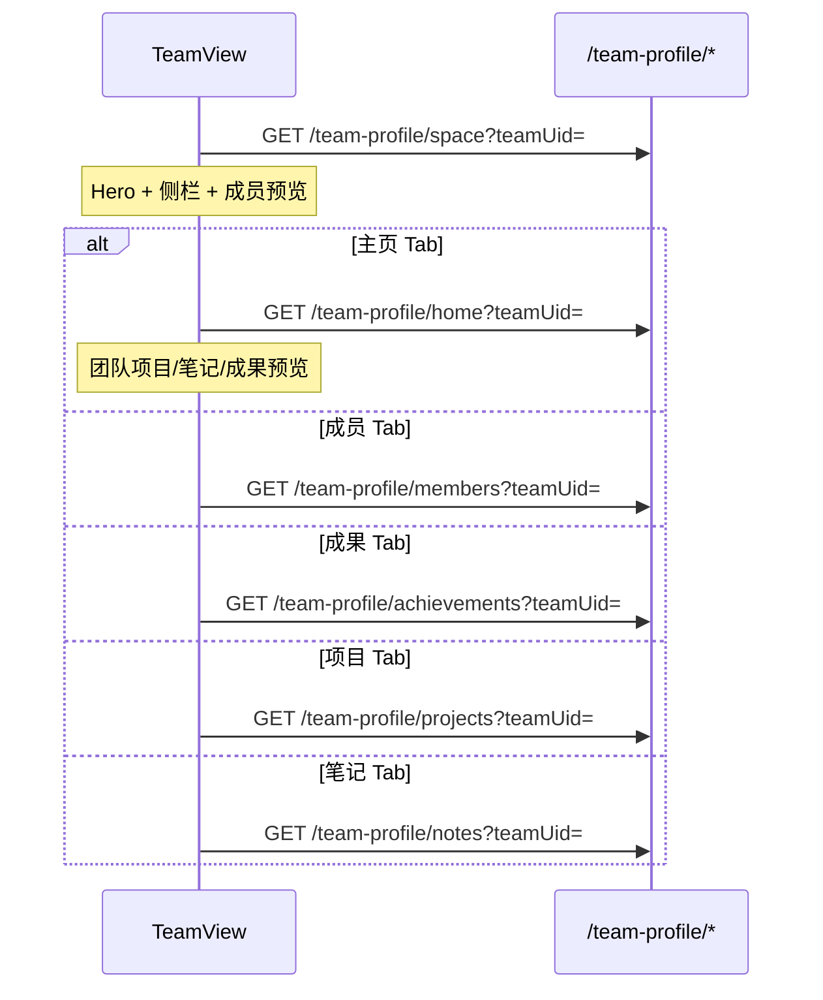

# UniBridge 前端 API 后端同步（待跟进）

> **完整 API 契约**已合并至 [`API.md`](./API.md)（含第四部分 Feed 推荐与互动、双 ID、个人空间项目卡片）。  
> **本文档**仅维护当前迭代待后，后端对齐的**增量项**，便于联调排期（含 §03 团队空间 TeamView 全新接口）。


## 03）团队空间 TeamView 接口（`/team-profile/*`，后端已实现）

### 3.1 背景

前端路由：`/team/:teamUid`（主页）、`/team/:teamUid/{member|achievement|project|note}`。  
实现目录：`apps/web-client/src/pages/ProfileSpace/variants/TeamView/`。

后端 §3.2 六处读接口已实现（`TeamSpaceController` / `TeamSpaceService`，见 `src/main/java/com/unibridge/backend/domain/space/`）；前端当前仍 **全部使用 Mock**（`teamViewPageData.ts` → `resolveTeamSpaceMockData`），待按 Tab 懒加载对接。

| 前端 Tab | 路由 segment | 主要 UI | 建议 API |
|----------|--------------|---------|----------|
| 主页 | （无） | Hero、侧栏、成员预览、团队项目/笔记/成果预览 | `GET /team-profile/space` + `GET /team-profile/home` |
| 成员 | `member` | 完整成员网格（卡片不可跳转） | `GET /team-profile/members` |
| 成果 | `achievement` | 团队成果列表 | `GET /team-profile/achievements` |
| 项目 | `project` | `ProjectCard` 列表 | `GET /team-profile/projects` |
| 笔记 | `note` | `GridNoteCard` 三列网格 | `GET /team-profile/notes` |

**UID 约定**

| 资源 | 格式 | 说明 |
|------|------|------|
| `teamUid` | `LB` / `ST` + 11 位 | 对应 `team.team_uid` |
| 成员 `uid` | 用户 `userUid` | 对应 `team_member.user_uid`；**禁止**返回自增 `id` |
| 项目 `uid` | `PR` + 11 位 | `project.project_uid`，且 `project.team_uid = teamUid` |
| 笔记 `uid` | `TX` / `VD` + 11 位 | 团队成员发布的笔记 |
| 成果 `achievementUid` | `AC` + 11 位 | 对应 `achievement_archive.achievement_uid` |

**隐私约定**

- 成员列表、笔记作者栏仅返回 **`nickname`（昵称）**，禁止返回实名 `name` / `realName`。
- 团队成果字段均为**脱敏**展示（`maskedProjectName`、`taskDescription`），与 `achievement_archive` 表语义一致。

---

### 3.2 API 总览

> 路径均相对 `/api/v1/client`。

| # | Method | Path | 说明 | 前端消费方 | 后端 | 前端 |
|---|--------|------|------|------------|------|------|
| 1 | GET | `/team-profile/space` | 页壳：Hero + 侧栏 + 成员预览 | `TeamViewHeroContent`、`TeamViewSidebar`、`TeamViewMembersSection`（预览） | ✅ 已实现 | 待接 |
| 2 | GET | `/team-profile/home` | 主页 Tab：项目/笔记/成果预览 | `TeamProjectsSection`、`TeamNotesSection`、`TeamAchievementsSection`（preview） | ✅ 已实现 | 待接 |
| 3 | GET | `/team-profile/members` | 成员 Tab 完整列表 | `TeamMembersTabContent` | ✅ 已实现 | 待接 |
| 4 | GET | `/team-profile/projects` | 项目 Tab 分页列表 | `TeamProjectsSection`（full） | ✅ 已实现 | 待接 |
| 5 | GET | `/team-profile/notes` | 笔记 Tab 分页列表 | `TeamNotesSection`（full） | ✅ 已实现 | 待接 |
| 6 | GET | `/team-profile/achievements` | 成果 Tab 分页列表 | `TeamAchievementsSection`（full） | ✅ 已实现 | 待接 |

**后端实现**：`TeamSpaceController`（路由）+ `TeamSpaceService`（业务）；DTO 见同目录 `dto/TeamProfile*.java`；游客只读，LAB 须 `audit_status=APPROVED` 且 `account_status=ACTIVE`，否则 `403 TEAM_NOT_ACCESSIBLE`。测试数据：`insert-test-data.sql`（含 `achievement_archive`）。

**Auth**：建议对已审核通过（`audit_status=APPROVED`）且账号活跃（`account_status=ACTIVE`）的团队空间允许**游客只读**；编辑类操作另议。未登录访问冻结/解散团队返回 `403` / `404`。

---

### 3.3 GET `/team-profile/space`

- **说明**：进入 `/team/:teamUid` 时调用，返回 Hero、右侧信息表、主页成员预览区所需数据（与 Tab 切换无关）。

#### Query Parameters

| 参数 | 类型 | 必填 | 说明 |
|------|------|------|------|
| `teamUid` | string | 是 | 团队对外 uid（`LB…` / `ST…`） |

#### Response Data

```json
{
  "teamUid": "LB00000001001",
  "coreProfile": {
    "teamUid": "LB00000001001",
    "name": "智能计算与应用实验室",
    "description": "以工程项目驱动实践，聚焦智能系统与大数据分析方向。",
    "organizationName": "深圳技术大学",
    "logoUrl": "http://localhost:8081/uploads/teams/lab-logo.png",
    "memberCount": 4,
    "foundedAt": "2023.09.01"
  },
  "extendedProfile": {
    "notice": "本团队采用项目制协作，每周固定进行进度复盘与代码评审。",
    "researchDirection": "智能系统 · 大数据分析 · 工程实践",
    "contactEmail": "lab-contact@example.com"
  },
  "members": [
    {
      "uid": "US00000001001",
      "nickname": "张同学",
      "role": "队长",
      "avatarUrl": "http://localhost:8081/uploads/avatars/u001.jpg",
      "level": "SR"
    }
  ],
  "infoRows": [
    { "label": "团队 UID", "value": "LB00000001001" },
    { "label": "所属主体", "value": "深圳技术大学" },
    { "label": "加入时间", "value": "2023.09.01" },
    { "label": "成员规模", "value": "4 人" },
    { "label": "研究方向", "value": "智能系统 · 大数据分析" },
    { "label": "联系邮箱", "value": "lab-contact@example.com" }
  ]
}
```

#### 字段说明

**coreProfile → `TeamCoreProfile`**

| 字段 | 类型 | 说明 |
|------|------|------|
| `teamUid` | string | 团队 uid |
| `name` | string | 团队名称 → `team.team_name` |
| `description` | string | 团队简介 → `team.intro` |
| `organizationName` | string \| null | 所属主体名称；LAB 取自 `entity`；学生团队可为 `null` |
| `logoUrl` | string \| null | Logo URL → `team.team_logo`；`null` 时前端 dicebear 占位 |
| `memberCount` | number | 成员总数（`team_member` 计数） |
| `foundedAt` | string | 成立/创建时间展示文案 → `team.created_at` 格式化 |

**extendedProfile → `TeamExtendedProfile`**

| 字段 | 类型 | 说明 |
|------|------|------|
| `notice` | string | 团队公告 → `team.announcement` |
| `researchDirection` | string | 研究方向展示文案；建议由 `team.tag` JSON 拼接 |
| `contactEmail` | string \| null | 联系邮箱 → `team.contact_email` |

**members[] → `TeamMemberItem`（主页预览）**

| 字段 | 类型 | 说明 |
|------|------|------|
| `uid` | string | 成员 `userUid` |
| `nickname` | string | 昵称（禁止实名） |
| `role` | string | 团队内职位展示文案（如 `队长`、`后端开发`）；由 `team_member.role` + 用户职位组装 |
| `avatarUrl` | string \| null | 头像 URL |
| `level` | string \| null | 能力等级 `N`/`R`/`SR`/`SSR`/`UR`；无效或空时不渲染 `LevelBadge` |

> 主页成员区 UI 最多展示 **两行**（前端 CSS 裁剪）；接口可返回完整 `members[]`，或增加 `memberPreviewLimit` 查询参数（默认不截断，由前端裁剪）。
> 成员数组必须排序，排序逻辑：第一个为实验室/团队所有人（team.owner_uid），然后为实验室/团队所有的导师，然后是学生。同层次（导师/学生）按照能力等级进行排序，同能力等级按照加入实验室/团队时间排序（team_member.join_at）

**infoRows[] → `TeamInfoRow`**

| 字段 | 类型 | 说明 |
|------|------|------|
| `label` | string | 表格行标题 |
| `value` | string | 表格行内容 |

侧栏「团队信息」表格直接渲染；后端可按运营需求组装行项。

#### 常见错误码

- `TEAM_NOT_FOUND`（404）
- `TEAM_NOT_ACCESSIBLE`（403，未审核 / 已冻结 / 已解散）
- `INVALID_TEAM_UID`（400）

---

### 3.4 GET `/team-profile/home`

- **说明**：主页 Tab 激活时调用，返回「团队项目」「团队笔记」「团队成果」预览列表。

#### Query Parameters

| 参数 | 类型 | 必填 | 说明 |
|------|------|------|------|
| `teamUid` | string | 是 | 团队 uid |
| `projectLimit` | number | 否 | 项目预览条数，默认 `3`（对齐 `TEAM_HOME_PROJECT_PREVIEW_LIMIT`） |
| `noteLimit` | number | 否 | 笔记预览条数，默认 `3`（对齐 `TEAM_HOME_NOTE_PREVIEW_LIMIT`） |
| `achievementLimit` | number | 否 | 成果预览条数，默认 `3`（对齐 `TEAM_HOME_ACHIEVEMENT_PREVIEW_LIMIT`） |

#### Response Data

```json
{
  "teamUid": "LB00000001001",
  "projects": [
    {
      "uid": "PR00000003001",
      "title": "智能数据分析平台",
      "preview": "面向实验室内部项目协作的数据分析平台…",
      "coverUrl": "http://localhost:8081/uploads/project-covers/analytics.jpg",
      "tags": [{ "label": "React" }, { "label": "SpringBoot" }],
      "category": "RECRUITMENT",
      "recruitmentType": "TEAM_RECRUIT",
      "ownerOrganization": "智能计算与应用实验室",
      "logoSvgUrl": null,
      "publishTime": "3天前发布",
      "level": "SR",
      "teamSize": "4-6人",
      "duration": "长期",
      "status": "ONGOING"
    }
  ],
  "notes": [
    {
      "uid": "TX00000004001",
      "title": "实验室项目启动会复盘模板",
      "summary": "总结项目启动会关键议题、角色分工与风险清单…",
      "contentType": "图文",
      "tags": ["项目管理", "协作流程"],
      "publishTime": "2026-05-10 10:20",
      "updateTime": "2026-05-10",
      "views": 326,
      "comments": 18,
      "favorites": 42,
      "cover": "http://localhost:8081/uploads/covers/kickoff.jpg",
      "authorNickname": "张同学",
      "authorOrganization": "智能计算与应用实验室",
      "authorAvatar": null
    }
  ],
  "achievements": [
    {
      "achievementUid": "AC00000005001",
      "maskedProjectName": "智能数据分析平台",
      "taskDescription": "完成核心指标看板与周报自动化导出模块…",
      "technicalTags": ["React", "ECharts", "SpringBoot"],
      "completedAt": "2026-04-30"
    }
  ],
  "projectTotal": 4,
  "noteTotal": 5,
  "achievementTotal": 4
}
```

#### 字段说明

**projects[]**：与个人空间 `GET /user-profile/home` 的 `projects[]` **同构**（`ProjectItem` / `ProjectCard`）。筛选条件：`project.team_uid = teamUid` 且已发布。

**notes[]**：与个人空间 `notes[]` **同构**（`ProfileNoteItem` / `GridNoteCard`）。筛选建议：作者 uid ∈ 当前团队成员。封面字段名为 **`cover`**。网格预览一行 **3** 列由前端 CSS 控制。

**achievements[] → `TeamAchievementItem`**

| 字段 | 类型 | 说明 |
|------|------|------|
| `achievementUid` | string | 成果 uid（`AC`+11 位） |
| `maskedProjectName` | string | 脱敏项目名 |
| `taskDescription` | string | 脱敏工作总结 |
| `technicalTags` | string[] | 技术标签；来自 `achievement_archive.technical_tags` JSON |
| `completedAt` | string | 完成时间展示文案 → `completed_at` 格式化 |

筛选建议：成果所属用户 ∈ 团队成员，且（可选）`source_project_uid` 关联项目的 `team_uid = teamUid`。

| 字段 | 类型 | 说明 |
|------|------|------|
| `projectTotal` | number | 团队项目总数（「查看全部」可选展示） |
| `noteTotal` | number | 团队笔记总数 |
| `achievementTotal` | number | 团队成果总数 |

---

### 3.5 GET `/team-profile/members`

- **说明**：「成员」Tab 激活时调用，返回完整成员列表（卡片纯展示，**不可跳转**）。

#### Query Parameters

| 参数 | 类型 | 必填 | 说明 |
|------|------|------|------|
| `teamUid` | string | 是 | 团队 uid |
| `page` | number | 否 | 页码，从 `1` 开始，默认 `1` |
| `pageSize` | number | 否 | 每页条数，默认 `50` |

#### Response Data

```json
{
  "teamUid": "LB00000001001",
  "members": [
    {
      "uid": "US00000001001",
      "nickname": "张同学",
      "role": "队长",
      "avatarUrl": null,
      "level": "SR"
    }
  ],
  "total": 4,
  "page": 1,
  "pageSize": 50
}
```

`members[]` 单条结构与 §3.3 一致。排序建议：`LEADER` → `MENTOR` → `MEMBER`，同角色按 `joined_at` 升序。

---

### 3.6 GET `/team-profile/projects`

- **说明**：「项目」Tab 激活时调用，供 `ProjectCard` 渲染完整列表。

#### Query Parameters

| 参数 | 类型 | 必填 | 说明 |
|------|------|------|------|
| `teamUid` | string | 是 | 团队 uid |
| `page` | number | 否 | 页码，默认 `1` |
| `pageSize` | number | 否 | 每页条数，默认 `20` |

#### Response Data

```json
{
  "teamUid": "LB00000001001",
  "projects": [],
  "total": 4,
  "page": 1,
  "pageSize": 20
}
```

`projects[]` 单条结构与 §3.4 / 个人空间 `GET /user-profile/projects` 一致。  
项目 `coverUrl` 待跟进规则见 **§01**。

---

### 3.7 GET `/team-profile/notes`

- **说明**：「笔记」Tab 激活时调用，供 `GridNoteCard` **三列网格**渲染。

#### Query Parameters

| 参数 | 类型 | 必填 | 说明 |
|------|------|------|------|
| `teamUid` | string | 是 | 团队 uid |
| `page` | number | 否 | 页码，默认 `1` |
| `pageSize` | number | 否 | 每页条数，默认 `21`（建议为 3 的倍数，便于三列网格） |
| `contentType` | string | 否 | 预筛：`图文` / `视频`；缺省返回全部 |

#### Response Data

```json
{
  "teamUid": "LB00000001001",
  "notes": [],
  "total": 5,
  "page": 1,
  "pageSize": 21
}
```

`notes[]` 单条结构与 §3.4 / 个人空间 `GET /user-profile/notes` 一致。  
作者栏、视频时长、互动计数字段待跟进规则见 **§02**。

---

### 3.8 GET `/team-profile/achievements`

- **说明**：「成果」Tab 激活时调用，返回团队成果完整列表。

#### Query Parameters

| 参数 | 类型 | 必填 | 说明 |
|------|------|------|------|
| `teamUid` | string | 是 | 团队 uid |
| `page` | number | 否 | 页码，默认 `1` |
| `pageSize` | number | 否 | 每页条数，默认 `20` |

#### Response Data

```json
{
  "teamUid": "LB00000001001",
  "achievements": [
    {
      "achievementUid": "AC00000005001",
      "maskedProjectName": "智能数据分析平台（脱敏）",
      "taskDescription": "完成核心指标看板与周报自动化导出模块…",
      "technicalTags": ["React", "ECharts", "SpringBoot"],
      "completedAt": "2026-04-30"
    }
  ],
  "total": 4,
  "page": 1,
  "pageSize": 20
}
```

`achievements[]` 单条结构与 §3.4 一致。排序建议：`completed_at` 降序。

---

### 3.9 前端页面与调用时机



| 用户操作 | API | 前端组件 |
|----------|-----|----------|
| 进入 `/team/:teamUid` | `GET /team-profile/space` | `TeamViewHeroContent`、`TeamViewSidebar`、`TeamViewMembersSection` |
| 主页 Tab / 首次展示预览区 | `GET /team-profile/home` | `TeamProjectsSection`、`TeamNotesSection`、`TeamAchievementsSection`（preview） |
| 点击「查看全部」→ 成员 | （已加载或 `GET /team-profile/members`） | `TeamMembersTabContent` |
| 点击「查看全部」→ 项目/笔记/成果 | 对应 Tab 列表接口 | 各 Section（full） |
| 激活「成员/成果/项目/笔记」Tab | 对应 §3.5–§3.8 | 侧栏折叠为单列布局 |

---

### 3.10 数据库映射建议

| 响应字段 | 来源 |
|----------|------|
| `coreProfile.*` | `team` + JOIN `entity`（LAB 所属主体名） |
| `extendedProfile.notice` | `team.announcement` |
| `extendedProfile.researchDirection` | `team.tag` JSON 拼接 |
| `extendedProfile.contactEmail` | `team.contact_email` |
| `members[]` | `team_member` JOIN `user` / `user_profile` |
| `members[].role` | `team_member.role` 枚举映射 + 可选职位字段 |
| `members[].level` | `user_profile.level` 或等价字段 |
| `projects[]` | `project` WHERE `team_uid = ?` |
| `notes[]` | 笔记表 JOIN 作者，作者 uid ∈ `team_member` |
| `achievements[]` | `achievement_archive` WHERE `user_uid` ∈ 团队成员 |
| `infoRows[]` | 服务端 Assembler 组装 |

---

### 3.11 前端跟进清单

- [ ] 新增 `src/api/teamProfile/`（types + index），镜像 `userProfile` 分层
- [ ] `useTeamViewPage`：挂载时调 `getTeamProfileSpace`，按 Tab 懒加载 home / members / projects / notes / achievements
- [ ] DTO 映射：`userUid` / `teamUid` 归一化（复用 `normalizeUserResourceUid` 模式）
- [ ] 移除 `resolveTeamSpaceMockData` 生产路径依赖（Mock 可保留 Storybook / 离线开发）
- [ ] 联调 §3.2 六处读接口；项目 `coverUrl`（§01）、笔记作者栏（§02）一并验证

---

## 04）文档索引

| 文档 | 用途 |
|------|------|
| [`API.md`](./API.md) | 全量接口契约（认证、个人空间、发布详情、Feed 与互动） |
| [`API-request.md`](./API-request.md) | **本文档**：当前迭代待跟进项（§01 项目 `coverUrl`、§02 网格笔记卡片、§03 团队空间 TeamView） |
