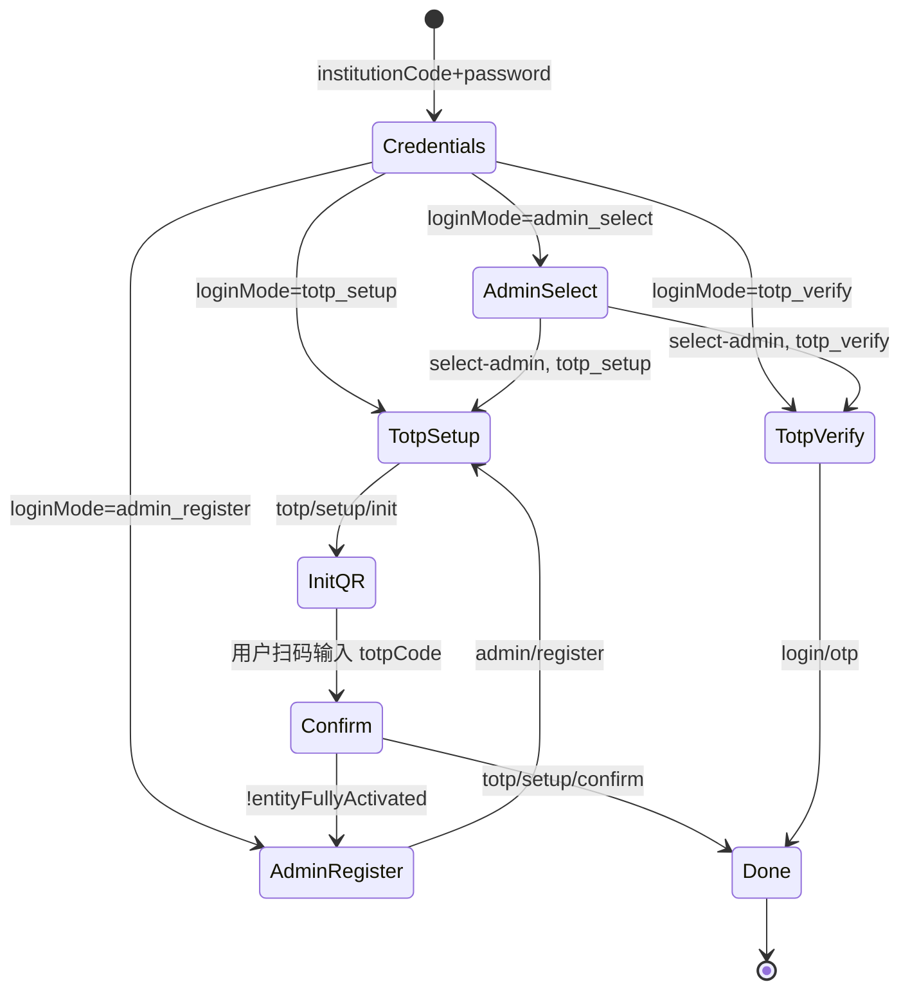

# UniBridge 前端 API 同步文档

> **用途**：前端联调增量契约（覆盖旧版「待跟进」草稿）。  
> **全量契约**：[`API.md`](./API.md)  
> **Swagger**：`http://localhost:8080/swagger-ui.html` → `Client - 认证` / `Client - 机构空间`

---

## 当前状态（请前端按此表改）

| 模块 | 后端 | 前端需同步 |
|------|------|------------|
| 团队空间 `/team-profile/*` | ✅ | 已完成 |
| 机构空间 `/entity-profile/*` | ✅ | 路径/Query 见 §09 |
| **主体登录** `/auth/organization/*` | ✅ | **§10**（含 `select-admin`、`admin/register`、多管理员绑定） |
| **主体顶栏菜单** `/entity-profile/menu` | ✅ | **§09.4** + `ProfileMenuContext` |

---

## 通用约定

### Base URL

| 环境 | `axios` baseURL 示例 | 机构登录完整路径示例 |
|------|----------------------|----------------------|
| 本地 | `/api/v1/client` | `POST /api/v1/client/auth/organization/login/credentials` |
| 经网关 | 按网关配置 | 禁止只写 `/login/credentials`（会 404/超时） |

### 响应包装 `Result`

所有接口 HTTP 200 时 body 仍为：

```json
{
  "code": 200,
  "message": "success",
  "data": { }
}
```

业务字段在 **`data`** 内；错误时 `code` 为 4xx/5xx，`message` 为错误码字符串（如 `ORGANIZATION_CREDENTIAL_INVALID`）。

### 密码字段

| 字段 | 说明 |
|------|------|
| `password` | **SHA256 十六进制小写**（与个人登录一致），**不是明文** |
| 主体根密码 | 对应 `entity.password_hash` |
| 管理员密码 | 对应 `sys_entity_totp_credentials.password_hash` |

### 测试账号（`insert-test-data.sql`）

| 主体代码 | 类型 | 主体根密码 | 管理员示例 |
|----------|------|------------|------------|
| `10598` | 高校 | `123456` → SHA256 | `EA00000000001` 深大教务管理员 |
| `10003` | 高校 | 同上 | `EA00000000003` 清华教务管理员 |
| `91440300708461136T` | 企业 | 同上 | `EA00000000005` 腾讯 HR 管理员 |

SHA256(`123456`) = `8d969eef6ecad3c29a3a629280e686cf0c3f5d5a86aff3ca12020c923adc6c92`

---

## 10）主体登录（`EntityTotpSetupForm` / 机构登录）— 前端同步重点

> **模块**：`apps/web-client/src/api/Auth`（或等价封装）  
> **页面**：`EntityTotpSetupForm`、`TwoFactorAuthForm`、机构登录弹窗  
> **Base**：`/api/v1/client/auth`

### 10.0）与旧版差异（超时/卡死常见原因）

| 旧行为（请废弃） | 新行为 |
|------------------|--------|
| 仅校验 `sys_entity_totp_credentials` 密码 | **同时支持** `entity.password_hash` 与管理员密码 |
| `credentials` 后直接调 `/login/otp` 用 6 位「短信码」 | `loginMode=totp_setup` 须走 **`totp/setup/init` → `confirm`**；`totp_verify` 才走 **`login/otp`** |
| 无 `select-admin` | 主体根密码 + 已有管理员 → **`loginMode=admin_select`**，必须先选管理员 |
| 请求字段 `entityCode` | 请求字段为 **`institutionCode`**（主体代码） |
| 响应扁平无 `data` 包装 | 必须从 **`response.data.data`** 取业务对象 |

### 10.1）业务规则摘要

1. **尚无管理员行**（`sys_entity_totp_credentials` 为空）：仅接受主体根密码 → `totp_setup` / `totp_verify` 绑定 **`entity.totp_secret`**。
2. **有管理员但 `boundAdminCount === 0`**：仅接受主体根密码 → `admin_select` → 选管理员 → 该管理员的 `totp_setup`。
3. **`boundAdminCount > 0`**：  
   - 主体根密码 → `admin_select` → `select-admin` → `totp_verify`（或该管理员未绑定则 `totp_setup`）。  
   - 管理员密码 → 跳过选管理员，直接 `totp_setup` / `totp_verify`。
4. 至少 **2** 名、最多 **3** 名管理员完成 TOTP 后，主体视为 fully activated（`entityFullyActivated=true`）。

### 10.2）接口列表

| # | Method | Path（相对 `/api/v1/client/auth`） | 前端建议函数名 |
|---|--------|-----------------------------------|----------------|
| 1 | POST | `/organization/login/credentials` | `loginOrganizationByCredentials` |
| 2 | POST | `/organization/login/select-admin` | `selectOrganizationAdmin` |
| 3 | POST | `/organization/totp/setup/init` | `initOrganizationTotpSetup` |
| 4 | POST | `/organization/totp/setup/confirm` | `confirmOrganizationTotpSetup` |
| 5 | POST | `/organization/login/otp` | `loginOrganizationByOtp` |
| 6 | POST | `/organization/admin/register` | `registerOrganizationAdmin` |

---

### 10.3）`POST /organization/login/credentials`

**Request**

```json
{
  "institutionCode": "10598",
  "password": "8d969eef6ecad3c29a3a629280e686cf0c3f5d5a86aff3ca12020c923adc6c92"
}
```

| 字段 | 类型 | 必填 | 说明 |
|------|------|------|------|
| `institutionCode` | string | 是 | `entity.entity_code`（高校 5 位数字 / 企业统一社会信用代码） |
| `password` | string | 是 | SHA256 哈希，匹配主体根密码或某一管理员密码 |

**Response `data`（`OrganizationCredentialResponse`）**

| 字段 | 类型 | 说明 |
|------|------|------|
| `challengeId` | string | 后续步骤必传，内存 challenge，约 30 分钟有效 |
| `passwordDigestPreview` | string | 可选展示 |
| `otpExpireInSec` | number | 建议 300 |
| `maskedTarget` | string | 脱敏主体代码 |
| `isFirstLogin` | boolean \| null | 当前路径是否首次绑定 TOTP；`admin_select` 时为 `null` |
| `loginMode` | string | **`admin_select` \| `admin_register` \| `totp_setup` \| `totp_verify`** |
| `requiresAdminSelection` | boolean | `loginMode=admin_select` 时为 `true` |
| `admins` | array \| null | `admin_select` 时管理员列表 |
| `admins[].adminUid` | string | `EA` + 11 位 |
| `admins[].displayName` | string | 展示名 |
| `admins[].isPrimary` | boolean | 是否主管理员 |
| `boundAdminCount` | number | 已完成 TOTP 绑定的管理员数 |
| `minAdminCount` | number | 固定 2 |
| `maxAdminCount` | number | 固定 3 |
| `currentAdminOrder` | number \| null | 绑定顺序 1/2/3 |
| `entityName` | string | 主体名称 |

**`loginMode` 分支示例**

```ts
// credentials 成功后
const d = res.data.data

switch (d.loginMode) {
  case 'admin_select':
    // 展示 d.admins，用户选 displayName
    // → POST select-admin { challengeId, adminUid }
    break
  case 'admin_register':
    // → 登记表单 displayName + password → POST admin/register
    break
  case 'totp_setup':
    // → init → 展示 QR → confirm（不要调 login/otp）
    break
  case 'totp_verify':
    // → TwoFactorAuthForm → POST login/otp { challengeId, otpCode }
    break
}
```

**示例 A：主体根密码 + 待选管理员**

```json
{
  "challengeId": "chl_a1b2c3d4e5f6g7h8",
  "loginMode": "admin_select",
  "requiresAdminSelection": true,
  "admins": [
    { "adminUid": "EA00000000001", "displayName": "深大教务管理员", "isPrimary": true },
    { "adminUid": "EA00000000002", "displayName": "深大学工管理员", "isPrimary": false }
  ],
  "boundAdminCount": 0,
  "minAdminCount": 2,
  "maxAdminCount": 3,
  "entityName": "深圳大学",
  "otpExpireInSec": 300,
  "maskedTarget": "1***8"
}
```

**示例 B：管理员密码 + 已绑定 TOTP**

```json
{
  "challengeId": "chl_xxx",
  "isFirstLogin": false,
  "loginMode": "totp_verify",
  "requiresAdminSelection": false,
  "admins": null,
  "boundAdminCount": 2,
  "currentAdminOrder": 1,
  "entityName": "深圳大学"
}
```

**常见错误 `message`**

| message | HTTP | 说明 |
|---------|------|------|
| `ORGANIZATION_FIELDS_REQUIRED` | 400 | 缺 institutionCode / password |
| `ORGANIZATION_CREDENTIAL_INVALID` | 400 | 密码错误或首次阶段用了管理员密码 |
| `ORGANIZATION_ACCOUNT_DISABLED` | 400 | 主体未审核 |
| `ORGANIZATION_ACCOUNT_FROZEN` | 400 | 主体或管理员冻结 |
| `ORGANIZATION_ACCOUNT_DEACTIVATED` | 400 | 已注销 |

---

### 10.4）`POST /organization/admin/register`

在主体根密码 challenge 下**登记新管理员**（`displayName` + 登录密码），随后进入 `totp_setup`。

**Request**

```json
{
  "challengeId": "chl_xxx",
  "displayName": "深大教务管理员",
  "password": "8d969eef6ecad3c29a3a629280e686cf0c3f5d5a86aff3ca12020c923adc6c92"
}
```

**Response `data`**：与 `credentials` 相同；通常 `loginMode=totp_setup`，`currentAdminOrder` 为 1/2/3。

**前端流程**：`admin_register` 或 `boundAdminCount < minAdminCount` 时展示登记表单 → 本接口 → 绑定须知 → QR 弹窗 → `confirm`；若 `entityFullyActivated=false` **不得** `commitAuthLogin`，应继续登记下一位管理员。

---

### 10.5）`POST /organization/login/select-admin`

仅在 `loginMode === 'admin_select'` 后调用。

**Request**

```json
{
  "challengeId": "chl_a1b2c3d4e5f6g7h8",
  "adminUid": "EA00000000001"
}
```

**Response `data`**

与 `credentials` 相同结构；此时 `loginMode` 变为 `totp_setup` 或 `totp_verify`，`requiresAdminSelection=false`，`admins=null`。

---

### 10.6）`POST /organization/totp/setup/init`

仅在 `loginMode === 'totp_setup'` 时调用（**不要**先调 `login/otp`）。

**Request**

```json
{
  "challengeId": "chl_xxx"
}
```

**Response `data`**

| 字段 | 类型 | 说明 |
|------|------|------|
| `qrCodeDataUrl` | string | `data:image/png;base64,...`，可直接赋给 `` |
| `qrCodeExpireInSec` | number | 300，超时需重新 init |
| `otpAuthUrl` | string | `otpauth://totp/...` |
| `currentAdminOrder` | number | 1 / 2 / 3 |

---

### 10.7）`POST /organization/totp/setup/confirm`

**Request**

```json
{
  "challengeId": "chl_xxx",
  "totpCode": "123456"
}
```

| 字段 | 说明 |
|------|------|
| `totpCode` | 验证器 6 位动态码（非短信 OTP） |

**Response `data`**

| 字段 | 类型 | 说明 |
|------|------|------|
| `accessToken` | string | Bearer Token |
| `refreshToken` | string | 刷新用 |
| `expiresIn` | number | 秒，通常 1800 |
| `entityFullyActivated` | boolean | `boundAdminCount >= 2` |
| `boundAdminCount` | number | 当前已绑定人数 |
| `minAdminCount` | number | 2 |
| `activationHint` | string \| null | 未达标时的提示文案 |
| `nextChallengeId` | string \| null | 未达标时继续下一位管理员绑定的 challenge |
| `nextLoginMode` | string \| null | 常为 `admin_register` |

仅当 `entityFullyActivated=true` 时前端写入登录态并关闭弹窗；否则留在弹窗内进入「登记下一位管理员」。

登录成功后：`Authorization: Bearer <accessToken>`。JWT `sub` 为 **`EA...`（管理员）** 或 **`entityCode`（无管理员时的主体根绑定）**。

---

### 10.8）`POST /organization/login/otp`

仅在 `loginMode === 'totp_verify'` 时调用。

**Request**

```json
{
  "challengeId": "chl_xxx",
  "otpCode": "123456"
}
```

**Response `data`（`LoginResponse`）**

| 字段 | 类型 | 说明 |
|------|------|------|
| `userUid` | string | 管理员 `EA...` 或主体 `entityCode` |
| `userRole` | string | `organization-admin` |
| `authStatus` | string | `verified` |
| `accessToken` | string | |
| `refreshToken` | string | |
| `expiresIn` | number | |

---

### 10.9）前端状态机（推荐实现）



### 10.9）`loginOrganizationByCredentials` 参考实现（TypeScript）

```ts
const ORG_AUTH = '/auth/organization'

export async function loginOrganizationByCredentials(institutionCode: string, passwordSha256: string) {
  const { data: body } = await client.post(`${ORG_AUTH}/login/credentials`, {
    institutionCode,
    password: passwordSha256,
  })
  if (body.code !== 200) throw new Error(body.message)
  return body.data as OrganizationCredentialResponse
}

export async function selectOrganizationAdmin(challengeId: string, adminUid: string) {
  const { data: body } = await client.post(`${ORG_AUTH}/login/select-admin`, {
    challengeId,
    adminUid,
  })
  if (body.code !== 200) throw new Error(body.message)
  return body.data as OrganizationCredentialResponse
}
```

---

## 09）机构空间（`OrganizationView`）

> **Base**：`/api/v1/client/entity-profile`  
> **Query**：`entityCode`（注意：机构空间用 `entityCode`，登录第一步用 `institutionCode`，值相同）

### 09.0）实验室展示规则

| `entityCode`（仅数字位数） | 展示实验室 Tab |
|---------------------------|----------------|
| **5 位** | ✅ |
| **非 5 位**（18 位信用代码等） | ❌ `teams` / `teamsPreview` 为空 |

### 09.1）接口列表

| Method | Path | Query |
|--------|------|-------|
| GET | `/entity-profile/space` | `entityCode` |
| GET | `/entity-profile/home` | `entityCode`, `teamLimit?`, `projectLimit?`, `noteLimit?` |
| GET | `/entity-profile/teams` | `entityCode`, `page?`, `pageSize?` |
| GET | `/entity-profile/members` | `entityCode`, `page?`, `pageSize?` |
| GET | `/entity-profile/projects` | `entityCode`, `page?`, `pageSize?` |
| GET | `/entity-profile/notes` | `entityCode`, `page?`, `pageSize?`, `contentType?`（`图文`/`视频`） |

### 09.2）`GET /entity-profile/space` 响应结构（摘要）

```json
{
  "entityCode": "10598",
  "coreProfile": {
    "entityCode": "10598",
    "name": "深圳大学",
    "intro": "...",
    "location": "广东·深圳",
    "type": "UNIVERSITY",
    "logoUrl": null,
    "bannerUrl": null,
    "teamCount": 3
  },
  "extendedProfile": { "announcement": "..." },
  "teamsPreview": [{ "teamUid": "LB...", "name": "...", "description": "...", "logoUrl": null, "memberCount": 2 }],
  "membersPreview": [{ "uid": "US...", "nickname": "...", "realName": "...", "role": "MENTOR", "avatarUrl": null, "level": "UR" }],
  "infoRows": [{ "label": "主体代码", "value": "10598" }]
}
```

`membersPreview` / `members`：仅 `user_auth_link` 中 **`role` 为 `PM` 或 `MENTOR`** 且 `audit_status=APPROVED`、`is_active=1`。

### 09.4）`GET /entity-profile/menu`

**Query**：`entityCode`（与登录 `institutionCode` 相同）

**Response `data`（摘要）**

| 字段 | 说明 |
|------|------|
| `entityCode` | 主体代码 |
| `entityName` | 展示名 |
| `logoUrl` | 头像/Logo |
| `boundAdminCount` | 已绑定 TOTP 管理员数 |
| `minAdminCount` | 2 |
| `maxAdminCount` | 3 |
| `entityFullyActivated` | 是否已达标 |

前端：`ProfileMenuContext` 在 `userRole=organization-admin` 时调用 `getEntityProfileMenu`，个人账号仍走 `GET /user-profile/menu`。

---

### 09.5）错误码

| message | HTTP |
|---------|------|
| `ENTITY_NOT_FOUND` | 404 |
| `ENTITY_NOT_ACCESSIBLE` | 403 |
| `INVALID_ENTITY_CODE` | 400 |

---

## 联调自检清单

- [ ] `baseURL` 含 `/api/v1/client`，完整路径为 `.../auth/organization/login/credentials`
- [ ] 请求体使用 `institutionCode`，密码为 SHA256
- [ ] 解析 `res.data.data`，不是 `res.data` 直接当业务对象
- [ ] `admin_select` 时先 `select-admin`，再 TOTP
- [ ] `totp_setup` 走 `init` + `confirm`，**不**走 `login/otp`
- [ ] `totp_verify` 才走 `login/otp`，`otpCode` 为验证器 6 位码
- [ ] Network 面板确认非 404（404 常被代理表现为超时）

---

## 文档索引

| 文档 | 用途 |
|------|------|
| [`API.md`](./API.md) | 全量接口 |
| **本文档 `API-1.md`** | 机构登录 + 机构空间前端同步（覆盖维护） |
