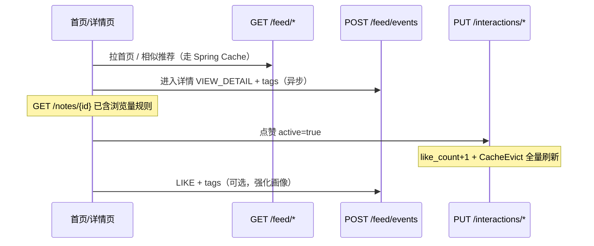

# UniBridge Feed 推荐与埋点 API（测试版）

> 本机联调地址：`http://localhost:8081/api/v1/client`
>
> 缓存架构：Spring Cache（当前本地内存 `ConcurrentMapCacheManager`）；未来引入 Redis 后业务代码零改动。

---

## 已完成 API 一览

> 以下路径均相对 `/api/v1/client`。

| 分类 | 接口 | Method | Path | Auth |
|------|------|--------|------|------|
| Feed 推荐 | 首页个性化推送（笔记 5 条 + 项目 10 条） | GET | `/feed/home` | 可选 |
| Feed 推荐 | 首页「换一换」混排 | GET | `/feed/home/shuffle` | 可选 |
| Feed 推荐 | 项目专区推送（商业 / 非商业分栏） | GET | `/feed/projects?category=` | 可选 |
| Feed 推荐 | 项目专区「换一换」 | GET | `/feed/projects/shuffle?category=` | 可选 |
| Feed 推荐 | 笔记专区推送（图文 / 视频分栏） | GET | `/feed/notes?noteType=` | 可选 |
| Feed 推荐 | 笔记专区「换一换」 | GET | `/feed/notes/shuffle?noteType=` | 可选 |
| Feed 推荐 | 相似笔记推荐 | GET | `/feed/notes/{noteId}/similar` | 否 |
| 埋点 | 用户行为捕获 | POST | `/feed/events` | 是 |
| 互动 | 点赞 / 取消点赞 | PUT | `/interactions/like` | 是 |
| 互动 | 收藏 / 取消收藏 | PUT | `/interactions/collect` | 是 |
| 互动 | 浏览计次（视频播放等） | POST | `/interactions/view` | 是 |

---

## 09）Feed 推荐读接口

| 接口 | Method | Path | 状态 |
|------|--------|------|------|
| 首页个性化推送 | GET | `/feed/home` | 已实现 |
| 项目专区推送 | GET | `/feed/projects` | 已实现 |
| 笔记专区推送 | GET | `/feed/notes` | 已实现 |
| 相似笔记推荐 | GET | `/feed/notes/{noteId}/similar` | 已实现 |

### 09.1）首页个性化推送

- **Method**：`GET`
- **Path**：`/feed/home`
- **Auth**：可选（未登录走冷启动；登录后按 `user_tag_interests` 加权）
- **Cache**：`@Cacheable("home_feed", key=userId)`

固定返回两类内容，**分别排序、分别截断**：

| 区块 | 条数 | `contentType` |
|------|------|---------------|
| 笔记 | **5** | `NOTE` |
| 项目 | **10** | `PROJECT` |

#### Response `data`

```json
{
  "notes": [
    {
      "contentType": "NOTE",
      "noteType": "IMAGE_TEXT",
      "id": 1,
      "title": "Spring Boot 实战笔记",
      "summary": "实践经验总结",
      "coverUrl": "http://localhost:8081/uploads/covers/xxx.jpg",
      "tags": ["Spring Boot", "后端"],
      "authorName": "张明",
      "views": 128,
      "likes": 24,
      "publishTime": "2026-05-10 14:20",
      "score": 2.415
    }
  ],
  "projects": [
    {
      "contentType": "PROJECT",
      "projectCategory": "COMMERCIAL",
      "id": 1,
      "title": "智能客服系统研发",
      "summary": "面向客服场景的多轮对话系统",
      "coverUrl": null,
      "tags": ["NLP", "客服"],
      "authorName": "王经理",
      "views": 0,
      "likes": 0,
      "publishTime": "2026-04-01 10:00",
      "score": 1.872
    }
  ]
}
```

**排序公式（服务端）**

| 因子 | 权重 |
|------|------|
| 标签匹配分（`user_tag_interests.weight` 累加） | × 时间衰减 × 0.7 |
| 热度分 `log(1+like+collect×1.5)` | × 0.3 |
| 时间衰减 | `1 / (1 + days×0.05)` |

卡片字段补充：

| 字段 | 适用 | 取值 |
|------|------|------|
| `noteType` | 笔记 | `IMAGE_TEXT`（图文，编码前缀 TX）\| `VIDEO`（视频，编码前缀 VD） |
| `projectCategory` | 项目 | `COMMERCIAL`（商业）\| `RECRUITMENT`（非商业/招募与实践） |

---

### 09.2）项目专区推送

- **Method**：`GET`
- **Path**：`/feed/projects`
- **Auth**：可选
- **Cache**：`@Cacheable("project_feed", key=userId:category:limit)`

**严格分栏**：仅返回指定 `category` 的项目，商业与非商业**互不混入**。

| 参数 | 类型 | 必填 | 说明 |
|------|------|------|------|
| `category` | string | 是 | `COMMERCIAL` 商业项目 \| `RECRUITMENT` 非商业（招募与实践）项目 |
| `limit` | number | 否 | 返回条数，默认 `10`，最大 `30` |

#### Response `data`

`ContentVO[]`，结构与首页项目卡片一致，每条均带 `projectCategory` 且与请求参数一致。

```json
[
  {
    "contentType": "PROJECT",
    "projectCategory": "COMMERCIAL",
    "id": 1,
    "title": "智能客服系统研发",
    "summary": "面向客服场景的多轮对话系统",
    "coverUrl": null,
    "tags": ["NLP", "客服"],
    "authorName": "王经理",
    "views": 0,
    "likes": 0,
    "publishTime": "2026-04-01 10:00",
    "score": 1.872
  }
]
```

---

### 09.3）笔记专区推送

- **Method**：`GET`
- **Path**：`/feed/notes`
- **Auth**：可选
- **Cache**：`@Cacheable("note_feed", key=userId:noteType:limit)`

**严格分栏**：仅返回指定 `noteType` 的笔记，图文与视频**互不混入**。

| 参数 | 类型 | 必填 | 说明 |
|------|------|------|------|
| `noteType` | string | 是 | `IMAGE_TEXT` 图文笔记 \| `VIDEO` 视频笔记 |
| `limit` | number | 否 | 返回条数，默认 `10`，最大 `30` |

#### Response `data`

`ContentVO[]`，结构与首页笔记卡片一致，每条均带 `noteType` 且与请求参数一致。

```json
[
  {
    "contentType": "NOTE",
    "noteType": "VIDEO",
    "id": 80002,
    "title": "项目复盘视频",
    "summary": "5 分钟讲清交付流程",
    "coverUrl": "http://localhost:8081/uploads/covers/xxx.jpg",
    "tags": ["项目管理"],
    "authorName": "李同学",
    "views": 256,
    "likes": 18,
    "publishTime": "2026-05-12 09:00",
    "score": 2.103
  }
]
```

---

### 09.4）相似笔记推荐

- **Method**：`GET`
- **Path**：`/feed/notes/{noteId}/similar`
- **Auth**：否
- **Cache**：`@Cacheable("similar_notes", key=noteId)`

| 参数 | 类型 | 默认 | 说明 |
|------|------|------|------|
| `limit` | number | 10 | 返回条数（最大 30） |

- 同源标签 Jaccard 相似度 + 点赞数 tie-break
- 源笔记无标签时降级为高赞笔记列表
- **「换一换」策略**：本接口**保持静止**，`noteId` 不变则结果永远一致；前端**无需**也不应对此区域做刷新/换量请求

---

### 09.5）「换一换」混排推送（首页 + 专区）

> 双机制供联调时二选一；专区接口同样严格分栏（商业/非商业、图文/视频互不串）。

| 场景 | Path | 机制 A（缓存分页） | 机制 B（实时洗牌） |
|------|------|-------------------|-------------------|
| 首页混排 | `/feed/home/shuffle` | 不传 `seed`，递增 `page` | 传 `seed`，每次换新随机数 |
| 项目专区 | `/feed/projects/shuffle` | 同上 + 必填 `category` | 同上 |
| 笔记专区 | `/feed/notes/shuffle` | 同上 + 必填 `noteType` | 同上 |

**公共 Query**

| 参数 | 类型 | 默认 | 说明 |
|------|------|------|------|
| `page` | number | 1 | 页码；机制 A 下「换一换」递增 |
| `size` | number | 首页 15 / 专区 10 | 每页条数，最大 30 |
| `seed` | number | — | **机制 B**：非空则走 `ORDER BY RAND(seed)`，**不缓存** |

**机制 A（高性能缓存滚动流）**

- `@Cacheable("home_feed", key=userId_page)` / `project_feed` / `note_feed`
- 分页保护：若 `page × size > total`，自动 `page=1`（`pageWrapped=true`），实现无缝循环

**机制 B（实时伪随机流）**

- MySQL `ORDER BY RAND(seed)` 拉候选 + Java 跨类型混排（首页）
- 每次 `seed` 不同 → **禁止** `@Cacheable`，避免垃圾缓存

#### Response `data`

```json
{
  "items": [ { "contentType": "NOTE", "noteType": "IMAGE_TEXT", "id": 1, "title": "..." } ],
  "page": 2,
  "size": 15,
  "total": 128,
  "pageWrapped": false,
  "shuffleMode": "CACHE_PAGE"
}
```

| 字段 | 说明 |
|------|------|
| `shuffleMode` | `CACHE_PAGE` \| `RANDOM_SEED` |
| `pageWrapped` | 是否触发循环重置到第 1 页 |

#### 前端「换一换」联调要点

1. **相似笔记区**：不处理刷新；仅首次进入详情页拉取 `GET /feed/notes/{id}/similar` 一次即可。
2. **首页/专区「换一换」**：
   - **机制 A**：维护本地 `page` 状态，点击时 `page++` 请求 `/feed/*/shuffle?page=N&size=…`（不传 `seed`）。
   - **机制 B**：点击时 `seed = Date.now()`（或 `Math.floor(Math.random()*1e9)`），`page=1`，请求 `…&seed={seed}`。
   - **Skeleton 交互**：点击后立即 `opacity` 降低 + 展示骨架屏 → 请求返回后整体替换 `items`（切歌式，勿逐条插入）→ 若 `pageWrapped=true` 可将 UI 页码重置为 1 并可选 toast「已刷完全部，从头开始」。

---

## 10）前端埋点与互动同步 API 契约

> **目标**：驱动 `user_tag_interests` 画像 + `note` 计数器；点赞/发布等行为触发 `@CacheEvict` 刷新 Feed 缓存。

### 10.1）用户行为捕获（埋点）

| 前端交互场景 | 必须/建议 | Method | Path | 说明 |
|--------------|-----------|--------|------|------|
| 点击进入笔记/项目详情页 | **必须**（登录用户） | POST | `/feed/events` | `eventType=VIEW_DETAIL`，上报 `tags` 累加画像 |
| 用户点赞（按钮态变化） | **建议** | POST | `/feed/events` | `eventType=LIKE`，与 §10.2 点赞同步并行 |
| 用户收藏 | **建议** | POST | `/feed/events` | `eventType=COLLECT` |

- **Auth**：是（`Authorization: Bearer <token>`）
- **Content-Type**：`application/json`
- **异步建议**：`navigator.sendBeacon` 或 fire-and-forget，不阻塞 UI

#### Request Body

```json
{
  "eventType": "VIEW_DETAIL",
  "targetType": "NOTE",
  "targetId": 80001,
  "tags": ["Spring Boot", "后端", "产学研"]
}
```

| 字段 | 类型 | 必填 | 说明 |
|------|------|------|------|
| `eventType` | string | 是 | `VIEW_DETAIL` \| `LIKE` \| `COLLECT` |
| `targetType` | string | 是 | `NOTE` \| `PROJECT` |
| `targetId` | number | 是 | 目标主键 |
| `tags` | string[] | 是 | 目标内容标签快照（Feed 卡片或详情接口已有字段） |

#### 权重累加规则（`user_tag_interests`）

| eventType | 每标签 +weight |
|-----------|----------------|
| `VIEW_DETAIL` | +0.5 |
| `LIKE` | +2.0 |
| `COLLECT` | +3.0 |

#### Response

```json
{ "code": 200, "message": "success", "data": null }
```

---

### 10.2）互动数据同步（计数器 + 缓存失效）

| 前端交互场景 | Method | Path | 缓存副作用 |
|--------------|--------|------|------------|
| 点赞 / 取消点赞 | PUT | `/interactions/like` | `@CacheEvict(home_feed, similar_notes, allEntries=true)` |
| 收藏 / 取消收藏 | PUT | `/interactions/collect` | 同上 |
| 笔记发布（写接口） | POST/PUT | `/notes` | `publishAction=PUBLISH` 时清空 Feed 缓存 |
| 视频播放计次（可选） | POST | `/interactions/view` | 仅更新 `view_count`（规则同详情读） |

#### PUT `/interactions/like` | `/interactions/collect`

- **Auth**：是

```json
{
  "targetType": "NOTE",
  "targetId": 80001,
  "active": true
}
```

| 字段 | 说明 |
|------|------|
| `active=true` | 点赞/收藏 |
| `active=false` | 取消；计数器 -1（不低于 0） |

- 幂等：同一用户重复提交相同状态不重复加减
- `targetType=NOTE` 时更新 `note.like_count` / `note.collect_count`
- `targetType=PROJECT`：当前仅记录互动态，项目表暂无计数器字段

#### POST `/interactions/view`（视频播放等）

```json
{
  "targetType": "NOTE",
  "targetId": 80001
}
```

| 规则 | 说明 |
|------|------|
| 发布者本人 | 不计浏览量 |
| 30 分钟去重 | 同用户/IP 不重复计次 |
| 与 GET 详情 | 规则一致；播放器可单独调本接口，避免重复打开详情页 |

---

### 10.3）前端联调时序（推荐）



---

### 10.4）缓存双写一致性（后端已实现）

| 触发动作 | 注解 | 效果 |
|----------|------|------|
| 笔记发布 `publishAction=PUBLISH` | `@CacheEvict(home_feed, similar_notes, project_feed, note_feed, allEntries=true)` | 强制下次 Feed 穿透 DB |
| 项目发布 `publishAction=PUBLISH` | 同上 | 强制下次 Feed 穿透 DB |
| 点赞/收藏同步 | 同上 | 热度变化后列表刷新 |
| 普通浏览 | 无 Evict | 不影响 Feed 缓存 |

---

### 10.5）Redis 升级路径（架构预留）

1. `pom.xml` 引入 `spring-boot-starter-data-redis`
2. `CacheConfig` 替换为 `RedisCacheManager`
3. `@Cacheable` / `@CacheEvict` **业务代码零改动**

---

## 11）联调检查清单（Feed）

- [ ] 未登录 `GET /feed/home` 可返回冷启动内容
- [ ] `GET /feed/projects?category=COMMERCIAL` 仅含商业项目，`RECRUITMENT` 仅含非商业项目
- [ ] `GET /feed/notes?noteType=IMAGE_TEXT` 仅含图文，`VIDEO` 仅含视频
- [ ] 登录用户点击详情后 `POST /feed/events`，`user_tag_interests` 有增量
- [ ] 同一用户重复上传相同文件走 MD5 秒传（上传模块）
- [ ] 点赞后 `note.like_count` 变化且 Feed 下次请求结果刷新
- [ ] 发布新笔记后 Feed 缓存失效，首页可见新内容
