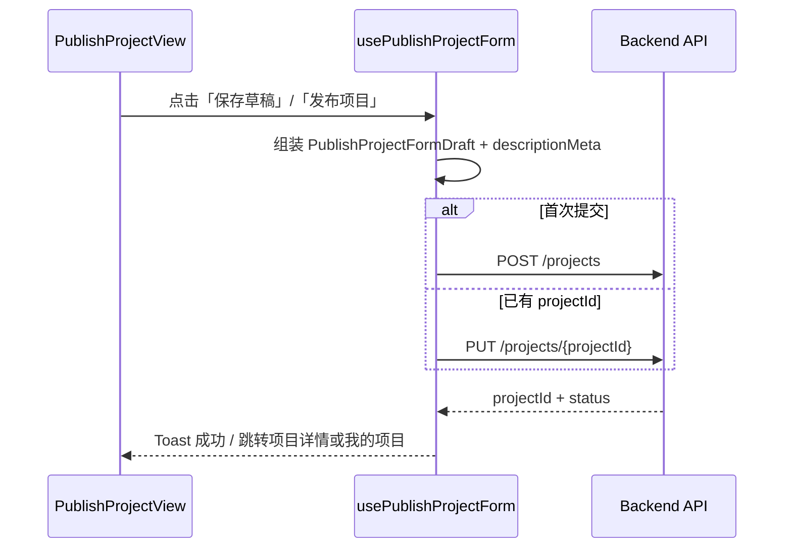
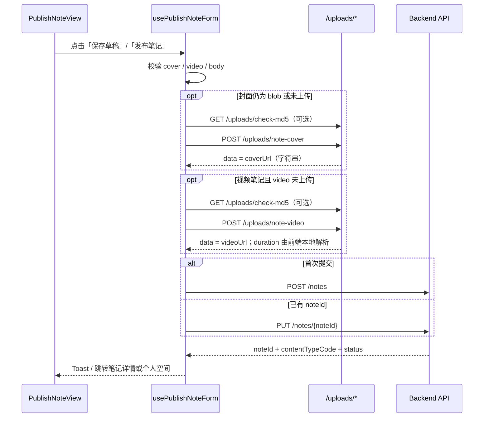
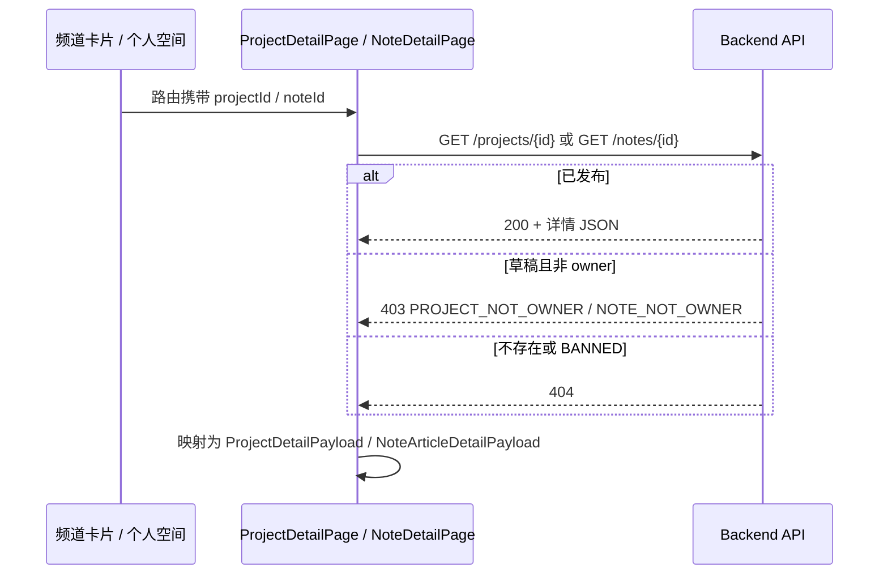

# UniBridge Web-Client 发布与详情 API 请求文档（测试版）

> 本机联调地址（localhost）：`http://localhost:8081/api/v1/client`
>
> 本文档覆盖以下页面所需接口：
>
> | 页面 | 路由 | 主要接口 |
> |------|------|----------|
> | `PublishProject` | `/publish/project` | `POST/PUT /projects` |
> | `PublishNote` | `/publish/note` | `POST/PUT /notes`、`POST /uploads/*` |
> | `ProjectDetailPage` | `/project/detail` | `GET /projects/{projectId}` |
> | `NoteDetailPage` | `/note/detail` | `GET /notes/{noteId}` |
>
> 前端接入点（发布页底栏固定操作栏）：
>
> | 页面 | 组件位置 | 按钮 | 对应接口 |
> |------|----------|------|----------|
> | 发布项目 | `PublishProjectView.tsx` L325-327 | 保存草稿 | `POST /projects`（`publishAction=DRAFT`）或 `PUT /projects/{id}` |
> | 发布项目 | `PublishProjectView.tsx` L331-333 | 发布项目 | `POST /projects`（`publishAction=PUBLISH`）或 `PUT /projects/{id}` |
> | 发布笔记 | `PublishNoteView.tsx` L293-295 | 保存草稿 | `POST /notes`（`publishAction=DRAFT`）或 `PUT /notes/{id}` |
> | 发布笔记 | `PublishNoteView.tsx` L299-301 | 发布笔记 | `POST /notes`（`publishAction=PUBLISH`）或 `PUT /notes/{id}` |
>
> 数据库参考：`db.sql` 中 `project` / `project_commercial_secret`（L196-266）、`note`（L332-373）、`user_profile`（L95-113）。

> 基础路径约定：前端 `axios` 默认 `baseURL = /api/v1/client`。  
> 下文所有路径均相对 `/api/v1/client`。

---

## 00）实现状态

> 本文档定义发布与详情相关接口契约；**下列接口均已实现**（本地多媒体落盘 + 发布 CRUD + 详情读）。

| 接口 | Method | Path | 状态 |
|------|--------|------|------|
| 创建项目 | POST | `/projects` | 已实现 |
| 更新项目 | PUT | `/projects/{projectId}` | 已实现 |
| 查询项目草稿 | GET | `/projects/{projectId}/draft` | 已实现 |
| **查询项目详情** | GET | `/projects/{projectId}` | 已实现 |
| 上传笔记封面 | POST | `/uploads/note-cover` | 已实现（本地落盘 + MD5 秒传） |
| 上传笔记视频 | POST | `/uploads/note-video` | 已实现（本地落盘 + MD5 秒传） |
| **秒传预检** | GET | `/uploads/check-md5` | 已实现 |
| 创建笔记 | POST | `/notes` | 已实现 |
| 更新笔记 | PUT | `/notes/{noteId}` | 已实现 |
| 查询笔记草稿 | GET | `/notes/{noteId}/draft` | 已实现 |
| **查询笔记详情** | GET | `/notes/{noteId}` | 已实现 |

---

## 01）通用约定

### 01.1）统一响应结构

```json
{
  "code": 200,
  "message": "success",
  "data": {}
}
```

- `code=200`：业务成功
- 非 `200`：业务失败，`message` 用于 Toast / 表单顶部错误提示
- `data` 为业务对象

### 01.2）认证与鉴权

- **写接口**（`POST` / `PUT`）与 **草稿读接口**（`GET .../draft`）：需要登录态。
- **详情读接口**（`GET /projects/{id}`、`GET /notes/{id}`）：
  - `status` 为已发布态（项目 `OPEN|ONGOING|CLOSED`、笔记 `PUBLISHED`）：**可不登录**（公开读）。
  - `status=DRAFT`：仅 **owner** 登录后可读。
  - 笔记 `status=BANNED`：一律不可读（返回 `NOTE_NOT_FOUND` 或 `NOTE_BANNED`）。
- 需要登录时，请求头统一携带：

```http
Authorization: Bearer <access_token>
```

- `owner_id` / `user_id` 以 token 解析为准；前端 `localStorage.user_id` 仅用于联调对照。

### 01.3）发布动作（publishAction）

| 值 | 说明 | 项目落库 | 笔记落库 |
|----|------|----------|----------|
| `DRAFT` | 保存草稿，可继续编辑 | `project.status='DRAFT'`，`published_at=NULL` | `note.status='DRAFT'`，`published_at=NULL` |
| `PUBLISH` | 正式发布 | `project.status='OPEN'`，写入 `published_at=NOW()`，同步 `updated_at`；`created_at` 不变 | `note.status='PUBLISHED'`，写入 `published_at=NOW()`，同步 `updated_at`；`created_at` 不变 |

**时间字段语义（项目 / 笔记通用）**

| 字段 | 含义 |
|------|------|
| `created_at` | 记录在数据库中**首次创建**的时间，草稿保存后不再变更 |
| `published_at` | 用户在前端点击「发布」并校验通过后写入；草稿态为 `NULL` |
| `updated_at` | 任意保存（含草稿编辑、正式发布）时由数据库自动更新 |

### 01.4）前端表单类型对齐

| 类型 | 说明 | 定义位置 |
|------|------|----------|
| `PublishProjectFormDraft` | 发布项目表单 | `publishProjectPageData.ts` |
| `PublishNoteFormDraft` | 发布笔记表单 | `publishNotePageData.ts` |
| `ProjectDetailPayload` | 项目详情页展示 | `ProjectDetailPage/types.ts` |
| `NoteArticleDetailPayload` | 图文笔记详情页展示 | `NoteDetailPage/types.ts` |
| `MarkdownContentChangeMeta` | 正文/需求说明来源：`editor` \| `upload` | `OnlineEditor/types/content.ts` |
| `LevelCode` | `N` / `R` / `SR` / `SSR` / `UR` | `types/level.ts` |

---

## 02）发布项目（PublishProject）

> 消费组件：`PublishProjectView`  
> Hook：`usePublishProjectForm`（`handleSaveDraft` / `handlePublish`）

### 02.1）创建项目（草稿 / 发布）

- **Method**：`POST`
- **Path**：`/projects`
- **Auth**：是
- **说明**：首次保存草稿或首次发布时调用。成功后返回 `projectId`，后续更新走 **02.2）**。

#### Request Body

```json
{
  "publishAction": "DRAFT",
  "title": "数据可视化大屏设计与开发",
  "summary": "基于 Vue3 + ECharts 构建企业级可视化大屏。",
  "channel": "enterprise",
  "campusRecruitType": null,
  "description": "# 项目背景\n\n## 交付物\n- 大屏原型\n- 前端实现",
  "amount": "18600",
  "level": "SR",
  "duration": "4 周",
  "teamSize": "1-3 人",
  "skillTags": ["Vue3", "ECharts", "可视化"],
  "deadline": "2026-06-30"
}
```

| 字段 | 类型 | 必填 | 说明 |
|------|------|------|------|
| `publishAction` | string | 是 | `DRAFT` \| `PUBLISH` |
| `title` | string | 是 | 项目标题 → `project.title` |
| `summary` | string | 是 | 一句话摘要（建议 ≤80 字）→ `project.preview` |
| `channel` | string | 是 | 项目频道：`enterprise`（商业项目）\| `campus`（招募/实践项目）→ `project.category` |
| `campusRecruitType` | string \| null | 条件 | `channel=campus` 时必填 → `project.recruitment_type`；商业项目传 `null` |
| `description` | string | 条件 | 项目详情 Markdown 正文；`PUBLISH` 时必填 → `project.description`（前端 Milkdown 编辑，服务端仅存 Markdown） |
| `amount` | string | 条件 | 预算数值字符串（后端解析为 DECIMAL）。商业项目 `PUBLISH` 时可选；可为空或 `0` |
| `level` | string | 是 | `N` / `R` / `SR` / `SSR` / `UR` → `project.level` |
| `duration` | string | 否 | 预计周期 → `project.duration` |
| `teamSize` | string | 否 | 团队人数 → `project.team_size` |
| `skillTags` | string[] | 是 | 技能标签 → `project.tags`（JSON 数组） |
| `deadline` | string | 否 | 报名截止日期 `YYYY-MM-DD` → `project.deadline` |

**发布权限（`user_auth_link.role`，取当前 `is_active=1` 身份）**

| 角色 | 可发布 `channel` | 说明 |
|------|------------------|------|
| `PM` | 仅 `enterprise` | 只能发布商业项目 |
| `MENTOR` | `enterprise` + `campus` | 可发布商业与招募项目 |
| `STUDENT` | 仅 `campus` | 只能发布招募/实践项目 |

不满足权限时返回 `PROJECT_PUBLISH_FORBIDDEN`。

#### Response Data

```json
{
  "projectId": 90001,
  "publishAction": "DRAFT",
  "status": "DRAFT",
  "category": "COMMERCIAL",
  "recruitmentType": null,
  "publishedAt": null,
  "createdAt": "2026-05-22T10:00:00+08:00",
  "updatedAt": "2026-05-22T10:00:00+08:00"
}
```

| 字段 | 类型 | 说明 |
|------|------|------|
| `projectId` | number | 新建项目 ID |
| `status` | string | `DRAFT`（草稿）\| `OPEN`（已发布）\| `ONGOING` \| `CLOSED` |
| `category` | string | `COMMERCIAL` \| `RECRUITMENT` |
| `recruitmentType` | string \| null | 招募子类型；商业项目为 `null` |
| `publishedAt` | string \| null | 正式发布时间；草稿为 `null` |
| `createdAt` | string | 记录创建时间 |
| `updatedAt` | string | 最后更新时间 |

#### 常见错误码

- `UNAUTHORIZED` / `ACCESS_TOKEN_EXPIRED`
- `VALIDATION_FAILED`（标题/摘要/描述/标签/金额校验失败）
- `AMOUNT_PARSE_FAILED`（金额无法解析为有效 DECIMAL）
- `PROJECT_PUBLISH_FORBIDDEN`（无企业发布权限等）

---

### 02.2）更新项目（草稿 / 发布）

- **Method**：`PUT`
- **Path**：`/projects/{projectId}`
- **Auth**：是
- **说明**：编辑已有草稿或已发布项目后再次保存。请求体与 **02.1）** 相同；仅 `owner_id` 匹配时可操作。

#### Path Parameters

| 参数 | 类型 | 必填 | 说明 |
|------|------|------|------|
| `projectId` | number | 是 | 项目 ID |

#### Response Data

同 **02.1）**，`projectId` 与路径一致。

#### 常见错误码

- `PROJECT_NOT_FOUND`
- `PROJECT_NOT_OWNER`
- 其余同 **02.1）**

---

### 02.3）查询项目草稿（进入编辑页，可选）

- **Method**：`GET`
- **Path**：`/projects/{projectId}/draft`
- **Auth**：是
- **说明**：从「我的项目」进入编辑页时拉取草稿；当前发布页原型未接路由参数，联调阶段可跳过，由前端 `sessionStorage` 暂存。

#### Response Data

```json
{
  "projectId": 90001,
  "publishAction": "DRAFT",
  "title": "数据可视化大屏设计与开发",
  "summary": "基于 Vue3 + ECharts 构建企业级可视化大屏。",
  "channel": "enterprise",
  "campusRecruitType": null,
  "description": "# 项目背景\n...",
  "amount": "18600",
  "level": "SR",
  "duration": "4 周",
  "teamSize": "1-3 人",
  "skillTags": ["Vue3", "ECharts"],
  "deadline": "2026-06-30",
  "descriptionEditorType": "MARKDOWN"
}
```

> `descriptionEditorType` ← `project.editor_type`；响应用 camelCase，库表为 snake_case。

---

### 02.4）数据库映射（project / project_commercial_secret）

#### 频道 → 主表分类

| 前端 `channel` | `project.category` | `campusRecruitType` → `project.recruitment_type` |
|----------------|-------------------|--------------------------------------------------|
| `enterprise` | `COMMERCIAL` | `NULL` |
| `campus` | `RECRUITMENT` | `LAB_RECRUIT` \| `TEAM_RECRUIT` \| `CAMPUS_PRACTICE` \| `PERSONAL_RECRUIT` |

#### 字段映射

| 前端字段 | 数据库表.字段 | 备注 |
|----------|---------------|------|
| `title` | `project.title` | |
| `summary` | `project.preview` | |
| `description` | `project.description` | Markdown 正文（Milkdown） |
| （读响应） | `project.editor_type` | → `descriptionEditorType` |
| （后端默认） | `project.editor_type` | 写接口不传时后端写 `MARKDOWN` |
| `skillTags` | `project.tags` | JSON 数组 |
| `level` | `project.level` | |
| `duration` | `project.duration` | |
| `teamSize` | `project.team_size` | |
| `deadline` | `project.deadline` | `DATE` |
| token 用户 | `project.owner_id` | |
| `amount`（解析后） | `project_commercial_secret.total_budget` | 仅**有保密需求的商业项目**创建扩展表；招募项目不需要 |
| `publishAction=DRAFT` | `project.status='DRAFT'`，`published_at=NULL` | 默认状态为 `DRAFT`，防止意外发布 |
| `publishAction=PUBLISH` | `project.status='OPEN'`，`published_at=NOW()`，`updated_at` 同步更新 | `created_at` 不变 |

#### 商业扩展表（`project_commercial_secret`）

| 场景 | 处理方式 |
|------|----------|
| `channel=enterprise` 且需保密托管金额 | 插入一行：`commercial_status='PENDING_START'`，`total_budget` 来自 `amount`（可为 `0` 或空） |
| `channel=campus`（招募/实践） | **不创建**扩展表 |

---

## 03）发布笔记（PublishNote）

> 消费组件：`PublishNoteView`  
> Hook：`usePublishNoteForm`（`handleSaveDraft` / `handlePublish`）  
> 关联：`usePublishNoteCover`（封面）、`PublishNoteVideoUploadCard`（视频）

### 03.1）媒体上传（发布前置）

笔记发布前需先将封面/视频上传至本地静态目录（联调阶段模拟 OSS），拿到 URL 再调用 **03.2）** / **03.3）**。

> **MD5 去重秒传**：同一文件内容（MD5 相同）只落盘一次；重复上传直接复用 `file_records` 中已有 URL，不写盘。大文件可先调 **03.1.0）** 预检，命中则跳过 POST 上传。

#### 03.1.0）秒传预检（可选，大文件推荐）

- **Method**：`GET`
- **Path**：`/uploads/check-md5`
- **Auth**：否（当前未校验）
- **说明**：正式上传前仅传 MD5；命中则前端可直接使用返回的 `filePath`，省去带宽。

| 参数 | 类型 | 必填 | 说明 |
|------|------|------|------|
| `md5` | string | 是 | 32 位小写十六进制 MD5 |

#### Response Data

**已存在（可秒传）**

```json
{
  "code": 200,
  "message": "success",
  "data": {
    "exists": true,
    "filePath": "http://localhost:8081/uploads/videos/a1b2c3d4.mp4"
  }
}
```

**不存在（需 POST 上传）**

```json
{
  "code": 200,
  "message": "success",
  "data": {
    "exists": false,
    "filePath": null
  }
}
```

---

#### 03.1.1）上传封面图

- **Method**：`POST`
- **Path**：`/uploads/note-cover`
- **Content-Type**：`multipart/form-data`
- **Auth**：否（当前后端未校验 token；生产环境建议补上）

| 字段 | 类型 | 必填 | 说明 |
|------|------|------|------|
| `file` | File | 是 | 图片文件（用户上传封面，或前端 Canvas 生成后转 Blob） |
| `source` | string | 否 | `auto` \| `upload`，**仅前端 UI 状态**；后端当前忽略 |

#### Response Data

> 统一走 §01.1 `Result` 结构；`data` 为 **URL 字符串**（非 `{ coverUrl }` 对象）。前端取值：`const coverUrl = res.data`。

```json
{
  "code": 200,
  "message": "success",
  "data": "http://localhost:8081/uploads/covers/3f2a1b9c-uuid.jpg"
}
```

- 同一文件 MD5 已存在时：仍返回 200，`data` 为库中已有 URL（秒传，不写盘）。

---

#### 03.1.2）上传视频（视频笔记）

- **Method**：`POST`
- **Path**：`/uploads/note-video`
- **Content-Type**：`multipart/form-data`
- **Auth**：否（当前后端未校验 token；生产环境建议补上）

| 字段 | 类型 | 必填 | 说明 |
|------|------|------|------|
| `file` | File | 是 | 视频源文件 |

#### Response Data

> 统一走 §01.1 `Result` 结构；`data` 为 **视频 URL 字符串**。`videoDuration`、封面 **不由本接口返回**。

```json
{
  "code": 200,
  "message": "success",
  "data": "http://localhost:8081/uploads/videos/8e7d6c5b-uuid.mp4"
}
```

| 字段 | 来源 | 说明 |
|------|------|------|
| `videoUrl` | `POST /uploads/note-video` 的 `data` | 直接作为笔记 `videoUrl` |
| `videoDuration` | **前端本地** | 浏览器读取视频元数据（如 `<video>` `duration`） |
| `coverUrl` | **单独上传** | 调用 **03.1.1）** 上传封面；后端**不**截取视频首帧 |

- 同一视频 MD5 已存在时：秒传复用已有 `data` URL。
- 若产品需要「服务端截帧封面 + 解析时长」，需另开增强接口；当前联调版未实现。

---

### 03.2）创建笔记（草稿 / 发布）

- **Method**：`POST`
- **Path**：`/notes`
- **Auth**：是
- **说明**：首次保存草稿或首次发布。

#### Request Body

**图文笔记示例**

```json
{
  "publishAction": "PUBLISH",
  "title": "大三暑期实习投递复盘",
  "summary": "从简历、笔试到面试的完整时间线与踩坑总结。",
  "contentType": "图文",
  "content": "# 背景\n\n## 时间线\n...",
  "tags": ["求职经验", "实习"],
  "coverUrl": "https://cdn.example.com/notes/cover/abc123.jpg"
}
```

**视频笔记示例**

```json
{
  "publishAction": "DRAFT",
  "title": "如何设计一个高质量用户系统",
  "summary": "结合权限模型与可观测方案的经验分享。",
  "contentType": "视频",
  "tags": ["系统设计"],
  "coverUrl": "https://cdn.example.com/notes/cover/frame-xyz789.jpg",
  "videoUrl": "https://cdn.example.com/notes/video/xyz789.mp4",
  "videoDuration": 186
}
```

| 字段 | 类型 | 必填 | 说明 |
|------|------|------|------|
| `publishAction` | string | 是 | `DRAFT` \| `PUBLISH` |
| `title` | string | 是 | → `note.title` |
| `summary` | string | 是 | 简介 → `note.summary`（视频笔记无单独 `videoDescription`） |
| `contentType` | string | 是 | 前端枚举：`图文` \| `视频`；**创建后不可变更** |
| `content` | string \| null | 条件 | **仅 `contentType=图文` 时**写入 `note.content`（Markdown）；视频笔记忽略/不传 |
| `tags` | string[] | 是 | → `note.tags` JSON |
| `coverUrl` | string | 是 | → `note.cover_url`；**草稿与发布均必填**（视觉统一） |
| `videoUrl` | string | 条件 | `contentType=视频` 且 `PUBLISH` 时必填 → `note.video_url` |
| `videoDuration` | number | 否 | 秒 → `note.video_duration` |

**后端校验规则**

| 规则 | 说明 |
|------|------|
| 无发布权限限制 | 任意登录用户可发布笔记 |
| `contentType` 不可变 | 创建后禁止图文↔视频互转；修改类型需新建笔记 → `NOTE_TYPE_IMMUTABLE` |
| `content` 与类型对应 | `图文`：可写 `content`；`视频`：不写入 `content`（保持 `NULL`） |
| 无 `editorType` 请求字段 | 前端统一 Milkdown；库表保留 `editor_type`，后端默认写 `MARKDOWN` |
| 无 `images` | 正文 Markdown 内嵌图片，不使用独立 URL 数组 |

#### Response Data

```json
{
  "noteId": 80001,
  "contentTypeCode": "TXa1B2c3D4e5F",
  "publishAction": "PUBLISH",
  "status": "PUBLISHED",
  "publishedAt": "2026-05-22T11:30:00+08:00",
  "createdAt": "2026-05-22T11:00:00+08:00",
  "updatedAt": "2026-05-22T11:30:00+08:00"
}
```

| 字段 | 类型 | 说明 |
|------|------|------|
| `noteId` | number | 笔记主键 |
| `contentTypeCode` | string | 后端生成：`TX` + 11 位 或 `VD` + 11 位 → `note.content_type_code` |
| `status` | string | `DRAFT` \| `PUBLISHED` |

#### 内容类型编码规则（后端生成）

| 前端 `contentType` | `content_type_code` 格式 | 生成方式 |
|--------------------|-------------------------|----------|
| `图文` | `TX` + 11 位 `[A-Za-z0-9]` | NanoID 随机后缀，碰撞时重试 |
| `视频` | `VD` + 11 位 `[A-Za-z0-9]` | NanoID 随机后缀，碰撞时重试 |

实现类：`NoteContentTypeCodeGenerator`（字符集与 `db.sql` CHECK 一致）。

#### 常见错误码

- `UNAUTHORIZED` / `ACCESS_TOKEN_EXPIRED`
- `VALIDATION_FAILED`
- `COVER_REQUIRED`（缺少 `coverUrl`）
- `VIDEO_REQUIRED`（视频笔记发布时缺少 `videoUrl`）
- `CONTENT_REQUIRED`（图文笔记发布时 `content` 为空）
- `INVALID_CONTENT_TYPE_CODE`（生成编码不符合 CHECK）

---

### 03.3）更新笔记（草稿 / 发布）

- **Method**：`PUT`
- **Path**：`/notes/{noteId}`
- **Auth**：是
- **说明**：请求体同 **03.2）**；`contentType` / `content_type_code` 创建后**不可变更**（禁止图文↔视频互转）。

#### Path Parameters

| 参数 | 类型 | 必填 | 说明 |
|------|------|------|------|
| `noteId` | number | 是 | 笔记 ID |

#### Response Data

同 **03.2）**。

#### 常见错误码

- `NOTE_NOT_FOUND`
- `NOTE_NOT_OWNER`
- `NOTE_TYPE_IMMUTABLE`（尝试修改 `contentType` / `content_type_code`）
- 其余同 **03.2）**

---

### 03.4）查询笔记草稿（可选）

- **Method**：`GET`
- **Path**：`/notes/{noteId}/draft`
- **Auth**：是

#### Response Data

与 **03.2）Request Body** 结构一致，并附带 `noteId`、`contentTypeCode`、`editorType`（← `note.editor_type`）。

---

### 03.5）数据库映射（note）

| 前端字段 | 数据库表.字段 | 备注 |
|----------|---------------|------|
| token 用户 | `note.user_id` | |
| 后端生成 | `note.content_type_code` | NanoID：`TX`/`VD` + 11 位，见 **03.2）** |
| `title` | `note.title` | |
| `summary` | `note.summary` | 简介（视频笔记亦用此字段，无 `videoDescription`） |
| `content` | `note.content` | 仅图文笔记写入 Markdown；视频为 `NULL` |
| （读响应） | `note.editor_type` | → `editorType` |
| （后端默认） | `note.editor_type` | 写接口不传时后端写 `MARKDOWN` |
| `tags` | `note.tags` | JSON |
| `coverUrl` | `note.cover_url` | 草稿/发布均必填 |
| `videoUrl` | `note.video_url` | 仅视频 |
| `videoDuration` | `note.video_duration` | 仅视频 |
| `publishAction=DRAFT` | `note.status='DRAFT'`，`published_at=NULL` | |
| `publishAction=PUBLISH` | `note.status='PUBLISHED'`，`published_at=NOW()`，`updated_at` 同步更新 | `created_at` 为首次入库时间，不变 |
| （响应）`publishedAt` | `note.published_at` | 草稿为 `null` |

计数器 `view_count` / `like_count` 等创建时默认 `0`，无需前端传入。

**个人空间读接口约定（`GET /user-profile/home`、`/notes`）**

| 字段 | 说明 |
|------|------|
| `projects[].id` / `notes[].id` | 项目/笔记主键，供详情页/编辑页路由使用 |
| 列表排序 | `ORDER BY COALESCE(published_at, created_at) DESC` |
| `publishTime` 展示 | 优先 `published_at`，为空则回退 `created_at` |

---

## 04）前端字段 → 请求体组装说明

### 04.1）发布项目（`usePublishProjectForm`）

| 前端状态 | 请求字段 |
|----------|----------|
| `draft.title` | `title` |
| `draft.summary` | `summary` |
| `draft.channel` | `channel` |
| `draft.campusRecruitType` | `campusRecruitType`（`channel=campus` 时） |
| `draft.description` | `description` |
| `draft.amount` | `amount` |
| `draft.level` | `level` |
| `draft.duration` | `duration` |
| `draft.teamSize` | `teamSize` |
| `draft.skillTags` | `skillTags` |
| `draft.deadline` | `deadline` |
| 按钮「保存草稿」 | `publishAction: 'DRAFT'` |
| 按钮「发布项目」 | `publishAction: 'PUBLISH'` |

**校验建议（与前端 `completionPercent` 对齐）**

| `publishAction` | 必填项 |
|-----------------|--------|
| `DRAFT` | `title`（建议宽松，允许空摘要暂存） |
| `PUBLISH` | `title`、`summary`、`description`、`amount`、`skillTags.length >= 1` |

---

### 04.2）发布笔记（`usePublishNoteForm`）

| 前端状态 | 请求字段 |
|----------|----------|
| `draft.title` | `title` |
| `draft.summary` | `summary` |
| `draft.contentType` | `contentType` |
| `draft.body` | `content`（仅 `contentType=图文`） |
| `draft.tags` | `tags` |
| `cover.activePreviewUrl` 上传后 | `coverUrl`（草稿亦必填） |
| `videoUpload` 上传后 | `videoUrl`、`videoDuration` |
| 按钮「保存草稿」 | `publishAction: 'DRAFT'` |
| 按钮「发布笔记」 | `publishAction: 'PUBLISH'` |

**校验建议**

| `publishAction` | 必填项 |
|-----------------|--------|
| `DRAFT` | `title`、`coverUrl`（视觉统一） |
| `PUBLISH` | `title`、`summary`、`tags.length >= 1`、`coverUrl`；`contentType=图文` 需 `content`；`contentType=视频` 需 `videoUrl` |

---

## 05）前端调用时序

### 05.1）发布项目



| 用户操作 | 接口 | `publishAction` |
|----------|------|-----------------|
| 保存草稿 | `POST` 或 `PUT /projects` | `DRAFT` |
| 发布项目 | `POST` 或 `PUT /projects` | `PUBLISH` |

> 「预览」按钮当前为原型（`console.info`），不调用后端；若后续接入可增加 `GET /projects/preview` 返回卡片快照。

---

### 05.2）发布笔记



| 用户操作 | 前置上传 | 主接口 | `publishAction` |
|----------|----------|--------|-----------------|
| 保存草稿 | 封面建议上传（或允许 data URL 暂存，联调约定） | `POST/PUT /notes` | `DRAFT` |
| 发布笔记 | 封面必填；视频需 `note-video` | `POST/PUT /notes` | `PUBLISH` |

---

## 06）详情读接口

> 消费组件：`ProjectDetailPage` / `NoteDetailPage`  
> 前端类型：`ProjectDetailPayload`、`NoteArticleDetailPayload`  
> 路由建议：发布/列表跳转时携带 `projectId` / `noteId`（如 `/project/detail?id=90001`），详情页调用下列接口；`PREVIEW` 仍为发布页本地预览，**无对应读接口**。

### 06.1）查询项目详情

- **Method**：`GET`
- **Path**：`/projects/{projectId}`
- **Auth**：条件（见 §01.2）
- **说明**：供 `ProjectDetailView` 渲染标题、合作信息、技能标签与 Markdown 需求详情。

#### Path Parameters

| 参数 | 类型 | 必填 | 说明 |
|------|------|------|------|
| `projectId` | number | 是 | `project.id` |

#### Response Data

```json
{
  "projectId": 90001,
  "title": "数据可视化大屏设计与开发",
  "summary": "基于 Vue3 + ECharts 构建企业级可视化大屏。",
  "channel": "enterprise",
  "campusRecruitType": null,
  "description": "# 项目背景\n...",
  "descriptionEditorType": "MARKDOWN",
  "amount": "18600",
  "level": "SR",
  "duration": "4 周",
  "teamSize": "1-3 人",
  "skillTags": ["Vue3", "ECharts", "可视化"],
  "deadline": "2026-06-30",
  "status": "OPEN",
  "publishedAt": "2026-05-22T10:30:00+08:00",
  "updatedAt": "2026-05-22T11:00:00+08:00"
}
```

| 字段 | 类型 | 说明 | 数据库来源 |
|------|------|------|------------|
| `projectId` | number | 项目 ID | `project.id` |
| `title` | string | 标题 | `project.title` |
| `summary` | string | 摘要 | `project.preview` |
| `channel` | string | `enterprise` \| `campus` | 由 `project.category` 反查：`COMMERCIAL`→`enterprise`，`RECRUITMENT`→`campus` |
| `campusRecruitType` | string \| null | 高校子类型 | `project.recruitment_type`；商业项目为 `null` |
| `description` | string | Markdown 正文 | `project.description` |
| `descriptionEditorType` | string | `MARKDOWN` \| `RICHTEXT` | `project.editor_type` |
| `amount` | string \| null | 预算展示文案 | `project_commercial_secret.total_budget`（仅 `COMMERCIAL`）；招募项目返回 `null`，前端展示占位 |
| `level` | string | 难度等级 | `project.level` |
| `duration` | string \| null | 周期 | `project.duration` |
| `teamSize` | string \| null | 团队规模 | `project.team_size` |
| `skillTags` | string[] | 技能标签 | `project.tags` JSON |
| `deadline` | string \| null | `YYYY-MM-DD` | `project.deadline` |
| `status` | string | `DRAFT` \| `OPEN` \| `ONGOING` \| `CLOSED` | `project.status` |
| `publishedAt` | string \| null | 发布时间 | `project.published_at` |
| `updatedAt` | string | 最后更新 | `project.updated_at` |

**前端映射（`ProjectDetailPayload`）**

| API 字段 | 前端字段 | 规则 |
|----------|----------|------|
| `channel` + `campusRecruitType` | `channelLabel` | 前端 `resolveProjectChannelLabel()` 本地计算 |
| `status` | `publishStatus` | `DRAFT`→`DRAFT`；`OPEN|ONGOING|CLOSED`→`PUBLISHED` |
| `updatedAt` | `updatedAt` | ISO 字符串 |
| — | `PREVIEW` | 仅发布页路由 state / sessionStorage，**不来自 API** |

**可见性**

| `project.status` | 未登录 | 登录非 owner | owner |
|------------------|--------|--------------|-------|
| `DRAFT` | 404 | 403 | ✅ |
| `OPEN` / `ONGOING` / `CLOSED` | ✅ | ✅ | ✅ |

#### 常见错误码

- `PROJECT_NOT_FOUND`
- `PROJECT_NOT_OWNER`（草稿且非 owner）
- `UNAUTHORIZED`（草稿未登录）

---

### 06.2）查询笔记详情

- **Method**：`GET`
- **Path**：`/notes/{noteId}`
- **Auth**：条件（见 §01.2）
- **说明**：供 `NoteArticleDetailView`（图文）及后续视频详情页渲染；按 `content_type_code` 前缀区分类型。

#### Path Parameters

| 参数 | 类型 | 必填 | 说明 |
|------|------|------|------|
| `noteId` | number | 是 | `note.id` |

#### Response Data（图文）

```json
{
  "noteId": 80001,
  "contentType": "图文",
  "contentTypeCode": "TXa1B2c3D4e5F",
  "title": "大三暑期实习投递复盘",
  "summary": "从简历、笔试到面试的完整时间线与踩坑总结。",
  "body": "# 背景\n\n## 时间线\n...",
  "editorType": "MARKDOWN",
  "tags": ["求职经验", "实习"],
  "coverUrl": "https://cdn.example.com/notes/cover/abc123.jpg",
  "author": {
    "name": "张同学",
    "handle": "zhang",
    "avatarUrl": "https://cdn.example.com/avatar/u10001.jpg"
  },
  "publishTime": "2026-05-22T11:30:00+08:00",
  "updateTime": "2026-05-22T11:30:00+08:00",
  "views": 128,
  "comments": 6,
  "favorites": 24,
  "status": "PUBLISHED"
}
```

#### Response Data（视频，增量字段）

```json
{
  "noteId": 80002,
  "contentType": "视频",
  "contentTypeCode": "VDx9Y8z7W6v5U",
  "title": "如何设计一个高质量用户系统",
  "summary": "结合权限模型与可观测方案的经验分享。",
  "body": null,
  "editorType": "MARKDOWN",
  "tags": ["系统设计"],
  "coverUrl": "https://cdn.example.com/notes/cover/frame.jpg",
  "videoUrl": "https://cdn.example.com/notes/video/xyz789.mp4",
  "videoDuration": 186,
  "author": { "name": "李同学", "handle": "li", "avatarUrl": null },
  "publishTime": "2026-05-20T09:00:00+08:00",
  "updateTime": "2026-05-20T09:00:00+08:00",
  "views": 520,
  "comments": 18,
  "favorites": 73,
  "status": "PUBLISHED"
}
```

| 字段 | 类型 | 说明 | 数据库来源 |
|------|------|------|------------|
| `noteId` | number | 笔记 ID | `note.id` |
| `contentType` | string | `图文` \| `视频` | 由 `note.content_type_code` 前缀：`TX*`→`图文`，`VD*`→`视频` |
| `contentTypeCode` | string | 类型编码 | `note.content_type_code` |
| `title` | string | 标题 | `note.title` |
| `summary` | string | 摘要 | `note.summary` |
| `body` | string \| null | Markdown 正文 | `note.content`；视频笔记为 `null` |
| `editorType` | string | `MARKDOWN` \| `RICHTEXT` | `note.editor_type` |
| `tags` | string[] | 话题标签 | `note.tags` JSON |
| `coverUrl` | string | 封面 | `note.cover_url` |
| `videoUrl` | string | 视频地址 | `note.video_url`；仅 `contentType=视频` |
| `videoDuration` | number | 时长（秒） | `note.video_duration`；仅视频 |
| `author.name` | string | 作者昵称 | `user_profile.nick_name`（空则回退「用户」） |
| `author.handle` | string | 作者 handle | `user_profile.nick_name` slug 或 `user_{id}` |
| `author.avatarUrl` | string \| null | 头像 | `user_profile.avatar_url` |
| `publishTime` | string | 展示用发布时间 | `COALESCE(note.published_at, note.created_at)` |
| `updateTime` | string | 最近更新 | `note.updated_at` |
| `views` | number | 浏览量 | `note.view_count` |
| `comments` | number | 评论数 | `note.comment_count` |
| `favorites` | number | 收藏数 | `note.collect_count` |
| `status` | string | `DRAFT` \| `PUBLISHED` | `note.status` |

**前端映射（`NoteArticleDetailPayload`）**

| API 字段 | 前端字段 | 规则 |
|----------|----------|------|
| `body` | `body` | 图文直接映射 |
| `status` | `publishStatus` | `DRAFT`→`DRAFT`；`PUBLISHED`→`PUBLISHED` |
| `publishTime` / `updateTime` | 同名字段 | ISO 或前端格式化 |
| — | `PREVIEW` | 仅发布页本地预览 |

**可见性**

| `note.status` | 未登录 | 登录非 owner | owner |
|---------------|--------|--------------|-------|
| `DRAFT` | 404 | 403 | ✅ |
| `PUBLISHED` | ✅ | ✅ | ✅ |
| `BANNED` | 404 | 404 | 404 |

> 公开读 `PUBLISHED` 笔记时，后端可在返回前对 `view_count` +1（异步亦可）。

#### 常见错误码

- `NOTE_NOT_FOUND`（含 BANNED 对外隐藏）
- `NOTE_NOT_OWNER`（草稿且非 owner）
- `UNAUTHORIZED`（草稿未登录）

---

### 06.3）详情页调用时序



| 入口 | 路由参数 | 读接口 |
|------|----------|--------|
| 企业实战 / 高校招募卡片 | `projectId` | `GET /projects/{projectId}` |
| 经验分享卡片 | `noteId` | `GET /notes/{noteId}` |
| 个人空间「我的项目/笔记」 | `id` | 同上 |
| 发布页保存后跳转 | 优先使用写接口返回的 `projectId` / `noteId` 再读详情（或继续用本地 preview state） |

---

## 07）联调检查清单

- [ ] 登录后 `localStorage` 存在 `access_token`
- [ ] 项目：`channel` → `category`，`campusRecruitType` → `recruitment_type`（含 `PERSONAL_RECRUIT`）
- [ ] 项目：新建默认 `status=DRAFT`，`published_at=NULL`；发布后为 `OPEN` 且写入 `published_at`
- [ ] 项目：发布权限按 `user_auth_link.role` 校验（PM / MENTOR / STUDENT）
- [ ] 项目：仅保密商业项目写入 `project_commercial_secret`；招募项目不需要
- [ ] 项目：`description` 为 Markdown（Milkdown）；`editor_type` 暂保留，后端默认 `MARKDOWN`
- [ ] 笔记：无 `contentSource` / `contentFileName` / `videoDescription` / 请求体 `editorType` / `images`
- [ ] 笔记：`editor_type` 暂保留于库表，后端默认 `MARKDOWN`
- [ ] 笔记：`contentType=图文` 才写 `content`；视频不写 `content`
- [ ] 笔记：草稿亦必填 `coverUrl`；无发布权限限制；`contentType` 创建后不可变
- [ ] 笔记：`content_type_code` 使用 NanoID 生成 11 位后缀，碰撞重试
- [ ] 读列表：含 `id` 字段；按 `COALESCE(published_at, created_at)` 降序
- [ ] 项目详情：`GET /projects/{id}` 字段可映射 `ProjectDetailPayload`；`channel` / `campusRecruitType` 与 `db.sql` CHECK 一致
- [ ] 项目详情：`amount` 仅商业项目来自 `project_commercial_secret.total_budget`；招募为 `null`
- [ ] 笔记详情：`GET /notes/{id}` 含 `author`、`views`/`comments`/`favorites`；图文返回 `body`，视频返回 `videoUrl`
- [ ] 笔记详情：`publishTime` 使用 `COALESCE(published_at, created_at)`
- [ ] 草稿详情：仅 owner 可读；已发布内容可匿名读
- [ ] 上传：`POST /uploads/note-cover|note-video` 的 `data` 为 URL **字符串**（非 `{ coverUrl }` 对象）
- [ ] 上传：同 MD5 重复上传秒传；`GET /uploads/check-md5` 命中可跳过 POST
- [ ] 上传：视频 `videoDuration` 由前端本地解析；封面走 **03.1.1** 单独上传

---

## 08）错误码汇总

| 错误码 | HTTP 建议 | 说明 |
|--------|-----------|------|
| `UNAUTHORIZED` | 401 | 未登录 |
| `ACCESS_TOKEN_EXPIRED` | 401 | token 过期 |
| `VALIDATION_FAILED` | 400 | 参数校验失败 |
| `PROJECT_NOT_FOUND` | 404 | 项目不存在 |
| `PROJECT_NOT_OWNER` | 403 | 非项目所有者 |
| `PROJECT_NOT_PUBLIC` | 403 | 草稿项目且当前用户非 owner（可与 `PROJECT_NOT_OWNER` 合并） |
| `PROJECT_PUBLISH_FORBIDDEN` | 403 | 当前角色无权发布该频道项目 |
| `AMOUNT_PARSE_FAILED` | 400 | 金额解析失败 |
| `NOTE_NOT_FOUND` | 404 | 笔记不存在 |
| `NOTE_NOT_OWNER` | 403 | 非笔记作者 |
| `NOTE_NOT_PUBLIC` | 403 | 草稿笔记且当前用户非 owner（可与 `NOTE_NOT_OWNER` 合并） |
| `NOTE_BANNED` | 404 | 笔记已封禁（对外统一 404） |
| `COVER_REQUIRED` | 400 | 缺少封面 |
| `VIDEO_REQUIRED` | 400 | 视频笔记缺少视频 |
| `CONTENT_REQUIRED` | 400 | 图文笔记缺少正文 |
| `UPLOAD_FAILED` | 500 | 媒体上传失败 |
