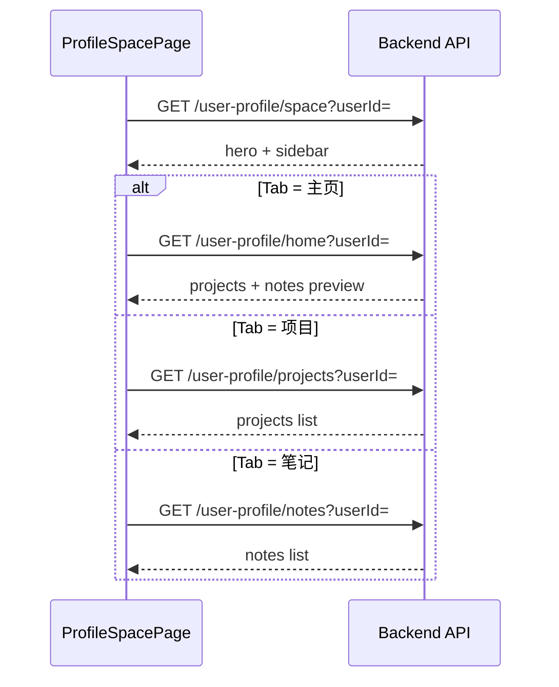

# UniBridge Web-Client Profile Space API 请求文档（测试版）

> 本机联调地址（localhost）：`http://localhost:8081/api/v1/client`
>
> 本文档覆盖个人空间页面与组件联调所需接口：
>
> - `apps/web-client/src/pages/ProfileSpacePage.tsx`
> - `apps/web-client/src/components/profile/ProfileHomeTabContent.tsx`
> - `apps/web-client/src/components/profile/ProfileProjectsTabContent.tsx`
> - `apps/web-client/src/components/profile/ProfileNotesTabContent.tsx`

> 基础路径约定：前端 `axios` 默认 `baseURL = /api/v1/client`。  
> 下文所有路径均相对 `/api/v1/client`。

---

## 01）通用约定

### 01.1）统一响应结构

```json
{
  "code": 200,
  "message": "success",
  "data": {}
}
```

- `code=200`：业务成功
- 非 `200`：业务失败，`message` 用于错误提示
- `data` 为业务对象

### 01.2）认证与鉴权

- 本文档全部接口需要登录态。
- 请求头统一携带：

```http
Authorization: Bearer <access_token>
```

### 01.3）用户身份参数

- 前端从 `localStorage` 读取 `user_id`（登录响应写入）参与请求构造。
- 建议后端以 token 解析出的用户身份为准；`userId` 查询参数用于联调显式指定目标用户（查看他人空间时扩展）。

### 01.4）前端数据类型对齐

| 类型 | 说明 | 使用方 |
|------|------|--------|
| `ProjectItem` | 项目卡片数据 | `ProfileHomeTabContent` / `ProfileProjectsTabContent` / `ProjectCard` |
| `ProfileNoteItem` | 笔记卡片数据 | `ProfileHomeTabContent` / `ProfileNotesTabContent` / `GridNoteCard` / `RowNoteCard` |
| `LevelCode` | 能力等级：`N` / `R` / `SR` / `SSR` / `UR` | `LevelBadge` |

---

## 02）获取个人空间页壳数据（Hero + 右侧栏）

### 02.1）查询个人空间页壳

- **Method**：`GET`
- **Path**：`/user-profile/space`
- **Auth**：是
- **说明**：`ProfileSpacePage` 进入页面时调用，返回顶部 Hero 区与右侧信息侧栏所需数据（与 Tab 切换无关，一次加载）。

#### Query Parameters

| 参数 | 类型 | 必填 | 说明 |
|------|------|------|------|
| `userId` | number | 否 | 目标用户 ID；缺省时由 token 解析当前用户 |

#### Request Data（联调示意）

```json
{
  "userId": 10001,
  "accessToken": "<access_token>"
}
```

#### Response Data

```json
{
  "userId": 10001,
  "hero": {
    "nickname": "张同学",
    "avatarText": "张",
    "avatarUrl": "https://cdn.example.com/avatar/u10001.png",
    "isVerified": true,
    "organization": "深圳技术大学",
    "bio": "热爱技术，喜欢把想法和创意变成价值的产品。",
    "joinDate": "2023.08.12",
    "ipLocation": "广东·深圳"
  },
  "sidebar": {
    "notice": "持续学习，持续创造，保持对前沿技术探索。",
    "level": "SR",
    "verifyStatus": "已实名",
    "organization": "深圳技术大学",
    "position": "学生",
    "skills": ["Vue3", "React", "Python", "AI", "SpringBoot"],
    "team": {
      "name": "智能计算与应用实验室",
      "description": "以工程项目驱动实践，聚焦智能系统与大数据分析方向。",
      "entryPath": "/lab/10001"
    },
    "honors": [],
    "activityHeatmap": [0, 1, 0, 2, 0, 1, 0, 1, 2, 1, 3, 2, 1, 0, 2, 3, 4, 2, 3, 1, 0, 1, 2, 3, 4, 3, 2, 1, 1, 2, 4, 3, 2, 1, 0, 1, 2, 3, 4, 4, 3, 2, 1, 0, 1, 2, 3, 3, 2, 1, 0, 0, 1, 2, 3, 2, 1, 0, 1, 2, 3, 2, 1, 0, 0, 1, 2, 1, 0, 0, 1, 2, 3, 2, 1, 1, 2, 3, 4, 3, 2, 1, 0]
  }
}
```

字段说明：

**hero**

| 字段 | 类型 | 说明 |
|------|------|------|
| `nickname` | string | 用户昵称，对应 Hero 标题 |
| `avatarText` | string | 无头像图时的占位文字（通常取昵称首字） |
| `avatarUrl` | string \| null | 头像图片地址；有值时前端优先渲染 `` |
| `isVerified` | boolean | 是否已实名，控制认证图标显示 |
| `organization` | string \| null | 所属主体名称；为空时不渲染主体行 |
| `bio` | string | 个人简介 |
| `joinDate` | string | 加入时间，展示格式如 `2023.08.12` |
| `ipLocation` | string | IP 属地展示文案 |

**sidebar**

| 字段 | 类型 | 说明 |
|------|------|------|
| `notice` | string | 个人信息卡片顶部提示文案 |
| `level` | string \| null | 能力等级；为空或无效时不渲染 `LevelBadge` |
| `verifyStatus` | string \| null | 实名状态文案，如 `已实名` |
| `organization` | string | 所属主体 |
| `position` | string | 职位/身份，如 `学生` |
| `skills` | string[] | 专业技能标签列表 |
| `team` | object \| null | 所属团队；`null` 时不渲染团队卡片内容区 |
| `team.name` | string | 团队名称 |
| `team.description` | string | 团队简介 |
| `team.entryPath` | string | 「进入团队」跳转路径 |
| `honors` | array | 个人荣誉列表；空数组时展示「暂无荣誉内容」 |
| `activityHeatmap` | number[] | 活跃度热力图数值数组，每项 `0~4` 对应色阶 |

#### 常见错误码

- `UNAUTHORIZED`
- `ACCESS_TOKEN_EXPIRED`
- `USER_NOT_FOUND`

---

## 03）获取个人空间「主页」Tab 数据

### 03.1）查询主页 Tab 内容

- **Method**：`GET`
- **Path**：`/user-profile/home`
- **Auth**：是
- **说明**：供 `ProfileHomeTabContent` 使用，返回「我的项目」「我的笔记」预览列表（主页 Tab 激活时调用）。

#### Query Parameters

| 参数 | 类型 | 必填 | 说明 |
|------|------|------|------|
| `userId` | number | 否 | 目标用户 ID |
| `projectLimit` | number | 否 | 项目预览条数，默认 `4` |
| `noteLimit` | number | 否 | 笔记预览条数，默认 `3` |

#### Request Data（联调示意）

```json
{
  "userId": 10001,
  "accessToken": "<access_token>",
  "projectLimit": 4,
  "noteLimit": 3
}
```

#### Response Data

```json
{
  "userId": 10001,
  "projects": [
    {
      "title": "数据可视化大屏设计与开发",
      "summary": "基于 Vue3 + ECharts 构建企业级可视化大屏，实现业务指标动态展示与交互分析。",
      "tags": [{ "label": "Vue3" }, { "label": "ECharts" }, { "label": "可视化" }],
      "company": "数智未来科技",
      "publisher": "张同学",
      "publishTime": "2024-12-18",
      "level": "SR",
      "amount": "18,600"
    }
  ],
  "notes": [
    {
      "title": "大模型 RAG 系统：从原理到项目落地",
      "summary": "本文梳理检索增强生成系统的关键链路，覆盖 embedding、召回与重排实践。",
      "contentType": "图文",
      "tags": ["人工智能", "RAG", "大模型"],
      "publishTime": "2024-05-18 19:36",
      "updateTime": "2024-05-19",
      "views": 532,
      "comments": 36,
      "favorites": 28,
      "cover": "https://images.unsplash.com/photo-1639322537504-6427a16b0a28?auto=format&fit=crop&w=200&q=80"
    }
  ],
  "projectTotal": 12,
  "noteTotal": 25
}
```

字段说明：

**projects[]（ProjectItem）**

| 字段 | 类型 | 说明 |
|------|------|------|
| `title` | string | 项目标题 |
| `summary` | string | 项目摘要 |
| `tags` | `{ label: string }[]` | 技术/业务标签 |
| `company` | string | 发布企业/主体 |
| `publisher` | string | 发布人昵称 |
| `publishTime` | string | 发布时间，如 `2024-12-18` |
| `level` | string | 项目等级：`N` / `R` / `SR` / `SSR` / `UR` |
| `amount` | string | 项目金额展示文案，如 `18,600` |

**notes[]（ProfileNoteItem）**

| 字段 | 类型 | 说明 |
|------|------|------|
| `title` | string | 笔记标题 |
| `summary` | string | 笔记摘要 |
| `contentType` | string | 内容类型：`图文` / `视频`（笔记 Tab 筛选用） |
| `tags` | string[] | 话题标签 |
| `publishTime` | string | 发布时间 |
| `updateTime` | string | 最近更新时间 |
| `views` | number | 浏览量 |
| `comments` | number | 评论数 |
| `favorites` | number | 收藏数 |
| `cover` | string | 封面图 URL |

| 字段 | 类型 | 说明 |
|------|------|------|
| `projectTotal` | number | 项目总数（用于「查看全部」展示，可选） |
| `noteTotal` | number | 笔记总数（用于「查看全部」展示，可选） |

#### 常见错误码

- `UNAUTHORIZED`
- `ACCESS_TOKEN_EXPIRED`
- `USER_NOT_FOUND`

---

## 04）获取个人空间「项目」Tab 数据

### 04.1）查询项目列表

- **Method**：`GET`
- **Path**：`/user-profile/projects`
- **Auth**：是
- **说明**：供 `ProfileProjectsTabContent` 使用，返回当前用户全部项目列表（切换到「项目」Tab 时调用，前端可展示加载态）。

#### Query Parameters

| 参数 | 类型 | 必填 | 说明 |
|------|------|------|------|
| `userId` | number | 否 | 目标用户 ID |
| `page` | number | 否 | 页码，从 `1` 开始，默认 `1` |
| `pageSize` | number | 否 | 每页条数，默认 `20` |

#### Request Data（联调示意）

```json
{
  "userId": 10001,
  "accessToken": "<access_token>",
  "page": 1,
  "pageSize": 20
}
```

#### Response Data

```json
{
  "userId": 10001,
  "projects": [
    {
      "title": "数据可视化大屏设计与开发",
      "summary": "基于 Vue3 + ECharts 构建企业级可视化大屏，实现业务指标动态展示与交互分析。",
      "tags": [{ "label": "Vue3" }, { "label": "ECharts" }, { "label": "可视化" }],
      "company": "数智未来科技",
      "publisher": "张同学",
      "publishTime": "2024-12-18",
      "level": "SR",
      "amount": "18,600"
    },
    {
      "title": "企业官网重构设计",
      "summary": "完成品牌官网重构与视觉升级，提升信息可读性与移动端体验，支持组件化内容管理。",
      "tags": [{ "label": "Web设计" }, { "label": "前端" }, { "label": "响应式" }],
      "company": "创新互联",
      "publisher": "张同学",
      "publishTime": "2024-11-29",
      "level": "R",
      "amount": "12,900"
    }
  ],
  "total": 4,
  "page": 1,
  "pageSize": 20
}
```

字段说明：

- `projects`：项目列表，元素结构同 **03.1）projects[]**。
- `total`：符合条件的项目总数。
- `page` / `pageSize`：分页回显。

#### 常见错误码

- `UNAUTHORIZED`
- `ACCESS_TOKEN_EXPIRED`
- `USER_NOT_FOUND`

---

## 05）获取个人空间「笔记」Tab 数据

### 05.1）查询笔记列表

- **Method**：`GET`
- **Path**：`/user-profile/notes`
- **Auth**：是
- **说明**：供 `ProfileNotesTabContent` 使用，返回当前用户全部笔记列表；前端按 `contentType` 在本地筛选「全部 / 图文 / 视频」。

#### Query Parameters

| 参数 | 类型 | 必填 | 说明 |
|------|------|------|------|
| `userId` | number | 否 | 目标用户 ID |
| `page` | number | 否 | 页码，从 `1` 开始，默认 `1` |
| `pageSize` | number | 否 | 每页条数，默认 `20` |
| `contentType` | string | 否 | 服务端预筛：`图文` / `视频`；缺省返回全部 |

#### Request Data（联调示意）

```json
{
  "userId": 10001,
  "accessToken": "<access_token>",
  "page": 1,
  "pageSize": 20,
  "contentType": "图文"
}
```

#### Response Data

```json
{
  "userId": 10001,
  "notes": [
    {
      "title": "大模型 RAG 系统：从原理到项目落地",
      "summary": "本文梳理检索增强生成系统的关键链路，覆盖 embedding、召回与重排实践。",
      "contentType": "图文",
      "tags": ["人工智能", "RAG", "大模型"],
      "publishTime": "2024-05-18 19:36",
      "updateTime": "2024-05-19",
      "views": 532,
      "comments": 36,
      "favorites": 28,
      "cover": "https://images.unsplash.com/photo-1639322537504-6427a16b0a28?auto=format&fit=crop&w=200&q=80"
    },
    {
      "title": "Vue3 最佳实践总结",
      "summary": "从组合式 API 到工程化规范，沉淀一套适用于团队协作的 Vue3 开发方案。",
      "contentType": "图文",
      "tags": ["Vue3", "前端工程"],
      "publishTime": "2024-05-12 13:42",
      "updateTime": "2024-05-13",
      "views": 412,
      "comments": 24,
      "favorites": 18,
      "cover": "https://images.unsplash.com/photo-1555066931-4365d14bab8c?auto=format&fit=crop&w=200&q=80"
    },
    {
      "title": "如何设计一个高质量用户系统",
      "summary": "结合权限模型、风控策略与可观测方案，分享用户系统从 0 到 1 的实现经验。",
      "contentType": "视频",
      "tags": ["产品设计", "系统设计", "用户体系"],
      "publishTime": "2024-05-06 09:18",
      "updateTime": "2024-05-09",
      "views": 299,
      "comments": 17,
      "favorites": 14,
      "cover": "https://images.unsplash.com/photo-1521737604893-d14cc237f11d?auto=format&fit=crop&w=200&q=80"
    }
  ],
  "total": 3,
  "page": 1,
  "pageSize": 20
}
```

字段说明：

- `notes`：笔记列表，元素结构同 **03.1）notes[]**。
- `total`：符合条件的笔记总数。
- `page` / `pageSize`：分页回显。

#### 常见错误码

- `UNAUTHORIZED`
- `ACCESS_TOKEN_EXPIRED`
- `USER_NOT_FOUND`

---

## 06）前端调用时序建议（ProfileSpacePage）



| 场景 | 调用接口 | 消费组件 |
|------|----------|----------|
| 进入 `/profile` | `GET /user-profile/space` | `ProfileSpacePage` Hero + 右侧栏 |
| 激活「主页」Tab | `GET /user-profile/home` | `ProfileHomeTabContent` |
| 激活「项目」Tab | `GET /user-profile/projects` | `ProfileProjectsTabContent` |
| 激活「笔记」Tab | `GET /user-profile/notes` | `ProfileNotesTabContent` |
| 刷新页面且带 `?tab=项目` | `space` + `projects` | 按路由 Tab 决定第二条请求 |

联调注意：

- 登录成功后需确保 `localStorage` 存在 `access_token` 与 `user_id`，否则接口易返回 `UNAUTHORIZED`。
- `level`、`organization` 等可空字段返回 `null` 或空字符串时，前端不渲染对应 UI 块。
- 「收藏」「设置」Tab 当前复用主页占位内容，后续可单独扩展 `GET /user-profile/favorites` 等接口。

---

## 07）相关接口（顶部导航）

个人空间与顶部用户菜单共用鉴权，菜单接口定义如下（供联调对照）：

| Method | Path | 说明 |
|--------|------|------|
| `GET` | `/user-profile/menu` | 顶部 `UserProfileMenu` 头像与昵称等 |

响应字段：`userId`、`nickname`、`level`、`avatarUrl`、`verifiedOrganization`（详见历史联调记录）。
