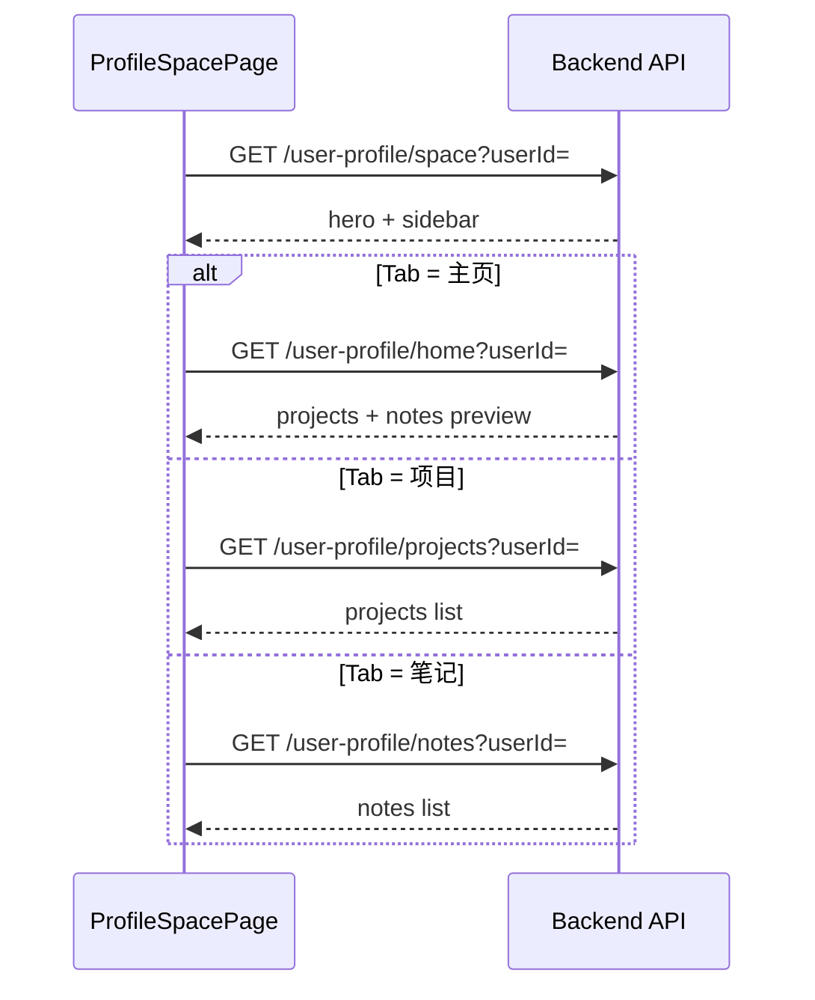
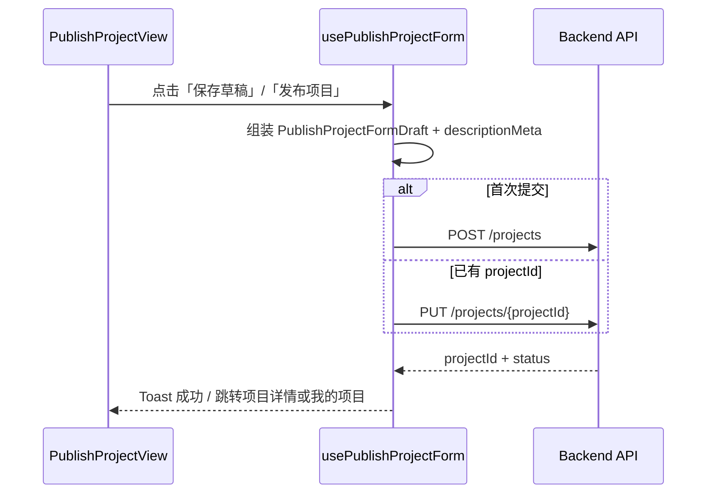
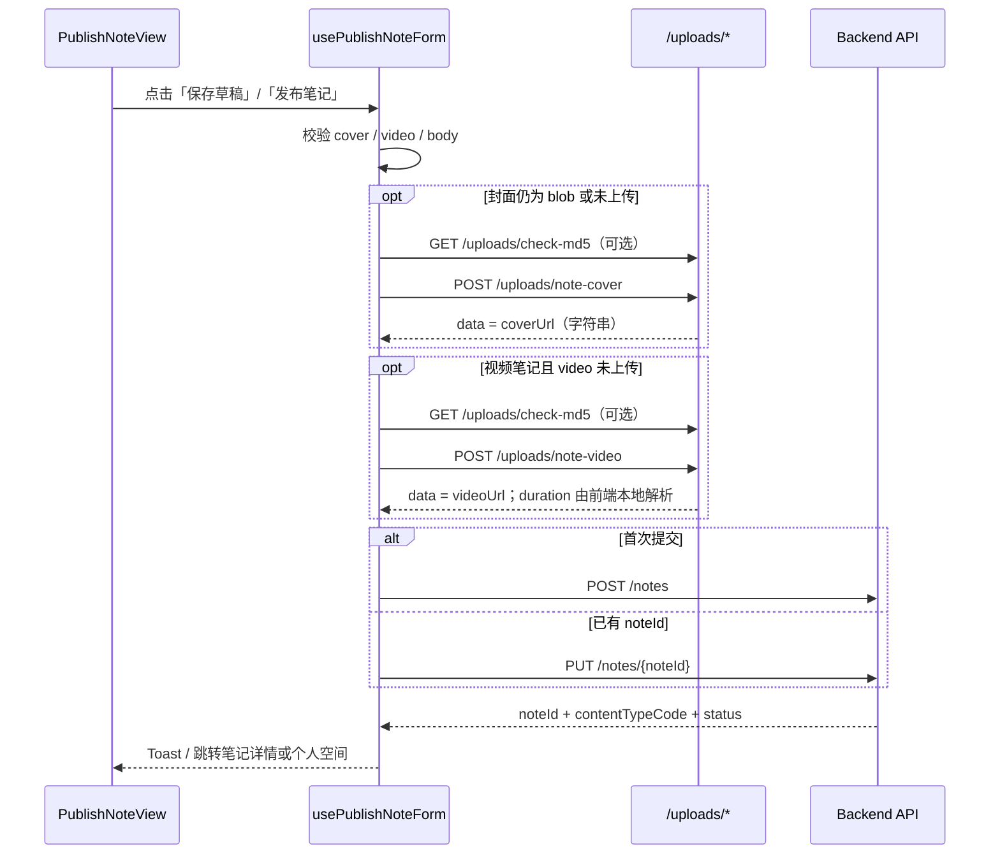
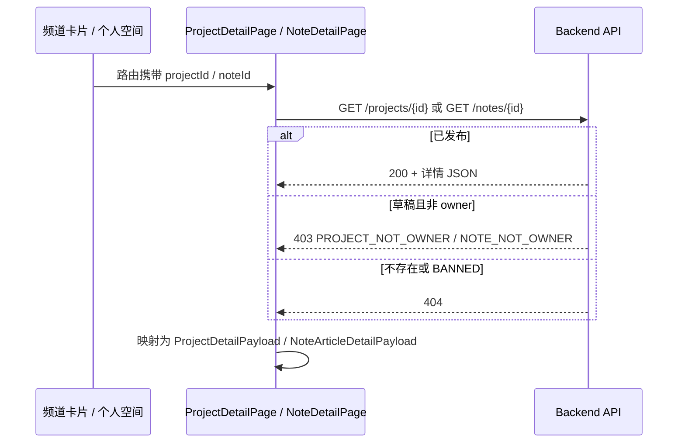

# UniBridge Web-Client API 文档

> **本机联调地址**：`http://localhost:8081/api/v1/client`  
> **前端 baseURL**：`/api/v1/client`（`apps/web-client/src/api/http.ts`）  
> **路径约定**：下文所有 Path 均相对 `/api/v1/client`。  
> **待跟进增量**：见 [`API-request.md`](./API-request.md)（当前为项目卡片 `coverUrl` 联调项）。

本文档汇总 Web 客户端已对接的后端接口，按业务模块分四部分编写。前端封装位于 `apps/web-client/src/api/`。

---

## API 总览与实现状态

> Feed 推荐与互动接口已实现并联调；个人空间项目列表字段与 Feed 项目卡片对齐见第四部分。  
> **双 ID / `uid`**：客户端**仅使用**对外 `uid`（项目 `PR`+11 位，笔记 `TX`/`VD`+11 位），**禁止**使用自增数字 `id` 访问内容。

### 接口清单

| # | 模块 | Method | Path | 说明 | 前端封装 |
|---|------|--------|------|------|----------|
| 1 | 认证 | POST | `/auth/personal/register` | 个人账号注册 | `registerPersonalAccount` |
| 2 | 认证 | POST | `/auth/personal/login/password` | 个人密码登录 | `loginPersonalByPassword` |
| 3 | 认证 | POST | `/auth/personal/login/sms` | 个人短信验证码登录 | `loginPersonalBySms` |
| 4 | 认证 | POST | `/auth/personal/login/email` | 个人邮箱验证码登录 | `loginPersonalByEmail` |
| 5 | 认证 | POST | `/auth/personal/sms/send` | 验证码下发（登录/注册） | `sendVerificationCode` |
| 6 | 认证 | POST | `/auth/organization/login/credentials` | 主体登录第一步：凭证校验 | `loginOrganizationByCredentials` |
| 7 | 认证 | POST | `/auth/organization/login/otp` | 主体登录第二步：OTP 验证 | `loginOrganizationByOtp` |
| 8 | 认证 | POST | `/auth/logout` | 退出登录 | `logoutByTokens` |
| 9 | 用户资料 | GET | `/user-profile/menu` | 顶部用户菜单 | `getUserProfileMenu` |
| 10 | 用户资料 | GET | `/user-profile/space` | 个人空间页壳（Hero + 侧栏） | `getUserProfileSpace` |
| 11 | 用户资料 | GET | `/user-profile/home` | 个人空间「主页」Tab | `getUserProfileHome` |
| 12 | 用户资料 | GET | `/user-profile/projects` | 个人空间「项目」Tab | `getUserProfileProjects` |
| 13 | 用户资料 | GET | `/user-profile/notes` | 个人空间「笔记」Tab | `getUserProfileNotes` |
| 14 | 项目 | POST | `/projects` | 创建项目（草稿/发布） | `createProject` |
| 15 | 项目 | PUT | `/projects/{uid}` | 更新项目 | `updateProject` |
| 16 | 项目 | GET | `/projects/{uid}` | 查询项目详情 | `getProjectDetail` |
| 17 | 项目 | GET | `/projects/{uid}/draft` | 查询项目草稿（owner） | 后端已实现，可按需接入 |
| 18 | 笔记 | POST | `/notes` | 创建笔记（草稿/发布） | `createNote` |
| 19 | 笔记 | PUT | `/notes/{uid}` | 更新笔记 | `updateNote` |
| 20 | 笔记 | GET | `/notes/{uid}` | 查询笔记详情 | `getNoteDetail` |
| 21 | 笔记 | GET | `/notes/{uid}/draft` | 查询笔记草稿（owner） | 后端已实现，可按需接入 |
| 22 | 上传 | GET | `/uploads/check-md5` | 秒传预检 | `checkUploadByMd5` |
| 23 | 上传 | POST | `/uploads/note-cover` | 上传笔记封面 | `uploadNoteCover` |
| 24 | 上传 | POST | `/uploads/note-video` | 上传笔记视频 | `uploadNoteVideo` |
| 25 | Feed | GET | `/feed/home` | 首页推荐（笔记 5 + 项目 10） | `getHomeFeed` |
| 26 | Feed | GET | `/feed/home/shuffle` | 首页「换一换」混排 | `shuffleHomeFeed` |
| 27 | Feed | GET | `/feed/projects` | 项目专区（商业/招募分栏） | `getProjectFeed` |
| 28 | Feed | GET | `/feed/projects/shuffle` | 项目专区「换一换」 | `shuffleProjectFeed` |
| 29 | Feed | GET | `/feed/notes` | 笔记专区（图文/视频分栏） | `getNoteFeed` |
| 30 | Feed | GET | `/feed/notes/shuffle` | 笔记专区「换一换」 | `shuffleNoteFeed` |
| 31 | Feed | GET | `/feed/notes/{uid}/similar` | 相似笔记推荐 | `getSimilarNotes` |
| 32 | 埋点 | POST | `/feed/events` | 用户行为捕获 | `postFeedEvent` |
| 33 | 互动 | PUT | `/interactions/like` | 点赞 / 取消 | `putInteractionLike` |
| 34 | 互动 | PUT | `/interactions/collect` | 收藏 / 取消 | `putInteractionCollect` |
| 35 | 互动 | POST | `/interactions/view` | 浏览计次（视频播放等） | `postInteractionView` |

### 页面与接口映射

| 页面 / 组件 | 路由 | 主要接口 |
|-------------|------|----------|
| `AuthModal` | 弹窗 | 认证 #1–#8 |
| `UserProfileMenu` | 顶栏 | `GET /user-profile/menu` |
| `ProfileSpacePage` | `/profile` | `GET /user-profile/space`、`/home`、`/projects`、`/notes` |
| `HomePage` | `/` | `GET /feed/home` |
| `CommercialProjectsPage` | `/commercial` | `GET /feed/projects?category=COMMERCIAL` |
| `CampusCoCreationPage` | `/campus` | `GET /feed/projects?category=RECRUITMENT` |
| `ExperienceSharePage` | `/note` | `GET /feed/notes`、`/feed/notes/shuffle` |
| `PublishProjectView` | `/publish/project` | `POST/PUT /projects` |
| `PublishNoteView` | `/publish/note` | `POST/PUT /notes`、`POST /uploads/*`、`GET /uploads/check-md5` |
| `ProjectDetailPage` | `/project-detail` | `GET /projects/{uid}`、`POST /feed/events`（VIEW_DETAIL） |
| `NoteDetailPage` | `/note-detail` | `GET /notes/{uid}`、`POST /feed/events`（VIEW_DETAIL） |

### 文档目录

| 部分 | 内容 |
|------|------|
| [第一部分：认证 API](#第一部分认证-api) | 注册、登录、验证码、退出 |
| [第二部分：个人空间与用户资料](#第二部分个人空间与用户资料) | 个人空间页与顶栏菜单 |
| [第三部分：发布与详情](#第三部分发布与详情) | 项目/笔记发布、上传、详情读 |
| [第四部分：Feed 推荐与互动](#第四部分feed-推荐与互动) | Feed 读接口、埋点、互动、双 ID 约定 |

### 全局通用约定

#### 统一响应结构

```json
{
  "code": 200,
  "message": "success",
  "data": {}
}
```

- `code = 200`：业务成功
- 非 `200`：业务失败，`message` 用于 Toast / 弹窗提示
- `data`：业务对象（各接口下文展开）

#### 认证请求头

需要登录的接口统一携带：

```http
Authorization: Bearer <access_token>
```

登录成功后前端写入 `localStorage`：`access_token`、`refresh_token`、`user_id` 等（见 `auth/tokenStorage`）。

#### 前端状态字段（认证模块）

- `authStatus`：`verified` / `unverified`
- `userRole`：`student` / `mentor` / `pm` / `organization-admin`

---

## 第一部分：认证 API

> 消费组件：`apps/web-client/src/components/AuthModal`  
> 前端模块：`apps/web-client/src/api/Auth`、`apps/web-client/src/api/common`

---

## 01）通用约定（认证）

### 01.1）接口范围与账号规则

- 前端通道：
  - `personal`：个人通道
  - `organization`：主体通道
- 个人账号：
  - 注册仅支持手机号
  - 登录支持手机号与邮箱（若已绑定邮箱）
- 主体账号：
  - 机构代码由系统发放
  - 企业/公司使用社会统一信用代码
  - 学校使用教育部高校官方代码（五位数字）

### 01.2）统一响应结构

```json
{
  "code": 200,
  "message": "success",
  "data": {}
}
```

- `code=200` 表示业务成功
- 非 `200` 视为失败，`message` 用于展示提示
- `data` 为业务对象

### 01.3）前端状态字段对齐

- `authStatus`：`verified` / `unverified`
- `userRole`：`student` / `mentor` / `pm` / `organization-admin`

### 01.4）前端交互约束

- 个人登录成功后若 `authStatus=unverified`，前端展示认证引导，不立即关闭弹窗。
- 主体登录为两步：
  - 第一步：机构代码 + 主体账号 + 登录凭证
  - 第二步：TOTP验证码绑定（首次登录），TOTP验证（非首次登录）
- 前端“获取验证码”按钮需要对应验证码下发接口。

---

## 02）个人账号注册

### 02.1）注册

- **Method**：`POST`
- **Path**：`/auth/personal/register`
- **Auth**：否
- **说明**：创建个人账号，供“立即注册”流程使用。

#### Request Body

```json
{
  "account": "13800138000",
  "password": "<前端SHA256后密码>",
  "confirmPassword": "<前端SHA256后密码>",
  "verifyCode": "123456",
  "channel": "sms"
}
```

字段说明：

- `account`：邮箱或手机号（当前注册仅手机号）
- `password`：建议前端 SHA256 后传输
- `confirmPassword`：二次确认密码
- `verifyCode`：6位验证码（对应前端 `registerCode`）
- `channel`：可选，`sms` / `email`

#### Response Data

```json
{
  "userId": 10001,
  "userRole": "null，注册后尚未绑定主体",
  "authStatus": "unverified",
  "needVerificationGuide": true,
  "accessToken": "<access_token>",
  "refreshToken": "<refresh_token>"
}
```

#### 常见错误码

- `ACCOUNT_ALREADY_EXISTS`
- `INVALID_VERIFY_CODE`
- `WEAK_PASSWORD`
- `PASSWORD_NOT_MATCH`
- `VERIFY_CODE_EXPIRED`

---

## 03）个人账号登录（密码）

### 03.1）密码登录

- **Method**：`POST`
- **Path**：`/auth/personal/login/password`
- **Auth**：否
- **说明**：个人通道密码登录（对应 `personalLoginMode=password`）。

#### Request Body

```json
{
  "account": "13800138000",
  "password": "<前端SHA256后密码>",
  "rememberMe": true / false,
  "channel": "sms"
}
```

字段说明：

- `account`：邮箱或手机号
- `password`：建议前端 SHA256 后传输
- `rememberMe`：前端选项，是否记住密码
- `channel`：`sms` / `email`，前端自动检测account，判断是手机号（十一位数）还是邮箱

#### Response Data

```json
{
  "userId": 10001,
  "userRole": "student",
  "authStatus": "verified",
  "accessToken": "<access_token>",
  "refreshToken": "<refresh_token>",
  "expiresIn": 7200
}
```

#### 常见错误码

- `ACCOUNT_OR_PASSWORD_INVALID`
- `ACCOUNT_LOCKED`
- `ACCOUNT_DISABLED`

---

## 04）个人账号登录（短信/邮箱验证码）

### 04.1）短信验证码登录

- **Method**：`POST`
- **Path**：`/auth/personal/login/sms`
- **Auth**：否
- **说明**：个人通道短信验证码登录（对应 `personalLoginMode=sms`）。

#### Request Body

```json
{
  "account": "13800138000",
  "smsCode": "123456",
  "rememberMe": true
}
```

#### Response Data

```json
{
  "userId": 10001,
  "userRole": "student",
  "authStatus": "verified",
  "accessToken": "<access_token>",
  "refreshToken": "<refresh_token>",
  "expiresIn": 7200
}
```

### 04.2）邮箱验证码登录

- **Method**：`POST`
- **Path**：`/auth/personal/login/email`
- **Auth**：否
- **说明**：个人通道邮箱验证码登录（对应 `personalLoginMode=email`）。

#### Request Body

```json
{
  "account": "120729545@qq.com",
  "emailCode": "123456",
  "rememberMe": true
}
```

#### Response Data

```json
{
  "userId": 10001,
  "userRole": "student",
  "authStatus": "verified",
  "accessToken": "<access_token>",
  "refreshToken": "<refresh_token>",
  "expiresIn": 7200
}
```

#### 常见错误码

- `SMS_CODE_INVALID`
- `SMS_CODE_EXPIRED`
- `ACCOUNT_NOT_FOUND`
- `TOO_MANY_ATTEMPTS`

---

## 05）验证码下发（登录/注册复用）(目前为开发调试模式，将验证码打印在日志上，不发送)

### 05.1）发送验证码

- **Method**：`POST`
- **Path**：`/auth/personal/sms/send`
- **Auth**：否
- **说明**：支撑“获取验证码”按钮，供个人登录短信模式与个人注册复用。

#### Request Body

```json
{
  "account": "13800138000",
  "bizType": "login",
  "channel": "sms",
  "captchaToken": "<optional_captcha_token>"
}
```

#### Response Data

```json
{
  "requestId": "req_20260520_000001",
  "expireInSec": 300,
  "retryAfterSec": 60
}
```

#### 常见错误码

- `TOO_FREQUENT_REQUEST`
- `CAPTCHA_REQUIRED`
- `CAPTCHA_INVALID`
- `ACCOUNT_RISK_BLOCKED`

---

## 06）主体账号登录（第一步：凭证校验）

### 06.1）主体凭证登录

- **Method**：`POST`
- **Path**：`/auth/organization/login/credentials`
- **Auth**：否
- **说明**：校验机构代码、主体账号、登录凭证，成功后进入 OTP 阶段。

#### Request Body

```json
{
  "institutionCode": "12345",
  "password": "<前端SHA256后凭证>"
}
```

#### Response Data

```json
{
  "challengeId": "chl_20260520_000001",
  "passwordDigestPreview": "a1b2c3d4e5f6",
  "otpExpireInSec": 300,
  "maskedTarget": "***@corp.com"
}
```

#### 常见错误码

- `ORGANIZATION_CREDENTIAL_INVALID`
- `ORGANIZATION_ACCOUNT_DISABLED`
- `NEED_CONTACT_OPERATOR`

---

## 07）主体账号登录（第二步：OTP 校验）

### 07.1）主体 OTP 验证登录

- **Method**：`POST`
- **Path**：`/auth/organization/login/otp`
- **Auth**：否
- **说明**：使用 `challengeId + otpCode` 完成主体登录。

#### Request Body

```json
{
  "challengeId": "chl_20260520_000001",
  "otpCode": "123456"
}
```

#### Response Data

```json
{
  "userId": 90001,
  "userRole": "organization-admin",
  "authStatus": "verified",
  "accessToken": "<access_token>",
  "refreshToken": "<refresh_token>",
  "expiresIn": 7200
}
```

#### 常见错误码

- `CHALLENGE_NOT_FOUND`
- `CHALLENGE_EXPIRED`
- `OTP_INVALID`
- `OTP_EXPIRED`
- `TOO_MANY_ATTEMPTS`

### 07.2）刷新 accessToken（一次性 refreshToken 轮换）

- **Method**：`POST`
- **Path**：`/auth/refresh`
- **Auth**：否（使用 refreshToken 换取新令牌）
- **说明**：当 accessToken 失效时，前端应调用该接口刷新令牌。`refreshToken` 采用一次性安全设计，刷新成功后旧 refreshToken 立即失效。

#### Request Body

```json
{
  "refreshToken": "<refresh_token>"
}
```

#### Response Data

```json
{
  "accessToken": "<new_access_token>",
  "refreshToken": "<new_refresh_token>",
  "expiresIn": 7200
}
```

字段说明：

- `accessToken`：新的访问令牌，前端需立即覆盖本地旧值
- `refreshToken`：新的刷新令牌，前端需立即覆盖本地旧值（旧 refreshToken 不可再次使用）
- `expiresIn`：accessToken 剩余有效期（秒）

#### 常见错误码

- `REFRESH_TOKEN_INVALID`
- `REFRESH_TOKEN_EXPIRED`
- `TOKEN_REUSE_DETECTED`

---

## 08）前端错误文案映射建议

- `ACCOUNT_OR_PASSWORD_INVALID` / `SMS_CODE_INVALID` → `手机号或验证码错误，请检查后重试`
- `ORGANIZATION_CREDENTIAL_INVALID` → `主体账号信息不匹配，请确认后重试`
- `OTP_INVALID` → `动态验证码错误，请重试`
- `OTP_FORMAT_INVALID` → `请输入 6 位数字动态验证码`
- `ORGANIZATION_FIELDS_REQUIRED` → `请完整输入机构代码、账号和密码`

---

## 09）安全与风控要求

- 所有登录与注册接口必须限流（IP、账号、设备维度）。
- 验证码必须设置有效期、发送频控、错误次数上限。
- 密码传输建议前端哈希 + HTTPS；服务端仍需二次加盐哈希存储。
- 返回体严禁回传敏感字段（原始密码、完整 OTP、完整手机号、完整邮箱）。
- 对 `unverified` 用户颁发受限权限 token（可浏览，敏感操作受限）。

---

## 10）联调说明

- 认证模块接口（#1–#8）均已实现并完成前端对接。
- 验证码接口当前为**开发调试模式**：验证码打印在后端日志，不真实发送短信/邮件。
- 后续扩展（未列入上文总览）：邮箱认证、资料上传等可与 `VerificationStep` 单独增补文档。

---

## 第二部分：个人空间与用户资料

> 消费页面：`ProfileSpacePage` 及 `components/profile/*`  
> 前端模块：`apps/web-client/src/api/userProfile`

---

## 01）通用约定（个人空间）

### 01.1）统一响应结构

```json
{
  "code": 200,
  "message": "success",
  "data": {}
}
```

- `code=200`：业务成功
- 非 `200`：业务失败，`message` 用于错误提示
- `data` 为业务对象

### 01.2）认证与鉴权

- 本文档全部接口需要登录态。
- 请求头统一携带：

```http
Authorization: Bearer <access_token>
```

### 01.3）用户身份参数

- 前端从 `localStorage` 读取 `user_id`（登录响应写入）参与请求构造。
- 建议后端以 token 解析出的用户身份为准；`userId` 查询参数用于联调显式指定目标用户（查看他人空间时扩展）。

### 01.4）前端数据类型对齐

| 类型 | 说明 | 使用方 |
|------|------|--------|
| `ProjectItem` | 项目卡片数据（`ProjectCard`） | `ProfileHomeTabContent` / `ProfileProjectsTabContent` / 频道 Feed 项目列表 |

**`ProjectItem` 卡片关键字段（与 `ProjectCard` UI 对齐）**

| 字段 | 类型 | 说明 |
|------|------|------|
| `uid` | string | 项目对外 uid（`PR`+11 位）；卡片跳转 `/project-detail?uid=` |
| `title` | string | 项目标题 |
| `preview` | string | 卡片摘要 → `project.preview` |
| `tags` | `{ label: string }[]` | 技术标签，卡片以 `#标签` 展示 |
| `category` | string | `COMMERCIAL` \| `RECRUITMENT` |
| `recruitmentType` | string \| null | 招募子类型；仅 `RECRUITMENT` 有效 |
| `ownerOrganization` | string | 发布主体；元信息行 |
| `logoSvgUrl` | string \| null | 主体 Logo SVG；`coverUrl` 缺失时可作左侧视觉回退 |
| `coverUrl` | string \| null | 项目卡片封面图 URL；见 [`API-request.md`](./API-request.md) §01 待跟进 |
| `level` | string | `N` / `R` / `SR` / `SSR` / `UR` |
| `teamSize` | string \| null | 团队规模 |
| `duration` | string \| null | 预计周期 |
| `publishTime` | string | 发布时间（列表可用，当前卡片 UI 不展示） |

> **列表卡片无需返回**：`budget` / `amount`、`ownerName` / `publisher`（`ProjectCard` 无对应展示位）。商业预算与发布人信息见 **项目详情** `GET /projects/{uid}`。

| 类型 | 说明 | 使用方 |
|------|------|--------|
| `ProfileNoteItem` | 笔记卡片数据 | `ProfileHomeTabContent` / `ProfileNotesTabContent` / `GridNoteCard` / `RowNoteCard` |
| `LevelCode` | 能力等级：`N` / `R` / `SR` / `SSR` / `UR` | `LevelBadge` |

---

## 02）获取个人空间页壳数据（Hero + 右侧栏）

### 02.1）查询个人空间页壳

- **Method**：`GET`
- **Path**：`/user-profile/space`
- **Auth**：是
- **说明**：`ProfileSpacePage` 进入页面时调用，返回顶部 Hero 区与右侧信息侧栏所需数据（与 Tab 切换无关，一次加载）。

#### Query Parameters

| 参数 | 类型 | 必填 | 说明 |
|------|------|------|------|
| `userId` | number | 否 | 目标用户 ID；缺省时由 token 解析当前用户 |

#### Request Data（联调示意）

```json
{
  "userId": 10001,
  "accessToken": "<access_token>"
}
```

#### Response Data

```json
{
    "id": 10001,
    /* 1. 核心基础信息（可直接直分发给 Hero 栏） */
    "baseInfo": {
      "nickname": "张同学",
      "avatarUrl": "https://cdn.example.com/avatar/u10001.png",
      "isVerified": true,
      "organization": "深圳技术大学",
      "position": "学生",
      "bio": "热爱技术，喜欢把想法和创意变成价值的产品。",
      "level": "SR"
    },

    /* 2. 扩展/安全/统计信息（可直接分发给 Sidebar 栏） */
    "extendInfo": {
      "notice": "持续学习，持续创造，保持对前沿技术探索。",
      "ipLocation": "广东·深圳",
      "joinDate": "2023.08.12",
      // careerData 对应数据库 user_profile 中的career_data
      "careerData": ["计算机科学与技术"],
      "skills": ["Vue3", "React", "Python", "AI", "SpringBoot"]
    },

    /* 3. 关联的外部实体（由 Sidebar 的子组件消费） */
    "associatedTeam": {
      "id": 10001,
      "name": "智能计算与应用实验室",
      "description": "以工程项目驱动实践，聚焦智能系统与大数据分析方向。",
      "entryPath": "/lab/10001"
    }
    "honors": [],
    "activityHeatmap": [0, 1, 0, 2, 0, 1, 0, 1, 2, 1, 3, 2, 1, 0, 2, 3, 4, 2, 3, 1, 0, 1, 2, 3, 4, 3, 2, 1, 1, 2, 4, 3, 2, 1, 0, 1, 2, 3, 4, 4, 3, 2, 1, 0, 1, 2, 3, 3, 2, 1, 0, 0, 1, 2, 3, 2, 1, 0, 1, 2, 3, 2, 1, 0, 0, 1, 2, 1, 0, 0, 1, 2, 3, 2, 1, 1, 2, 3, 4, 3, 2, 1, 0]
  }
}
```

**顶级字段**

| 字段 | 类型 | 说明 |
| --- | --- | --- |
| `id` | number / long | 当前 Profile 主体的唯一标识（用户 ID 或机构 ID） |
| `baseInfo` | object | 核心基础信息，主要供 **Hero** 栏及全局导航/页头消费 |
| `extendInfo` | object | 扩展/安全/统计信息，主要供 **Sidebar** 栏消费 |
| `associatedTeam` | object | null | 关联的外部实体（所属团队/实验室），为空时不渲染团队卡片组件 |

**baseInfo (核心基础信息)**

| 字段 | 类型 | 说明 |
| --- | --- | --- |
| `nickname` | string | 用户/机构昵称，对应 Hero 标题 |
| `avatarText` | string | 无头像图时的占位文字（通常在前端或后端取昵称首字） |
| `avatarUrl` | string | null | 头像图片地址；有值时前端优先渲染 `` |
| `isVerified` | boolean | 是否已实名/已认证，控制认证图标显示 |
| `organization` | string | null | 所属主体名称（如：学校或企业名称）；为空时不渲染主体行 |
| `position` | string | null | 职位/身份，如 `学生`、`教授`、`HR` |
| `bio` | string | 个人/机构简介 |
| `level` | string | null | 能力/企业等级；为空或无效时不渲染 `LevelBadge`（如 `SR`） |

**extendInfo (扩展/安全/统计信息)**

| 字段 | 类型 | 说明 |
| --- | --- | --- |
| `notice` | string | 个人/机构信息卡片顶部的提示公告文案 |
| `verifyStatus` | string | null | 实名状态详细文案，如 `已实名`、`企业已认证` |
| `ipLocation` | string | IP 属地展示文案，如 `广东·深圳` |
| `joinDate` | string | 加入/注册时间，展示格式如 `2023.08.12` |
| `skills` | string[] | 专业技能标签或业务标签列表 |

**associatedTeam (关联的外部实体)**

| 字段 | 类型 | 说明 |
| --- | --- | --- |
| `id` | number / long | 关联团队/实验室的唯一 ID 标识 |
| `name` | string | 团队/实验室名称 |
| `description` | string | 团队/实验室的一句话简介 |
| `entryPath` | string | 点击卡片跳转到该团队空间的路由路径，如 `/lab/10001` |

| `honors` | array | 个人荣誉列表；空数组时展示「暂无荣誉内容」 |
| `activityHeatmap` | number[] | 活跃度热力图数值数组，每项 `0~4` 对应色阶 |

#### 常见错误码

- `UNAUTHORIZED`
- `ACCESS_TOKEN_EXPIRED`
- `USER_NOT_FOUND`

---

## 03）获取个人空间「主页」Tab 数据

### 03.1）查询主页 Tab 内容

- **Method**：`GET`
- **Path**：`/user-profile/home`
- **Auth**：是
- **说明**：供 `ProfileHomeTabContent` 使用，返回「我的项目」「我的笔记」预览列表（主页 Tab 激活时调用）。

#### Query Parameters

| 参数 | 类型 | 必填 | 说明 |
|------|------|------|------|
| `userId` | number | 否 | 目标用户 ID |
| `projectLimit` | number | 否 | 项目预览条数，默认 `4` |
| `noteLimit` | number | 否 | 笔记预览条数，默认 `3` |

#### Request Data（联调示意）

```json
{
  "userId": 10001,
  "accessToken": "<access_token>",
  "projectLimit": 4,
  "noteLimit": 3
}
```

#### Response Data

```json
{
  "userId": 10001,
  "projects": [
    {
      "uid": "PR00000090001",
      "title": "数据可视化大屏设计与开发",
      "preview": "基于 Vue3 + ECharts 构建企业级可视化大屏，实现业务指标动态展示与交互分析。",
      "coverUrl": "http://localhost:8081/uploads/project-covers/viz-dashboard.jpg",
      "tags": [{ "label": "Vue3" }, { "label": "ECharts" }, { "label": "可视化" }],
      "category": "COMMERCIAL",
      "recruitmentType": null,
      "ownerOrganization": "数智未来科技",
      "logoSvgUrl": null,
      "publishTime": "2024-12-18",
      "level": "SR",
      "teamSize": "2-4人",
      "duration": "1个月"
    }
  ],
  "notes": [
    {
      "uid": "TX20212345678",
      "title": "大模型 RAG 系统：从原理到项目落地",
      "summary": "本文梳理检索增强生成系统的关键链路，覆盖 embedding、召回与重排实践。",
      "contentType": "图文",
      "tags": ["人工智能", "RAG", "大模型"],
      "publishTime": "2024-05-18 19:36",
      "updateTime": "2024-05-19",
      "views": 532,
      "comments": 36,
      "favorites": 28,
      "cover": "https://images.unsplash.com/photo-1639322537504-6427a16b0a28?auto=format&fit=crop&w=200&q=80"
    }
  ],
  "projectTotal": 12,
  "noteTotal": 25
}
```

字段说明：

**projects[]（ProjectItem）**

| 字段 | 类型 | 说明 |
|------|------|------|
| `uid` | string | 项目对外 uid（`PR`+11 位） |
| `title` | string | 项目标题 |
| `preview` | string | 卡片摘要 → `project.preview` |
| `coverUrl` | string \| null | 项目卡片封面图 URL |
| `tags` | `{ label: string }[]` | 技术/业务标签 |
| `category` | string | `COMMERCIAL` \| `RECRUITMENT` |
| `recruitmentType` | string \| null | `LAB_RECRUIT` \| `TEAM_RECRUIT` \| `CAMPUS_PRACTICE` \| `PERSONAL_RECRUIT`；商业项目为 `null` |
| `ownerOrganization` | string | 发布企业/主体名称 |
| `logoSvgUrl` | string \| null | 主体 Logo SVG 地址 |
| `publishTime` | string | 发布时间，如 `2024-12-18` |
| `level` | string | 项目等级：`N` / `R` / `SR` / `SSR` / `UR` |
| `teamSize` | string \| null | 团队规模，如 `2-4人` |
| `duration` | string \| null | 预计周期，如 `1个月` |

> 兼容说明：后端可短期同时返回旧字段 `summary` / `company`；前端 `mapApiProjects` 会映射为 `preview` / `ownerOrganization`。列表**无需** `publisher` / `ownerName`、`amount`（卡片不展示；详情见 `GET /projects/{uid}`）。

**notes[]（ProfileNoteItem）**

| 字段 | 类型 | 说明 |
|------|------|------|
| `title` | string | 笔记标题 |
| `summary` | string | 笔记摘要 |
| `contentType` | string | 内容类型：`图文` / `视频`（笔记 Tab 筛选用） |
| `tags` | string[] | 话题标签 |
| `publishTime` | string | 发布时间 |
| `updateTime` | string | 最近更新时间 |
| `views` | number | 浏览量 |
| `comments` | number | 评论数 |
| `favorites` | number | 收藏数 |
| `cover` | string | 封面图 URL |

| 字段 | 类型 | 说明 |
|------|------|------|
| `projectTotal` | number | 项目总数（用于「查看全部」展示，可选） |
| `noteTotal` | number | 笔记总数（用于「查看全部」展示，可选） |

#### 常见错误码

- `UNAUTHORIZED`
- `ACCESS_TOKEN_EXPIRED`
- `USER_NOT_FOUND`

---

## 04）获取个人空间「项目」Tab 数据

### 04.1）查询项目列表

- **Method**：`GET`
- **Path**：`/user-profile/projects`
- **Auth**：是
- **说明**：供 `ProfileProjectsTabContent` 使用，返回当前用户全部项目列表（切换到「项目」Tab 时调用，前端可展示加载态）。

#### Query Parameters

| 参数 | 类型 | 必填 | 说明 |
|------|------|------|------|
| `userId` | number | 否 | 目标用户 ID |
| `page` | number | 否 | 页码，从 `1` 开始，默认 `1` |
| `pageSize` | number | 否 | 每页条数，默认 `20` |

#### Request Data（联调示意）

```json
{
  "userId": 10001,
  "accessToken": "<access_token>",
  "page": 1,
  "pageSize": 20(首页调用)
}
```

#### Response Data

```json
{
  "userId": 10001,
  "projects": [
    {
      "uid": "PR00000090001",
      "title": "数据可视化大屏设计与开发",
      "preview": "基于 Vue3 + ECharts 构建企业级可视化大屏，实现业务指标动态展示与交互分析。",
      "coverUrl": "http://localhost:8081/uploads/project-covers/viz-dashboard.jpg",
      "tags": [{ "label": "Vue3" }, { "label": "ECharts" }, { "label": "可视化" }],
      "category": "COMMERCIAL",
      "recruitmentType": null,
      "ownerOrganization": "数智未来科技",
      "logoSvgUrl": null,
      "publishTime": "2024-12-18",
      "level": "SR",
      "teamSize": "2-4人",
      "duration": "1个月"
    },
    {
      "uid": "PR00000090002",
      "title": "企业官网重构设计",
      "preview": "完成品牌官网重构与视觉升级，提升信息可读性与移动端体验，支持组件化内容管理。",
      "coverUrl": null,
      "tags": [{ "label": "Web设计" }, { "label": "前端" }, { "label": "响应式" }],
      "category": "RECRUITMENT",
      "recruitmentType": "TEAM_RECRUIT",
      "ownerOrganization": "创新互联",
      "logoSvgUrl": null,
      "publishTime": "2024-11-29",
      "level": "R",
      "teamSize": "3-5人",
      "duration": "2个月"
    }
  ],
  "total": 4,
  "page": 1,
  "pageSize": 20
}
```

字段说明：

- `projects`：项目列表，元素结构同 **03.1）projects[]**。
- `total`：符合条件的项目总数。
- `page` / `pageSize`：分页回显。

#### 常见错误码

- `UNAUTHORIZED`
- `ACCESS_TOKEN_EXPIRED`
- `USER_NOT_FOUND`

---

## 05）获取个人空间「笔记」Tab 数据

### 05.1）查询笔记列表

- **Method**：`GET`
- **Path**：`/user-profile/notes`
- **Auth**：是
- **说明**：供 `ProfileNotesTabContent` 使用，返回当前用户全部笔记列表；前端按 `contentType` 在本地筛选「全部 / 图文 / 视频」。

#### Query Parameters

| 参数 | 类型 | 必填 | 说明 |
|------|------|------|------|
| `userId` | number | 否 | 目标用户 ID |
| `page` | number | 否 | 页码，从 `1` 开始，默认 `1` |
| `pageSize` | number | 否 | 每页条数，默认 `20` |
| `contentType` | string | 否 | 服务端预筛：`图文` / `视频`；缺省返回全部 |

#### Request Data（联调示意）

```json
{
  "userId": 10001,
  "accessToken": "<access_token>",
  "page": 1,
  "pageSize": 20,
  "contentType": "图文"
}
```

#### Response Data

```json
{
  "userId": 10001,
  "notes": [
    {
      "title": "大模型 RAG 系统：从原理到项目落地",
      "summary": "本文梳理检索增强生成系统的关键链路，覆盖 embedding、召回与重排实践。",
      "contentType": "图文",
      "tags": ["人工智能", "RAG", "大模型"],
      "publishTime": "2024-05-18 19:36",
      "updateTime": "2024-05-19",
      "views": 532,
      "comments": 36,
      "favorites": 28,
      "cover": "https://images.unsplash.com/photo-1639322537504-6427a16b0a28?auto=format&fit=crop&w=200&q=80"
    },
    {
      "title": "Vue3 最佳实践总结",
      "summary": "从组合式 API 到工程化规范，沉淀一套适用于团队协作的 Vue3 开发方案。",
      "contentType": "图文",
      "tags": ["Vue3", "前端工程"],
      "publishTime": "2024-05-12 13:42",
      "updateTime": "2024-05-13",
      "views": 412,
      "comments": 24,
      "favorites": 18,
      "cover": "https://images.unsplash.com/photo-1555066931-4365d14bab8c?auto=format&fit=crop&w=200&q=80"
    },
    {
      "title": "如何设计一个高质量用户系统",
      "summary": "结合权限模型、风控策略与可观测方案，分享用户系统从 0 到 1 的实现经验。",
      "contentType": "视频",
      "tags": ["产品设计", "系统设计", "用户体系"],
      "publishTime": "2024-05-06 09:18",
      "updateTime": "2024-05-09",
      "views": 299,
      "comments": 17,
      "favorites": 14,
      "cover": "https://images.unsplash.com/photo-1521737604893-d14cc237f11d?auto=format&fit=crop&w=200&q=80"
    }
  ],
  "total": 3,
  "page": 1,
  "pageSize": 20
}
```

字段说明：

- `notes`：笔记列表，元素结构同 **03.1）notes[]**。
- `total`：符合条件的笔记总数。
- `page` / `pageSize`：分页回显。

#### 常见错误码

- `UNAUTHORIZED`
- `ACCESS_TOKEN_EXPIRED`
- `USER_NOT_FOUND`

---

## 06）前端调用时序建议（ProfileSpacePage）



| 场景 | 调用接口 | 消费组件 |
|------|----------|----------|
| 进入 `/profile` | `GET /user-profile/space` | `ProfileSpacePage` Hero + 右侧栏 |
| 激活「主页」Tab | `GET /user-profile/home` | `ProfileHomeTabContent` |
| 激活「项目」Tab | `GET /user-profile/projects` | `ProfileProjectsTabContent` |
| 激活「笔记」Tab | `GET /user-profile/notes` | `ProfileNotesTabContent` |
| 刷新页面且带 `?tab=项目` | `space` + `projects` | 按路由 Tab 决定第二条请求 |

联调注意：

- 登录成功后需确保 `localStorage` 存在 `access_token` 与 `user_id`，否则接口易返回 `UNAUTHORIZED`。
- `level`、`organization` 等可空字段返回 `null` 或空字符串时，前端不渲染对应 UI 块。
- 「收藏」「设置」Tab 当前复用主页占位内容，后续可单独扩展 `GET /user-profile/favorites` 等接口。

---

## 07）顶部用户菜单（`/user-profile/menu`）

- **Method**：`GET`
- **Path**：`/user-profile/menu`
- **Auth**：是
- **说明**：顶部 `UserProfileMenu` 头像、昵称、等级、认证主体等；与个人空间接口共用鉴权。
- **前端封装**：`getUserProfileMenu`（`api/userProfile`）

响应字段：`userId`、`nickname`、`level`、`avatarUrl`、`verifiedOrganization` 等。

---

## 第三部分：发布与详情

> 消费页面：`PublishProjectView`、`PublishNoteView`、`ProjectDetailPage`、`NoteDetailPage`  
> 前端模块：`apps/web-client/src/api/projects`、`apps/web-client/src/api/notes`  
> 数据库参考：`db.sql` — `project` / `project_commercial_secret`、`note`、`user_profile`

### 发布页按钮与接口

| 页面 | 按钮 | 对应接口 |
|------|------|----------|
| 发布项目 | 保存草稿 | `POST /projects`（`publishAction=DRAFT`）或 `PUT /projects/{id}` |
| 发布项目 | 发布项目 | `POST /projects`（`publishAction=PUBLISH`）或 `PUT /projects/{id}` |
| 发布笔记 | 保存草稿 | `POST /notes`（`publishAction=DRAFT`）或 `PUT /notes/{id}` |
| 发布笔记 | 发布笔记 | `POST /notes`（`publishAction=PUBLISH`）或 `PUT /notes/{id}` |
| 发布笔记 | 预览 | 先 `POST/PUT /notes`（`DRAFT`），再跳转详情预览 |

---

## 01）通用约定（发布与详情）

### 01.1）统一响应结构

```json
{
  "code": 200,
  "message": "success",
  "data": {}
}
```

- `code=200`：业务成功
- 非 `200`：业务失败，`message` 用于 Toast / 表单顶部错误提示
- `data` 为业务对象

### 01.2）认证与鉴权

- **写接口**（`POST` / `PUT`）与 **草稿读接口**（`GET .../draft`）：需要登录态。
- **详情读接口**（`GET /projects/{id}`、`GET /notes/{id}`）：
  - `status` 为已发布态（项目 `OPEN|ONGOING|CLOSED`、笔记 `PUBLISHED`）：**可不登录**（公开读）。
  - `status=DRAFT`：仅 **owner** 登录后可读。
  - 笔记 `status=BANNED`：一律不可读（返回 `NOTE_NOT_FOUND` 或 `NOTE_BANNED`）。
- 需要登录时，请求头统一携带：

```http
Authorization: Bearer <access_token>
```

- `owner_id` / `user_id` 以 token 解析为准；前端 `localStorage.user_id` 仅用于联调对照。

### 01.3）发布动作（publishAction）

| 值 | 说明 | 项目落库 | 笔记落库 |
|----|------|----------|----------|
| `DRAFT` | 保存草稿，可继续编辑 | `project.status='DRAFT'`，`published_at=NULL` | `note.status='DRAFT'`，`published_at=NULL` |
| `PUBLISH` | 正式发布 | `project.status='OPEN'`，写入 `published_at=NOW()`，同步 `updated_at`；`created_at` 不变 | `note.status='PUBLISHED'`，写入 `published_at=NOW()`，同步 `updated_at`；`created_at` 不变 |

**时间字段语义（项目 / 笔记通用）**

| 字段 | 含义 |
|------|------|
| `created_at` | 记录在数据库中**首次创建**的时间，草稿保存后不再变更 |
| `published_at` | 用户在前端点击「发布」并校验通过后写入；草稿态为 `NULL` |
| `updated_at` | 任意保存（含草稿编辑、正式发布）时由数据库自动更新 |

### 01.4）前端表单类型对齐

| 类型 | 说明 | 定义位置 |
|------|------|----------|
| `PublishProjectFormDraft` | 发布项目表单 | `publishProjectPageData.ts` |
| `PublishNoteFormDraft` | 发布笔记表单 | `publishNotePageData.ts` |
| `ProjectDetailPayload` | 项目详情页展示 | `ProjectDetailPage/types.ts` |
| `NoteArticleDetailPayload` | 图文笔记详情页展示 | `NoteDetailPage/types.ts` |
| `MarkdownContentChangeMeta` | 正文/需求说明来源：`editor` \| `upload` | `OnlineEditor/types/content.ts` |
| `LevelCode` | `N` / `R` / `SR` / `SSR` / `UR` | `types/level.ts` |

---

## 02）发布项目（PublishProject）

> 消费组件：`PublishProjectView`  
> Hook：`usePublishProjectForm`（`handleSaveDraft` / `handlePublish`）

### 02.1）创建项目（草稿 / 发布）

- **Method**：`POST`
- **Path**：`/projects`
- **Auth**：是
- **说明**：首次保存草稿或首次发布时调用。成功后返回 `projectId`，后续更新走 **02.2）**。

#### Request Body

```json
{
  "publishAction": "DRAFT",
  "title": "数据可视化大屏设计与开发",
  "summary": "基于 Vue3 + ECharts 构建企业级可视化大屏。",
  "channel": "enterprise",
  "campusRecruitType": null,
  "description": "# 项目背景\n\n## 交付物\n- 大屏原型\n- 前端实现",
  "amount": "18600",
  "level": "SR",
  "duration": "4 周",
  "teamSize": "1-3 人",
  "skillTags": ["Vue3", "ECharts", "可视化"],
  "deadline": "2026-06-30"
}
```

| 字段 | 类型 | 必填 | 说明 |
|------|------|------|------|
| `publishAction` | string | 是 | `DRAFT` \| `PUBLISH` |
| `title` | string | 是 | 项目标题 → `project.title` |
| `summary` | string | 是 | 一句话摘要（建议 ≤80 字）→ `project.preview` |
| `channel` | string | 是 | 项目频道：`enterprise`（商业项目）\| `campus`（招募/实践项目）→ `project.category` |
| `campusRecruitType` | string \| null | 条件 | `channel=campus` 时必填 → `project.recruitment_type`；商业项目传 `null` |
| `description` | string | 条件 | 项目详情 Markdown 正文；`PUBLISH` 时必填 → `project.description`（前端 Milkdown 编辑，服务端仅存 Markdown） |
| `amount` | string | 条件 | 预算数值字符串（后端解析为 DECIMAL）。商业项目 `PUBLISH` 时可选；可为空或 `0` |
| `level` | string | 是 | `N` / `R` / `SR` / `SSR` / `UR` → `project.level` |
| `duration` | string | 否 | 预计周期 → `project.duration` |
| `teamSize` | string | 否 | 团队人数 → `project.team_size` |
| `skillTags` | string[] | 是 | 技能标签 → `project.tags`（JSON 数组） |
| `deadline` | string | 否 | 报名截止日期 `YYYY-MM-DD` → `project.deadline` |

**发布权限（`user_auth_link.role`，取当前 `is_active=1` 身份）**

| 角色 | 可发布 `channel` | 说明 |
|------|------------------|------|
| `PM` | 仅 `enterprise` | 只能发布商业项目 |
| `MENTOR` | `enterprise` + `campus` | 可发布商业与招募项目 |
| `STUDENT` | 仅 `campus` | 只能发布招募/实践项目 |

不满足权限时返回 `PROJECT_PUBLISH_FORBIDDEN`。

#### Response Data

```json
{
  "projectId": 90001,
  "publishAction": "DRAFT",
  "status": "DRAFT",
  "category": "COMMERCIAL",
  "recruitmentType": null,
  "publishedAt": null,
  "createdAt": "2026-05-22T10:00:00+08:00",
  "updatedAt": "2026-05-22T10:00:00+08:00"
}
```

| 字段 | 类型 | 说明 |
|------|------|------|
| `projectId` | number | 新建项目 ID |
| `status` | string | `DRAFT`（草稿）\| `OPEN`（已发布）\| `ONGOING` \| `CLOSED` |
| `category` | string | `COMMERCIAL` \| `RECRUITMENT` |
| `recruitmentType` | string \| null | 招募子类型；商业项目为 `null` |
| `publishedAt` | string \| null | 正式发布时间；草稿为 `null` |
| `createdAt` | string | 记录创建时间 |
| `updatedAt` | string | 最后更新时间 |

#### 常见错误码

- `UNAUTHORIZED` / `ACCESS_TOKEN_EXPIRED`
- `VALIDATION_FAILED`（标题/摘要/描述/标签/金额校验失败）
- `AMOUNT_PARSE_FAILED`（金额无法解析为有效 DECIMAL）
- `PROJECT_PUBLISH_FORBIDDEN`（无企业发布权限等）

---

### 02.2）更新项目（草稿 / 发布）

- **Method**：`PUT`
- **Path**：`/projects/{projectId}`
- **Auth**：是
- **说明**：编辑已有草稿或已发布项目后再次保存。请求体与 **02.1）** 相同；仅 `owner_id` 匹配时可操作。

#### Path Parameters

| 参数 | 类型 | 必填 | 说明 |
|------|------|------|------|
| `projectId` | number | 是 | 项目 ID |

#### Response Data

同 **02.1）**，`projectId` 与路径一致。

#### 常见错误码

- `PROJECT_NOT_FOUND`
- `PROJECT_NOT_OWNER`
- 其余同 **02.1）**

---

### 02.3）查询项目草稿（进入编辑页，可选）

- **Method**：`GET`
- **Path**：`/projects/{projectId}/draft`
- **Auth**：是
- **说明**：从「我的项目」进入编辑页时拉取草稿；当前发布页原型未接路由参数，联调阶段可跳过，由前端 `sessionStorage` 暂存。

#### Response Data

```json
{
  "projectId": 90001,
  "publishAction": "DRAFT",
  "title": "数据可视化大屏设计与开发",
  "summary": "基于 Vue3 + ECharts 构建企业级可视化大屏。",
  "channel": "enterprise",
  "campusRecruitType": null,
  "description": "# 项目背景\n...",
  "amount": "18600",
  "level": "SR",
  "duration": "4 周",
  "teamSize": "1-3 人",
  "skillTags": ["Vue3", "ECharts"],
  "deadline": "2026-06-30",
  "descriptionEditorType": "MARKDOWN"
}
```

> `descriptionEditorType` ← `project.editor_type`；响应用 camelCase，库表为 snake_case。

---

### 02.4）数据库映射（project / project_commercial_secret）

#### 频道 → 主表分类

| 前端 `channel` | `project.category` | `campusRecruitType` → `project.recruitment_type` |
|----------------|-------------------|--------------------------------------------------|
| `enterprise` | `COMMERCIAL` | `NULL` |
| `campus` | `RECRUITMENT` | `LAB_RECRUIT` \| `TEAM_RECRUIT` \| `CAMPUS_PRACTICE` \| `PERSONAL_RECRUIT` |

#### 字段映射

| 前端字段 | 数据库表.字段 | 备注 |
|----------|---------------|------|
| `title` | `project.title` | |
| `summary` | `project.preview` | |
| `description` | `project.description` | Markdown 正文（Milkdown） |
| （读响应） | `project.editor_type` | → `descriptionEditorType` |
| （后端默认） | `project.editor_type` | 写接口不传时后端写 `MARKDOWN` |
| `skillTags` | `project.tags` | JSON 数组 |
| `level` | `project.level` | |
| `duration` | `project.duration` | |
| `teamSize` | `project.team_size` | |
| `deadline` | `project.deadline` | `DATE` |
| token 用户 | `project.owner_id` | |
| `amount`（解析后） | `project_commercial_secret.total_budget` | 仅**有保密需求的商业项目**创建扩展表；招募项目不需要 |
| `publishAction=DRAFT` | `project.status='DRAFT'`，`published_at=NULL` | 默认状态为 `DRAFT`，防止意外发布 |
| `publishAction=PUBLISH` | `project.status='OPEN'`，`published_at=NOW()`，`updated_at` 同步更新 | `created_at` 不变 |

#### 商业扩展表（`project_commercial_secret`）

| 场景 | 处理方式 |
|------|----------|
| `channel=enterprise` 且需保密托管金额 | 插入一行：`commercial_status='PENDING_START'`，`total_budget` 来自 `amount`（可为 `0` 或空） |
| `channel=campus`（招募/实践） | **不创建**扩展表 |

---

## 03）发布笔记（PublishNote）

> 消费组件：`PublishNoteView`  
> Hook：`usePublishNoteForm`（`handleSaveDraft` / `handlePublish`）  
> 关联：`usePublishNoteCover`（封面）、`PublishNoteVideoUploadCard`（视频）

### 03.1）媒体上传（发布前置）

笔记发布前需先将封面/视频上传至本地静态目录（联调阶段模拟 OSS），拿到 URL 再调用 **03.2）** / **03.3）**。

> **MD5 去重秒传**：同一文件内容（MD5 相同）只落盘一次；重复上传直接复用 `file_records` 中已有 URL，不写盘。大文件可先调 **03.1.0）** 预检，命中则跳过 POST 上传。

#### 03.1.0）秒传预检（可选，大文件推荐）

- **Method**：`GET`
- **Path**：`/uploads/check-md5`
- **Auth**：否（当前未校验）
- **说明**：正式上传前仅传 MD5；命中则前端可直接使用返回的 `filePath`，省去带宽。

| 参数 | 类型 | 必填 | 说明 |
|------|------|------|------|
| `md5` | string | 是 | 32 位小写十六进制 MD5 |

#### Response Data

**已存在（可秒传）**

```json
{
  "code": 200,
  "message": "success",
  "data": {
    "exists": true,
    "filePath": "http://localhost:8081/uploads/videos/a1b2c3d4.mp4"
  }
}
```

**不存在（需 POST 上传）**

```json
{
  "code": 200,
  "message": "success",
  "data": {
    "exists": false,
    "filePath": null
  }
}
```

---

#### 03.1.1）上传封面图

- **Method**：`POST`
- **Path**：`/uploads/note-cover`
- **Content-Type**：`multipart/form-data`
- **Auth**：否（当前后端未校验 token；生产环境建议补上）

| 字段 | 类型 | 必填 | 说明 |
|------|------|------|------|
| `file` | File | 是 | 图片文件（用户上传封面，或前端 Canvas 生成后转 Blob） |
| `source` | string | 否 | `auto` \| `upload`，**仅前端 UI 状态**；后端当前忽略 |

#### Response Data

> 统一走 §01.1 `Result` 结构；`data` 为 **URL 字符串**（非 `{ coverUrl }` 对象）。前端取值：`const coverUrl = res.data`。

```json
{
  "code": 200,
  "message": "success",
  "data": "http://localhost:8081/uploads/covers/3f2a1b9c-uuid.jpg"
}
```

- 同一文件 MD5 已存在时：仍返回 200，`data` 为库中已有 URL（秒传，不写盘）。

---

#### 03.1.2）上传视频（视频笔记）

- **Method**：`POST`
- **Path**：`/uploads/note-video`
- **Content-Type**：`multipart/form-data`
- **Auth**：否（当前后端未校验 token；生产环境建议补上）

| 字段 | 类型 | 必填 | 说明 |
|------|------|------|------|
| `file` | File | 是 | 视频源文件 |

#### Response Data

> 统一走 §01.1 `Result` 结构；`data` 为 **视频 URL 字符串**。`videoDuration`、封面 **不由本接口返回**。

```json
{
  "code": 200,
  "message": "success",
  "data": "http://localhost:8081/uploads/videos/8e7d6c5b-uuid.mp4"
}
```

| 字段 | 来源 | 说明 |
|------|------|------|
| `videoUrl` | `POST /uploads/note-video` 的 `data` | 直接作为笔记 `videoUrl` |
| `videoDuration` | **前端本地** | 浏览器读取视频元数据（如 `<video>` `duration`） |
| `coverUrl` | **单独上传** | 调用 **03.1.1）** 上传封面；后端**不**截取视频首帧 |

- 同一视频 MD5 已存在时：秒传复用已有 `data` URL。
- 若产品需要「服务端截帧封面 + 解析时长」，需另开增强接口；当前联调版未实现。

---

### 03.2）创建笔记（草稿 / 发布）

- **Method**：`POST`
- **Path**：`/notes`
- **Auth**：是
- **说明**：首次保存草稿或首次发布。

#### Request Body

**图文笔记示例**

```json
{
  "publishAction": "PUBLISH",
  "title": "大三暑期实习投递复盘",
  "summary": "从简历、笔试到面试的完整时间线与踩坑总结。",
  "contentType": "图文",
  "content": "# 背景\n\n## 时间线\n...",
  "tags": ["求职经验", "实习"],
  "coverUrl": "https://cdn.example.com/notes/cover/abc123.jpg"
}
```

**视频笔记示例**

```json
{
  "publishAction": "DRAFT",
  "title": "如何设计一个高质量用户系统",
  "summary": "结合权限模型与可观测方案的经验分享。",
  "contentType": "视频",
  "tags": ["系统设计"],
  "coverUrl": "https://cdn.example.com/notes/cover/frame-xyz789.jpg",
  "videoUrl": "https://cdn.example.com/notes/video/xyz789.mp4",
  "videoDuration": 186
}
```

| 字段 | 类型 | 必填 | 说明 |
|------|------|------|------|
| `publishAction` | string | 是 | `DRAFT` \| `PUBLISH` |
| `title` | string | 是 | → `note.title` |
| `summary` | string | 是 | 简介 → `note.summary`（视频笔记无单独 `videoDescription`） |
| `contentType` | string | 是 | 前端枚举：`图文` \| `视频`；**创建后不可变更** |
| `content` | string \| null | 条件 | **仅 `contentType=图文` 时**写入 `note.content`（Markdown）；视频笔记忽略/不传 |
| `tags` | string[] | 是 | → `note.tags` JSON |
| `coverUrl` | string | 是 | → `note.cover_url`；**草稿与发布均必填**（视觉统一） |
| `videoUrl` | string | 条件 | `contentType=视频` 且 `PUBLISH` 时必填 → `note.video_url` |
| `videoDuration` | number | 否 | 秒 → `note.video_duration` |

**后端校验规则**

| 规则 | 说明 |
|------|------|
| 无发布权限限制 | 任意登录用户可发布笔记 |
| `contentType` 不可变 | 创建后禁止图文↔视频互转；修改类型需新建笔记 → `NOTE_TYPE_IMMUTABLE` |
| `content` 与类型对应 | `图文`：可写 `content`；`视频`：不写入 `content`（保持 `NULL`） |
| 无 `editorType` 请求字段 | 前端统一 Milkdown；库表保留 `editor_type`，后端默认写 `MARKDOWN` |
| 无 `images` | 正文 Markdown 内嵌图片，不使用独立 URL 数组 |

#### Response Data

```json
{
  "noteId": 80001,
  "contentTypeCode": "TXa1B2c3D4e5F",
  "publishAction": "PUBLISH",
  "status": "PUBLISHED",
  "publishedAt": "2026-05-22T11:30:00+08:00",
  "createdAt": "2026-05-22T11:00:00+08:00",
  "updatedAt": "2026-05-22T11:30:00+08:00"
}
```

| 字段 | 类型 | 说明 |
|------|------|------|
| `noteId` | number | 笔记主键 |
| `contentTypeCode` | string | 后端生成：`TX` + 11 位 或 `VD` + 11 位 → `note.content_type_code` |
| `status` | string | `DRAFT` \| `PUBLISHED` |

#### 内容类型编码规则（后端生成）

| 前端 `contentType` | `content_type_code` 格式 | 生成方式 |
|--------------------|-------------------------|----------|
| `图文` | `TX` + 11 位 `[A-Za-z0-9]` | NanoID 随机后缀，碰撞时重试 |
| `视频` | `VD` + 11 位 `[A-Za-z0-9]` | NanoID 随机后缀，碰撞时重试 |

实现类：`NoteContentTypeCodeGenerator`（字符集与 `db.sql` CHECK 一致）。

#### 常见错误码

- `UNAUTHORIZED` / `ACCESS_TOKEN_EXPIRED`
- `VALIDATION_FAILED`
- `COVER_REQUIRED`（缺少 `coverUrl`）
- `VIDEO_REQUIRED`（视频笔记发布时缺少 `videoUrl`）
- `CONTENT_REQUIRED`（图文笔记发布时 `content` 为空）
- `INVALID_CONTENT_TYPE_CODE`（生成编码不符合 CHECK）

---

### 03.3）更新笔记（草稿 / 发布）

- **Method**：`PUT`
- **Path**：`/notes/{noteId}`
- **Auth**：是
- **说明**：请求体同 **03.2）**；`contentType` / `content_type_code` 创建后**不可变更**（禁止图文↔视频互转）。

#### Path Parameters

| 参数 | 类型 | 必填 | 说明 |
|------|------|------|------|
| `noteId` | number | 是 | 笔记 ID |

#### Response Data

同 **03.2）**。

#### 常见错误码

- `NOTE_NOT_FOUND`
- `NOTE_NOT_OWNER`
- `NOTE_TYPE_IMMUTABLE`（尝试修改 `contentType` / `content_type_code`）
- 其余同 **03.2）**

---

### 03.4）查询笔记草稿（可选）

- **Method**：`GET`
- **Path**：`/notes/{noteId}/draft`
- **Auth**：是

#### Response Data

与 **03.2）Request Body** 结构一致，并附带 `noteId`、`contentTypeCode`、`editorType`（← `note.editor_type`）。

---

### 03.5）数据库映射（note）

| 前端字段 | 数据库表.字段 | 备注 |
|----------|---------------|------|
| token 用户 | `note.user_id` | |
| 后端生成 | `note.content_type_code` | NanoID：`TX`/`VD` + 11 位，见 **03.2）** |
| `title` | `note.title` | |
| `summary` | `note.summary` | 简介（视频笔记亦用此字段，无 `videoDescription`） |
| `content` | `note.content` | 仅图文笔记写入 Markdown；视频为 `NULL` |
| （读响应） | `note.editor_type` | → `editorType` |
| （后端默认） | `note.editor_type` | 写接口不传时后端写 `MARKDOWN` |
| `tags` | `note.tags` | JSON |
| `coverUrl` | `note.cover_url` | 草稿/发布均必填 |
| `videoUrl` | `note.video_url` | 仅视频 |
| `videoDuration` | `note.video_duration` | 仅视频 |
| `publishAction=DRAFT` | `note.status='DRAFT'`，`published_at=NULL` | |
| `publishAction=PUBLISH` | `note.status='PUBLISHED'`，`published_at=NOW()`，`updated_at` 同步更新 | `created_at` 为首次入库时间，不变 |
| （响应）`publishedAt` | `note.published_at` | 草稿为 `null` |

计数器 `view_count` / `like_count` 等创建时默认 `0`，无需前端传入。

**个人空间读接口约定（`GET /user-profile/home`、`/notes`）**

| 字段 | 说明 |
|------|------|
| `projects[].id` / `notes[].id` | 项目/笔记主键，供详情页/编辑页路由使用 |
| 列表排序 | `ORDER BY COALESCE(published_at, created_at) DESC` |
| `publishTime` 展示 | 优先 `published_at`，为空则回退 `created_at` |

---

## 04）前端字段 → 请求体组装说明

### 04.1）发布项目（`usePublishProjectForm`）

| 前端状态 | 请求字段 |
|----------|----------|
| `draft.title` | `title` |
| `draft.summary` | `summary` |
| `draft.channel` | `channel` |
| `draft.campusRecruitType` | `campusRecruitType`（`channel=campus` 时） |
| `draft.description` | `description` |
| `draft.amount` | `amount` |
| `draft.level` | `level` |
| `draft.duration` | `duration` |
| `draft.teamSize` | `teamSize` |
| `draft.skillTags` | `skillTags` |
| `draft.deadline` | `deadline` |
| 按钮「保存草稿」 | `publishAction: 'DRAFT'` |
| 按钮「发布项目」 | `publishAction: 'PUBLISH'` |

**校验建议（与前端 `completionPercent` 对齐）**

| `publishAction` | 必填项 |
|-----------------|--------|
| `DRAFT` | `title`（建议宽松，允许空摘要暂存） |
| `PUBLISH` | `title`、`summary`、`description`、`amount`、`skillTags.length >= 1` |

---

### 04.2）发布笔记（`usePublishNoteForm`）

| 前端状态 | 请求字段 |
|----------|----------|
| `draft.title` | `title` |
| `draft.summary` | `summary` |
| `draft.contentType` | `contentType` |
| `draft.body` | `content`（仅 `contentType=图文`） |
| `draft.tags` | `tags` |
| `cover.activePreviewUrl` 上传后 | `coverUrl`（草稿亦必填） |
| `videoUpload` 上传后 | `videoUrl`、`videoDuration` |
| 按钮「保存草稿」 | `publishAction: 'DRAFT'` |
| 按钮「发布笔记」 | `publishAction: 'PUBLISH'` |

**校验建议**

| `publishAction` | 必填项 |
|-----------------|--------|
| `DRAFT` | `title`、`coverUrl`（视觉统一） |
| `PUBLISH` | `title`、`summary`、`tags.length >= 1`、`coverUrl`；`contentType=图文` 需 `content`；`contentType=视频` 需 `videoUrl` |

---

## 05）前端调用时序

### 05.1）发布项目



| 用户操作 | 接口 | `publishAction` |
|----------|------|-----------------|
| 保存草稿 | `POST` 或 `PUT /projects` | `DRAFT` |
| 发布项目 | `POST` 或 `PUT /projects` | `PUBLISH` |

> 「预览」按钮当前为原型（`console.info`），不调用后端；若后续接入可增加 `GET /projects/preview` 返回卡片快照。

---

### 05.2）发布笔记



| 用户操作 | 前置上传 | 主接口 | `publishAction` |
|----------|----------|--------|-----------------|
| 保存草稿 | 封面建议上传（或允许 data URL 暂存，联调约定） | `POST/PUT /notes` | `DRAFT` |
| 发布笔记 | 封面必填；视频需 `note-video` | `POST/PUT /notes` | `PUBLISH` |

---

## 06）详情读接口

> 消费组件：`ProjectDetailPage` / `NoteDetailPage`  
> 前端类型：`ProjectDetailPayload`、`NoteArticleDetailPayload`  
> 路由建议：发布/列表跳转时携带 `projectId` / `noteId`（如 `/project/detail?id=90001`），详情页调用下列接口；`PREVIEW` 仍为发布页本地预览，**无对应读接口**。

### 06.1）查询项目详情

- **Method**：`GET`
- **Path**：`/projects/{projectId}`
- **Auth**：条件（见 §01.2）
- **说明**：供 `ProjectDetailView` 渲染标题、合作信息、技能标签与 Markdown 需求详情。

#### Path Parameters

| 参数 | 类型 | 必填 | 说明 |
|------|------|------|------|
| `projectId` | number | 是 | `project.id` |

#### Response Data

```json
{
  "projectId": 90001,
  "title": "数据可视化大屏设计与开发",
  "summary": "基于 Vue3 + ECharts 构建企业级可视化大屏。",
  "channel": "enterprise",
  "campusRecruitType": null,
  "description": "# 项目背景\n...",
  "descriptionEditorType": "MARKDOWN",
  "amount": "18600",
  "level": "SR",
  "duration": "4 周",
  "teamSize": "1-3 人",
  "skillTags": ["Vue3", "ECharts", "可视化"],
  "deadline": "2026-06-30",
  "status": "OPEN",
  "publishedAt": "2026-05-22T10:30:00+08:00",
  "updatedAt": "2026-05-22T11:00:00+08:00"
}
```

| 字段 | 类型 | 说明 | 数据库来源 |
|------|------|------|------------|
| `projectId` | number | 项目 ID | `project.id` |
| `title` | string | 标题 | `project.title` |
| `summary` | string | 摘要 | `project.preview` |
| `channel` | string | `enterprise` \| `campus` | 由 `project.category` 反查：`COMMERCIAL`→`enterprise`，`RECRUITMENT`→`campus` |
| `campusRecruitType` | string \| null | 高校子类型 | `project.recruitment_type`；商业项目为 `null` |
| `description` | string | Markdown 正文 | `project.description` |
| `descriptionEditorType` | string | `MARKDOWN` \| `RICHTEXT` | `project.editor_type` |
| `amount` | string \| null | 预算展示文案 | `project_commercial_secret.total_budget`（仅 `COMMERCIAL`）；招募项目返回 `null`，前端展示占位 |
| `level` | string | 难度等级 | `project.level` |
| `duration` | string \| null | 周期 | `project.duration` |
| `teamSize` | string \| null | 团队规模 | `project.team_size` |
| `skillTags` | string[] | 技能标签 | `project.tags` JSON |
| `deadline` | string \| null | `YYYY-MM-DD` | `project.deadline` |
| `status` | string | `DRAFT` \| `OPEN` \| `ONGOING` \| `CLOSED` | `project.status` |
| `publishedAt` | string \| null | 发布时间 | `project.published_at` |
| `updatedAt` | string | 最后更新 | `project.updated_at` |

**前端映射（`ProjectDetailPayload`）**

| API 字段 | 前端字段 | 规则 |
|----------|----------|------|
| `channel` + `campusRecruitType` | `channelLabel` | 前端 `resolveProjectChannelLabel()` 本地计算 |
| `status` | `publishStatus` | `DRAFT`→`DRAFT`；`OPEN|ONGOING|CLOSED`→`PUBLISHED` |
| `updatedAt` | `updatedAt` | ISO 字符串 |
| — | `PREVIEW` | 仅发布页路由 state / sessionStorage，**不来自 API** |

**可见性**

| `project.status` | 未登录 | 登录非 owner | owner |
|------------------|--------|--------------|-------|
| `DRAFT` | 404 | 403 | ✅ |
| `OPEN` / `ONGOING` / `CLOSED` | ✅ | ✅ | ✅ |

#### 常见错误码

- `PROJECT_NOT_FOUND`
- `PROJECT_NOT_OWNER`（草稿且非 owner）
- `UNAUTHORIZED`（草稿未登录）

---

### 06.2）查询笔记详情

- **Method**：`GET`
- **Path**：`/notes/{noteId}`
- **Auth**：条件（见 §01.2）
- **说明**：供 `NoteArticleDetailView`（图文）及后续视频详情页渲染；按 `content_type_code` 前缀区分类型。

#### Path Parameters

| 参数 | 类型 | 必填 | 说明 |
|------|------|------|------|
| `noteId` | number | 是 | `note.id` |

#### Response Data（图文）

```json
{
  "noteId": 80001,
  "contentType": "图文",
  "contentTypeCode": "TXa1B2c3D4e5F",
  "title": "大三暑期实习投递复盘",
  "summary": "从简历、笔试到面试的完整时间线与踩坑总结。",
  "body": "# 背景\n\n## 时间线\n...",
  "editorType": "MARKDOWN",
  "tags": ["求职经验", "实习"],
  "coverUrl": "https://cdn.example.com/notes/cover/abc123.jpg",
  "author": {
    "name": "张同学",
    "handle": "zhang",
    "avatarUrl": "https://cdn.example.com/avatar/u10001.jpg"
  },
  "publishTime": "2026-05-22T11:30:00+08:00",
  "updateTime": "2026-05-22T11:30:00+08:00",
  "views": 128,
  "comments": 6,
  "favorites": 24,
  "status": "PUBLISHED"
}
```

#### Response Data（视频，增量字段）

```json
{
  "noteId": 80002,
  "contentType": "视频",
  "contentTypeCode": "VDx9Y8z7W6v5U",
  "title": "如何设计一个高质量用户系统",
  "summary": "结合权限模型与可观测方案的经验分享。",
  "body": null,
  "editorType": "MARKDOWN",
  "tags": ["系统设计"],
  "coverUrl": "https://cdn.example.com/notes/cover/frame.jpg",
  "videoUrl": "https://cdn.example.com/notes/video/xyz789.mp4",
  "videoDuration": 186,
  "author": { "name": "李同学", "handle": "li", "avatarUrl": null },
  "publishTime": "2026-05-20T09:00:00+08:00",
  "updateTime": "2026-05-20T09:00:00+08:00",
  "views": 520,
  "comments": 18,
  "favorites": 73,
  "status": "PUBLISHED"
}
```

| 字段 | 类型 | 说明 | 数据库来源 |
|------|------|------|------------|
| `noteId` | number | 笔记 ID | `note.id` |
| `contentType` | string | `图文` \| `视频` | 由 `note.content_type_code` 前缀：`TX*`→`图文`，`VD*`→`视频` |
| `contentTypeCode` | string | 类型编码 | `note.content_type_code` |
| `title` | string | 标题 | `note.title` |
| `summary` | string | 摘要 | `note.summary` |
| `body` | string \| null | Markdown 正文 | `note.content`；视频笔记为 `null` |
| `editorType` | string | `MARKDOWN` \| `RICHTEXT` | `note.editor_type` |
| `tags` | string[] | 话题标签 | `note.tags` JSON |
| `coverUrl` | string | 封面 | `note.cover_url` |
| `videoUrl` | string | 视频地址 | `note.video_url`；仅 `contentType=视频` |
| `videoDuration` | number | 时长（秒） | `note.video_duration`；仅视频 |
| `author.name` | string | 作者昵称 | `user_profile.nick_name`（空则回退「用户」） |
| `author.handle` | string | 作者 handle | `user_profile.nick_name` slug 或 `user_{id}` |
| `author.avatarUrl` | string \| null | 头像 | `user_profile.avatar_url` |
| `publishTime` | string | 展示用发布时间 | `COALESCE(note.published_at, note.created_at)` |
| `updateTime` | string | 最近更新 | `note.updated_at` |
| `views` | number | 浏览量 | `note.view_count` |
| `comments` | number | 评论数 | `note.comment_count` |
| `favorites` | number | 收藏数 | `note.collect_count` |
| `status` | string | `DRAFT` \| `PUBLISHED` | `note.status` |

**前端映射（`NoteArticleDetailPayload`）**

| API 字段 | 前端字段 | 规则 |
|----------|----------|------|
| `body` | `body` | 图文直接映射 |
| `status` | `publishStatus` | `DRAFT`→`DRAFT`；`PUBLISHED`→`PUBLISHED` |
| `publishTime` / `updateTime` | 同名字段 | ISO 或前端格式化 |
| — | `PREVIEW` | 仅发布页本地预览 |

**可见性**

| `note.status` | 未登录 | 登录非 owner | owner |
|---------------|--------|--------------|-------|
| `DRAFT` | 404 | 403 | ✅ |
| `PUBLISHED` | ✅ | ✅ | ✅ |
| `BANNED` | 404 | 404 | 404 |

> 公开读 `PUBLISHED` 笔记时，满足下列条件才 `view_count +1`：**非发布者本人**；**同一访问者 30 分钟内不重复计次**（登录按 `userId`，未登录按 IP）。

#### 常见错误码

- `NOTE_NOT_FOUND`（含 BANNED 对外隐藏）
- `NOTE_NOT_OWNER`（草稿且非 owner）
- `UNAUTHORIZED`（草稿未登录）

---

### 06.3）详情页调用时序



| 入口 | 路由参数 | 读接口 |
|------|----------|--------|
| 企业实战 / 高校招募卡片 | `projectId` | `GET /projects/{projectId}` |
| 经验分享卡片 | `noteId` | `GET /notes/{noteId}` |
| 个人空间「我的项目/笔记」 | `id` | 同上 |
| 发布页保存后跳转 | 使用 `?id=` 跳转详情页，由 `GET /projects/{id}` 或 `GET /notes/{id}` 拉取服务端数据 |

---

## 07）联调检查清单

- [x] 登录后 `localStorage` 存在 `access_token`
- [x] 项目：`channel` → `category`，`campusRecruitType` → `recruitment_type`（含 `PERSONAL_RECRUIT`）
- [x] 项目：新建默认 `status=DRAFT`，`published_at=NULL`；发布后为 `OPEN` 且写入 `published_at`
- [x] 项目：发布权限按 `user_auth_link.role` 校验（PM / MENTOR / STUDENT）
- [x] 项目：仅保密商业项目写入 `project_commercial_secret`；招募项目不需要
- [x] 项目：`description` 为 Markdown（Milkdown）；`editor_type` 暂保留，后端默认 `MARKDOWN`
- [x] 笔记：无 `contentSource` / `contentFileName` / 请求体 `editorType` / `images`（`videoDescription` 为前端展示字段）
- [x] 笔记：`editor_type` 暂保留于库表，后端默认 `MARKDOWN`
- [x] 笔记：`contentType=图文` 才写 `content`；视频不写 `content`
- [x] 笔记：草稿亦必填 `coverUrl`；`contentType` 创建后不可变
- [x] 笔记：`content_type_code` 使用 NanoID 生成 11 位后缀，碰撞重试
- [x] 读列表：含 `id` 字段；按 `COALESCE(published_at, created_at)` 降序
- [x] 个人空间项目列表：返回 `ProjectItem` 对齐字段（`preview`、`category`、`ownerOrganization`、`teamSize`、`duration` 等）
- [x] 项目详情：`GET /projects/{id}` 可映射 `ProjectDetailPayload`
- [x] 项目详情：`amount` 仅商业项目来自 `project_commercial_secret.total_budget`；招募为 `null`
- [x] 笔记详情：`GET /notes/{id}` 含 `author`、互动数；图文返回 `body`，视频返回 `videoUrl`
- [x] 笔记详情：`publishTime` 使用 `COALESCE(published_at, created_at)`
- [x] 草稿详情：仅 owner 可读；已发布内容可匿名读
- [x] 上传：`POST /uploads/note-cover|note-video` 的 `data` 为 URL **字符串**
- [x] 上传：同 MD5 秒传；`GET /uploads/check-md5` 命中可跳过 POST
- [x] 上传：视频 `videoDuration` 由前端本地解析；封面单独上传

---

## 第四部分：Feed 推荐与互动

> 前端模块：`apps/web-client/src/api/feed`  
> 缓存架构：Spring Cache（当前本地内存 `ConcurrentMapCacheManager`）；未来引入 Redis 后业务代码零改动。

### 01）Feed 读接口总览

| 接口 | Method | Path | Auth | 前端封装 |
|------|--------|------|------|----------|
| 首页个性化推送 | GET | `/feed/home` | 可选 | `getHomeFeed` |
| 首页「换一换」混排 | GET | `/feed/home/shuffle` | 可选 | `shuffleHomeFeed` |
| 项目专区推送 | GET | `/feed/projects` | 可选 | `getProjectFeed` |
| 项目专区「换一换」 | GET | `/feed/projects/shuffle` | 可选 | `shuffleProjectFeed` |
| 笔记专区推送 | GET | `/feed/notes` | 可选 | `getNoteFeed` |
| 笔记专区「换一换」 | GET | `/feed/notes/shuffle` | 可选 | `shuffleNoteFeed` |
| 相似笔记推荐 | GET | `/feed/notes/{uid}/similar` | 否 | `getSimilarNotes` |

---

### 02）首页个性化推送

- **Method**：`GET`
- **Path**：`/feed/home`
- **Auth**：可选（未登录走冷启动；登录后按 `user_tag_interests` 加权）
- **Cache**：`@Cacheable("home_feed", key=userId)`

固定返回两类内容，**分别排序、分别截断**：

| 区块 | 条数 | `contentType` |
|------|------|---------------|
| 笔记 | **5** | `NOTE` |
| 项目 | **10** | `PROJECT` |

#### Response `data`

```json
{
  "notes": [
    {
      "contentType": "NOTE",
      "noteType": "IMAGE_TEXT",
      "uid": "TX20212345678",
      "title": "Spring Boot 实战笔记",
      "summary": "实践经验总结",
      "coverUrl": "http://localhost:8081/uploads/covers/xxx.jpg",
      "tags": ["Spring Boot", "后端"],
      "authorName": "张明",
      "views": 128,
      "likes": 24,
      "publishTime": "2026-05-10 14:20",
      "score": 2.415
    }
  ],
  "projects": [
    {
      "contentType": "PROJECT",
      "projectCategory": "COMMERCIAL",
      "recruitmentType": null,
      "uid": "PR20212345678",
      "title": "基于大模型的智能问答系统开发",
      "preview": "构建企业级智能问答平台，支持多知识库接入与权限管理，提升内部知识检索效率。",
      "coverUrl": "http://localhost:8081/uploads/project-covers/qa-system.jpg",
      "tags": [{ "label": "AI开发" }, { "label": "Python" }],
      "ownerOrganization": "智源科技有限公司",
      "logoSvgUrl": null,
      "level": "R",
      "teamSize": "3-5人",
      "duration": "3个月",
      "publishTime": "2026-04-01 10:00",
      "views": 0,
      "likes": 0,
      "score": 1.872
    }
  ]
}
```

**排序公式（服务端）**

| 因子 | 权重 |
|------|------|
| 标签匹配分（`user_tag_interests.weight` 累加） | × 时间衰减 × 0.7 |
| 热度分 `log(1+like+collect×1.5)` | × 0.3 |
| 时间衰减 | `1 / (1 + days×0.05)` |

**Feed 卡片字段**

| 字段 | 适用 | 取值 / 说明 |
|------|------|-------------|
| `uid` | 笔记 / 项目 | 对外唯一标识；笔记 `TX…`/`VD…`，项目 `PR…`；**禁止**返回自增 `id` |
| `noteType` | 笔记 | `IMAGE_TEXT` \| `VIDEO` |
| `projectCategory` | 项目 | `COMMERCIAL` \| `RECRUITMENT`；映射前端 `ProjectItem.category` |
| `recruitmentType` | 项目 | 仅 `RECRUITMENT` 有效，商业为 `null` |
| `preview` | 项目 | 卡片摘要 → `project.preview` |
| `coverUrl` | 笔记 / 项目 | 卡片封面图 URL；项目见 [`API-request.md`](./API-request.md) §01 |
| `tags` | 项目 | `{ label: string }[]`；笔记为 `string[]` |
| `ownerOrganization` | 项目 | 发布主体名称 |
| `logoSvgUrl` | 项目 | 主体 Logo SVG；`coverUrl` 缺失时可作回退 |
| `level` / `teamSize` / `duration` | 项目 | 等级与元信息行 |

> 项目列表卡片**无需返回** `summary`、`authorName`、`ownerName`、`publisher`、`budget` / `amount`；预算见 `GET /projects/{uid}`。

---

### 03）项目专区推送

- **Method**：`GET`
- **Path**：`/feed/projects`
- **Auth**：可选
- **Cache**：`@Cacheable("project_feed", key=userId:category:limit)`

**严格分栏**：仅返回指定 `category` 的项目。

| 参数 | 类型 | 必填 | 说明 |
|------|------|------|------|
| `category` | string | 是 | `COMMERCIAL` \| `RECRUITMENT` |
| `limit` | number | 否 | 默认 `10`，最大 `30` |

#### Response `data`

`ContentVO[]`，结构与首页项目卡片一致。

```json
[
  {
    "contentType": "PROJECT",
    "projectCategory": "COMMERCIAL",
    "recruitmentType": null,
    "uid": "PR20212345678",
    "title": "基于大模型的智能问答系统开发",
    "preview": "构建企业级智能问答平台…",
    "coverUrl": "http://localhost:8081/uploads/project-covers/qa-system.jpg",
    "tags": [{ "label": "AI开发" }, { "label": "Python" }],
    "ownerOrganization": "智源科技有限公司",
    "logoSvgUrl": null,
    "level": "R",
    "teamSize": "3-5人",
    "duration": "3个月",
    "publishTime": "2026-04-01 10:00",
    "views": 0,
    "likes": 0,
    "score": 1.872
  }
]
```

---

### 04）笔记专区推送

- **Method**：`GET`
- **Path**：`/feed/notes`
- **Auth**：可选

| 参数 | 类型 | 必填 | 说明 |
|------|------|------|------|
| `noteType` | string | 是 | `IMAGE_TEXT` \| `VIDEO` |
| `limit` | number | 否 | 默认 `10`，最大 `30` |

#### Response `data`

```json
[
  {
    "contentType": "NOTE",
    "noteType": "VIDEO",
    "uid": "VD1T1w2K4x6O8",
    "title": "项目复盘视频",
    "summary": "5 分钟讲清交付流程",
    "coverUrl": "http://localhost:8081/uploads/covers/xxx.jpg",
    "tags": ["项目管理"],
    "authorName": "李同学",
    "views": 256,
    "likes": 18,
    "publishTime": "2026-05-12 09:00",
    "score": 2.103
  }
]
```

---

### 05）相似笔记推荐

- **Method**：`GET`
- **Path**：`/feed/notes/{uid}/similar`
- **Auth**：否

| 参数 | 类型 | 默认 | 说明 |
|------|------|------|------|
| `uid` | string | — | 源笔记 uid（路径参数） |
| `limit` | number | 10 | 最大 30 |

- 同源标签 Jaccard + 点赞 tie-break；无标签时降级高赞列表
- **不用于「换一换」**：`uid` 不变则结果固定，仅首次进入详情拉取一次

---

### 06）「换一换」混排推送

| 场景 | Path | 机制 A（缓存分页） | 机制 B（实时洗牌） |
|------|------|-------------------|-------------------|
| 首页 | `/feed/home/shuffle` | 递增 `page`，不传 `seed` | 传 `seed`，`page=1` |
| 项目专区 | `/feed/projects/shuffle` | 同上 + `category` | 同上 |
| 笔记专区 | `/feed/notes/shuffle` | 同上 + `noteType` | 同上 |

**公共 Query**：`page`（默认 1）、`size`（首页 15 / 专区 10）、`seed`（机制 B）

#### Response `data`

```json
{
  "items": [{ "contentType": "NOTE", "noteType": "IMAGE_TEXT", "uid": "TX20212345678", "title": "..." }],
  "page": 2,
  "size": 15,
  "total": 128,
  "pageWrapped": false,
  "shuffleMode": "CACHE_PAGE"
}
```

---

### 07）埋点与互动

#### POST `/feed/events`（Auth：是）

| 场景 | eventType | 说明 |
|------|-----------|------|
| 进入详情 | `VIEW_DETAIL` | **必须**（登录用户），携带 `tags` |
| 点赞 | `LIKE` | 建议，与 PUT like 并行 |
| 收藏 | `COLLECT` | 建议 |

```json
{
  "eventType": "VIEW_DETAIL",
  "targetType": "NOTE",
  "targetUid": "TX20212345678",
  "tags": ["Spring Boot", "后端"]
}
```

#### PUT `/interactions/like` | `/interactions/collect`

```json
{
  "targetType": "NOTE",
  "targetUid": "TX20212345678",
  "active": true
}
```

#### POST `/interactions/view`（视频播放计次等）

```json
{
  "targetType": "NOTE",
  "targetUid": "VD1T1w2K4x6O8"
}
```

---

### 08）Feed 项目卡片与个人空间对齐

个人空间 `projects[]` 与 Feed 项目 `ContentVO` 建议共用 Assembler，字段差异：

| 场景 | 分类字段 | 封面字段 |
|------|----------|----------|
| 个人空间 | `category` | `coverUrl` |
| Feed | `projectCategory` | `coverUrl` |

统一项目卡片 VO 见第二部分 §01.4、`§03`、`§04`；`coverUrl` 待跟进见 [`API-request.md`](./API-request.md)。

---

### 09）内容读写 `uid` 约定

| 资源 | 路径 | 响应主键 |
|------|------|----------|
| 笔记 | `GET/PUT /notes/{uid}` | `data.uid` |
| 项目 | `GET/PUT /projects/{uid}` | `data.uid` |

| uid 前缀 | 资源 |
|----------|------|
| `TX` / `VD` + 11 位 | 笔记 |
| `PR` + 11 位 | 项目 |

- 埋点 / 互动请求体使用 **`targetUid`**（string）
- Feed / 列表禁止返回自增 `id`

---

### 10）Feed 联调检查清单

- [ ] 请求体使用 `targetUid`，勿传数字 `targetId`
- [ ] 列表 / Feed 使用 `uid` 跳转详情
- [ ] `GET /feed/projects?category=` 严格分栏
- [ ] 项目 Feed 含 `preview`、`coverUrl`、`ownerOrganization`、`level` 等
- [ ] 登录用户进入详情后 `POST /feed/events`（VIEW_DETAIL）
- [ ] 点赞后 Feed 缓存失效、列表刷新

---

## 08）错误码汇总

| 错误码 | HTTP 建议 | 说明 |
|--------|-----------|------|
| `UNAUTHORIZED` | 401 | 未登录 |
| `ACCESS_TOKEN_EXPIRED` | 401 | token 过期 |
| `VALIDATION_FAILED` | 400 | 参数校验失败 |
| `PROJECT_NOT_FOUND` | 404 | 项目不存在 |
| `PROJECT_NOT_OWNER` | 403 | 非项目所有者 |
| `PROJECT_NOT_PUBLIC` | 403 | 草稿项目且当前用户非 owner（可与 `PROJECT_NOT_OWNER` 合并） |
| `PROJECT_PUBLISH_FORBIDDEN` | 403 | 当前角色无权发布该频道项目 |
| `AMOUNT_PARSE_FAILED` | 400 | 金额解析失败 |
| `NOTE_NOT_FOUND` | 404 | 笔记不存在 |
| `NOTE_NOT_OWNER` | 403 | 非笔记作者 |
| `NOTE_NOT_PUBLIC` | 403 | 草稿笔记且当前用户非 owner（可与 `NOTE_NOT_OWNER` 合并） |
| `NOTE_BANNED` | 404 | 笔记已封禁（对外统一 404） |
| `COVER_REQUIRED` | 400 | 缺少封面 |
| `VIDEO_REQUIRED` | 400 | 视频笔记缺少视频 |
| `CONTENT_REQUIRED` | 400 | 图文笔记缺少正文 |
| `UPLOAD_FAILED` | 500 | 媒体上传失败 |
