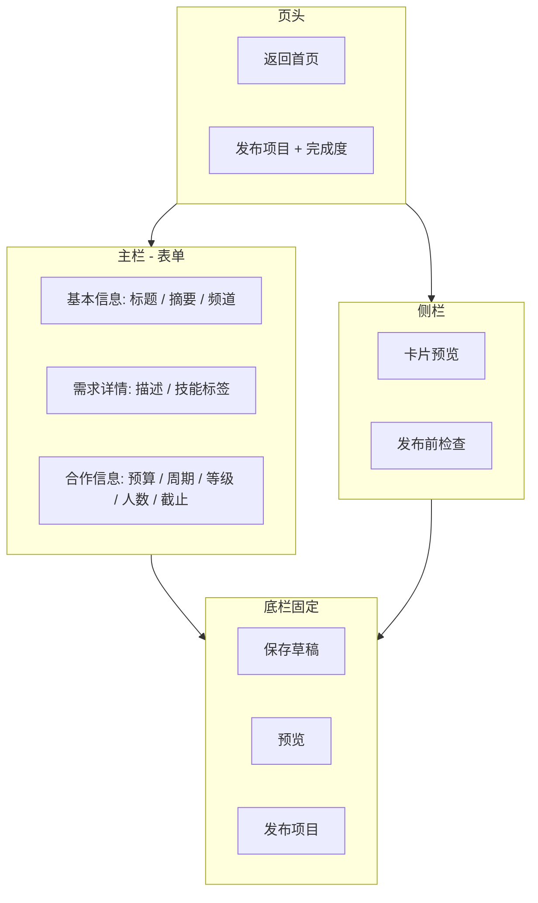

# 发布项目页 UI 草图

> 路径：`/publish/project` · React 实现见同目录 `PublishProjectView.tsx`

## 1. 页面目标

- 让已登录用户通过分步表单创建「企业实战 / 高校招募」项目需求。
- 右侧实时预览列表卡片样式，降低发布后与频道展示不一致的落差。
- 当前为 **UI 原型**：按钮仅 `console` 输出，不接后端 API。

## 2. 信息架构



## 3. 布局（桌面 ≥1024px）

| 区域 | 宽度 | 说明 |
|------|------|------|
| 内容区 | `max-w-6xl` 居中 | 与频道页一致的阅读宽度 |
| 主表单 | `1fr` | 三段白色卡片，段首图标 + 标题 |
| 侧栏 | `320px` sticky | 预览 + 检查清单 |
| 底栏 | 全宽 fixed | 毛玻璃背景，主按钮 `#2563EB` |

移动端：侧栏堆叠在表单下方；底栏按钮换行。

## 4. 字段清单（原型）

| 字段 | 必填 | 说明 |
|------|------|------|
| title | ✓ | 项目标题 |
| summary | ✓ | 一句话摘要（建议 ≤80 字） |
| channel | ✓ | `enterprise` / `campus` |
| description | ✓ | 详细需求 |
| skillTags | ✓ | 可多选建议标签或自定义 |
| amount | ✓ | 预算区间 |
| duration | | 预计周期 |
| level | | N ~ UR |
| teamSize | | 团队规模 |
| deadline | | 报名截止日期 |

## 5. React 文件结构

```
PublishForm/
└── publishFormShared.css     # 主题感知共享样式（映射 --page-bg 等全局变量）

PublishProject/
├── index.tsx
├── PublishProjectView.tsx
├── usePublishProjectForm.ts
├── publishProjectPageData.ts
├── style.css                 # @import 共享样式
└── UI-SKETCH.md
```

切换顶栏「浅色/深色」主题时，发布页背景、卡片、输入框、按钮会随 `:root[data-theme='dark']` 自动适配。

## 6. 独立 HTML 原型（Tailwind CDN）

将下面保存为 `publish-project-sketch.html`，用浏览器直接打开即可预览（无需构建）：

```html
<!DOCTYPE html>
<html lang="zh-CN">
<head>
  <meta charset="UTF-8" />
  <meta name="viewport" content="width=device-width, initial-scale=1.0" />
  <title>发布项目 · UI 草图</title>
  <script src="https://cdn.tailwindcss.com"></script>
</head>
<body class="min-h-screen bg-slate-50 text-slate-900">
  <div class="mx-auto max-w-6xl px-4 pb-28 pt-8 sm:px-6 lg:px-8">
    <a href="/" class="inline-flex items-center gap-2 text-sm text-slate-500 hover:text-blue-600">← 返回首页</a>
    <div class="mt-4 flex flex-wrap items-end justify-between gap-4">
      <div>
        <p class="text-xs font-semibold uppercase tracking-wider text-blue-600">Publish</p>
        <h1 class="mt-1 text-3xl font-bold">发布项目</h1>
        <p class="mt-2 max-w-2xl text-sm text-slate-500">填写项目需求，右侧为卡片预览（静态草图）。</p>
      </div>
      <div class="rounded-2xl border bg-white px-4 py-3 shadow-sm">
        <p class="text-xs text-slate-500">完成度</p>
        <p class="text-2xl font-bold text-blue-600">40%</p>
      </div>
    </div>

    <div class="mt-8 grid gap-8 lg:grid-cols-[1fr_320px]">
      <main class="space-y-6">
        <section class="rounded-2xl border bg-white p-6 shadow-sm">
          <h2 class="text-lg font-semibold">基本信息</h2>
          <label class="mt-4 block text-sm font-medium">项目标题 *</label>
          <input class="mt-2 w-full rounded-xl border px-3 py-2 text-sm" placeholder="例如：电商平台用户增长数据分析" />
          <label class="mt-4 block text-sm font-medium">一句话摘要 *</label>
          <input class="mt-2 w-full rounded-xl border px-3 py-2 text-sm" placeholder="80 字以内" />
          <p class="mt-4 text-sm font-medium">发布频道</p>
          <div class="mt-2 grid gap-3 sm:grid-cols-2">
            <div class="rounded-xl border-2 border-blue-600 bg-blue-50/40 p-4">
              <p class="font-semibold">企业实战</p>
              <p class="text-xs text-slate-500">面向企业真实业务需求</p>
            </div>
            <div class="rounded-xl border p-4">
              <p class="font-semibold">高校招募</p>
              <p class="text-xs text-slate-500">实验室 / 课题组招募</p>
            </div>
          </div>
        </section>

        <section class="rounded-2xl border bg-white p-6 shadow-sm">
          <h2 class="text-lg font-semibold">需求详情</h2>
          <textarea class="mt-4 w-full rounded-xl border px-3 py-2 text-sm" rows="6" placeholder="背景、目标、交付标准…"></textarea>
          <div class="mt-3 flex flex-wrap gap-2">
            <span class="rounded-full bg-blue-50 px-3 py-1 text-xs text-blue-600">Vue3</span>
            <span class="rounded-full bg-slate-100 px-3 py-1 text-xs">Python</span>
            <span class="rounded-full bg-slate-100 px-3 py-1 text-xs">数据分析</span>
          </div>
        </section>

        <section class="rounded-2xl border bg-white p-6 shadow-sm">
          <h2 class="text-lg font-semibold">合作信息</h2>
          <div class="mt-4 grid gap-4 sm:grid-cols-2">
            <input class="rounded-xl border px-3 py-2 text-sm" placeholder="预算 ¥3000 - ¥5000" />
            <input class="rounded-xl border px-3 py-2 text-sm" placeholder="周期 4 周" />
          </div>
        </section>
      </main>

      <aside class="space-y-6 lg:sticky lg:top-24">
        <section class="rounded-2xl border bg-white p-5 shadow-sm">
          <p class="text-sm font-semibold">卡片预览</p>
          <article class="mt-4 rounded-xl border border-dashed p-4">
            <span class="rounded-full bg-blue-50 px-2 py-0.5 text-xs font-semibold text-blue-600">企业实战</span>
            <h3 class="mt-2 text-lg font-bold">项目标题将显示在这里</h3>
            <p class="mt-1 text-sm text-slate-500">摘要将显示在卡片副标题区域</p>
            <p class="mt-3 text-sm font-semibold text-blue-600">¥3000 - ¥5000</p>
          </article>
        </section>
      </aside>
    </div>
  </div>

  <footer class="fixed inset-x-0 bottom-0 border-t bg-white/90 backdrop-blur">
    <div class="mx-auto flex max-w-6xl justify-end gap-2 px-4 py-4">
      <button class="rounded-xl border px-4 py-2 text-sm">保存草稿</button>
      <button class="rounded-xl border px-4 py-2 text-sm">预览</button>
      <button class="rounded-xl bg-blue-600 px-4 py-2 text-sm font-semibold text-white">发布项目</button>
    </div>
  </footer>
</body>
</html>
```

## 7. 接入说明（后续）

1. 对接 `API-request.md` 中项目创建接口，替换 `handlePublish`。
2. 草稿可落 `localStorage` 或后端草稿箱。
3. 顶栏「发布 → 发布项目」已指向 `/publish/project`，需登录后访问（`ProtectedRoute`）。
